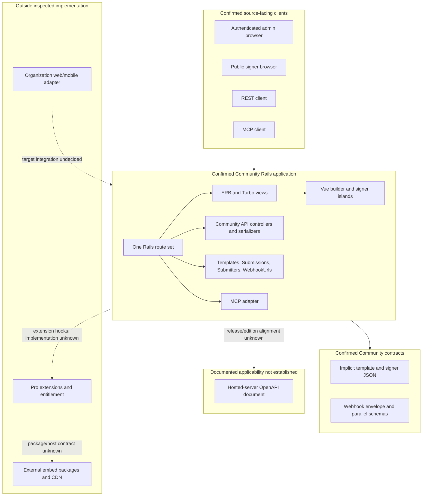

# Component And Contract Boundaries

## Purpose And Evidence Boundary

- Reader question: Which source components and integration contracts share the Community application boundary, and where does unavailable Pro/external code begin?
- Evidence cutoff: 2026-08-06; Community `3.1.7` / `a2d8b855…`.
- Confirmed notation: solid node/edge present in pinned source.
- Inferred notation: dotted relationship is a source-supported consequence, not runtime proof.
- Unknown notation: dashed edge/node requires vendor, target or live evidence.
- Evidence links: [component packet](../../../evidence/packets/architecture-component-api-ui-contracts.md); [ADR-001](../adr/ADR-001-modular-monolith-and-ui-boundary.md); [ADR-003](../adr/ADR-003-edition-specific-integration-boundary.md).

## Evidence Dimensions Used

Implementation and approved public edition statements are present. Runtime, ownership/approval, commercial entitlement, Pro implementation and consumer acceptance are unknown.

## Diagram

## Known Gaps And Follow-Up

OI-001/OI-005 must resolve edition entitlement, release-specific alignment between Community routes/serializers and the hosted OpenAPI, Pro package contracts/module topology, supported clients and whether an organization-owned adapter is required. The diagram does not prove live co-location or target acceptance.
