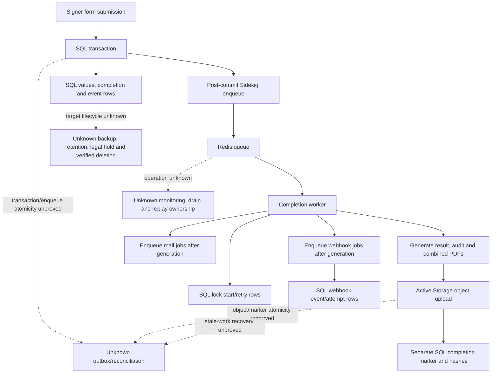

# Data, Job, And Artifact Provenance

## Purpose And Evidence Boundary

- Reader question: How does signer completion cross authoritative stores, asynchronous work, generated artifacts and external notifications?
- Evidence cutoff: 2026-08-06; Community `3.1.7` / `a2d8b855…`.
- Confirmed notation: solid source-implemented node/edge.
- Inferred notation: dotted consequence requiring runtime validation.
- Unknown notation: dashed target/control boundary without approved evidence.
- Evidence links: [data/jobs packet](../../../evidence/packets/architecture-data-jobs-migrations-provenance.md); [ADR-005](../adr/ADR-005-data-and-file-authority.md); [ADR-006](../adr/ADR-006-completion-and-job-topology.md).

## Evidence Dimensions Used

Implementation is present. Live job history, data correctness, owner/approval, recovery, capacity, retention and specialist evidence are unknown.

## Diagram

## Known Gaps And Follow-Up

OI-003 must validate queue/store failure and capacity behavior; OI-006 must close authoritative-record, backup/restore, retention/deletion and reconciliation rules. Solid paths are source code, not completed production transactions.
