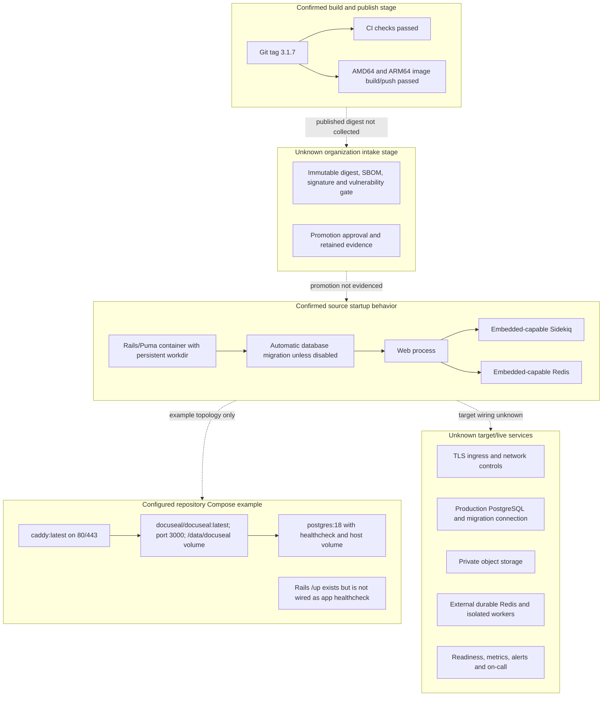

# Deployment And Runtime Path

## Purpose And Evidence Boundary

- Reader question: What delivery, image, migration and runtime path is configured, and which production gates remain unknown?
- Evidence cutoff: 2026-08-06; Community `3.1.7` / `a2d8b855…`.
- Confirmed notation: solid configuration or hosted-run evidence within cutoff.
- Inferred notation: dotted source-supported relationship without live proof.
- Unknown notation: dashed target/runtime/approval boundary.
- Evidence links: [runtime packet](../../../evidence/packets/architecture-runtime-deployment-delivery-identity-secrets.md); [GitHub packet](../../../evidence/packets/github-history-and-hosted-ci.md); [approved deployment docs](../../../evidence/packets/architecture-approved-public-deployment-docs.md); [ADR-008](../adr/ADR-008-boot-coupled-database-migrations.md); [ADR-011](../adr/ADR-011-release-image-provenance-and-promotion.md).

## Evidence Dimensions Used

Implementation, cutoff-bounded CI/image-run history and dynamic public documentation are present. Deployed digest, registry state, promotion approval, live services, ownership, cost and control effectiveness are unknown.

## Diagram

## Configured Dependency Boundary

| Dependency group | Source role | Validation boundary |
|---|---|---|
| Rails/Puma/ERB/Turbo/Vue | Web, UI and API runtime | Pinned source only; live process/browser behavior unobserved |
| PostgreSQL/SQLite/Trilogy | Relational workflow/evidence authority options | Production adapter/version, HA and pool compatibility unknown |
| Active Storage disk/S3/GCS/Azure | File-byte persistence/proxy | Provider, keys, retention, residency and recovery unknown |
| Redis/Sidekiq | Queue, scheduled and completion processing | Durability, isolation, backlog, replay and shutdown unobserved |
| SMTP and webhook destinations | External notification/integration handoffs | Provider/consumer SLA, authentication and failure ownership unknown |
| HexaPDF, PDFium, Vips, Leptonica, ONNX Runtime | PDF, image and field-detection processing | Native artifact provenance, runtime compatibility and resource limits unproved |
| External Pro embed packages/CDN | Required web/mobile embedding boundary | Outside inspected implementation; version, provenance, entitlement and support unknown |

## Known Gaps And Follow-Up

OI-003 defines/tests the live topology and dependencies. OI-004 creates immutable artifact intake, dedicated migration, application health wiring, observability, backup, upgrade and rollback gates. The live DevOps infrastructure view was not created because no approved live-environment evidence exists.
