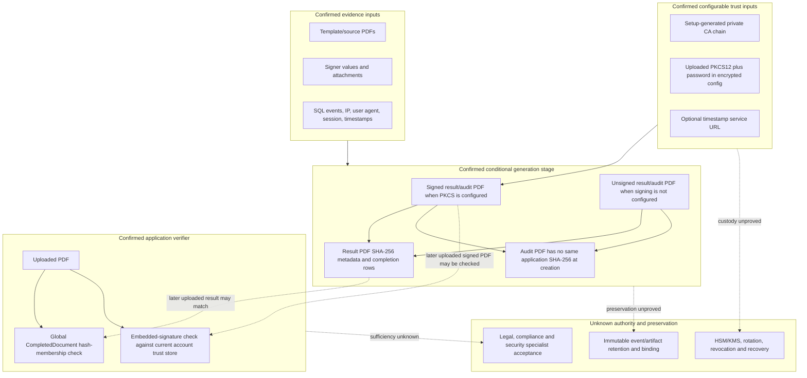

# Signing And Verification Trust Boundary

## Purpose And Evidence Boundary

- Reader question: Which inputs create signed/audit artifacts, where are trust decisions made, and what remains unknown for independent verification?
- Evidence cutoff: 2026-08-06; Community `3.1.7` / `a2d8b855…`.
- Confirmed notation: solid implemented source path.
- Inferred notation: dotted consequence requiring artifact/specialist validation.
- Unknown notation: dashed authority, key-custody or acceptance boundary.
- Evidence links: [data/jobs packet §5–8](../../../evidence/packets/architecture-data-jobs-migrations-provenance.md); [runtime packet §11, §15](../../../evidence/packets/architecture-runtime-deployment-delivery-identity-secrets.md); [ADR-007](../adr/ADR-007-signing-audit-and-verification-trust.md).

## Evidence Dimensions Used

Implementation is present. No live certificate/TSA/artifact, HSM/KMS, legal/compliance/security acceptance, or independent verifier observation was supplied.

## Diagram

## Known Gaps And Follow-Up

OI-002 must choose the trust/key/TSA model with specialists. OI-006 must verify signed and unsigned paths, timestamp failure behavior, the global hash query versus account-scoped trust, audit-artifact hashing, tenant/provenance binding, tamper detection, regeneration, immutable retention and independent verification. No legal or regulatory conclusion is made.
