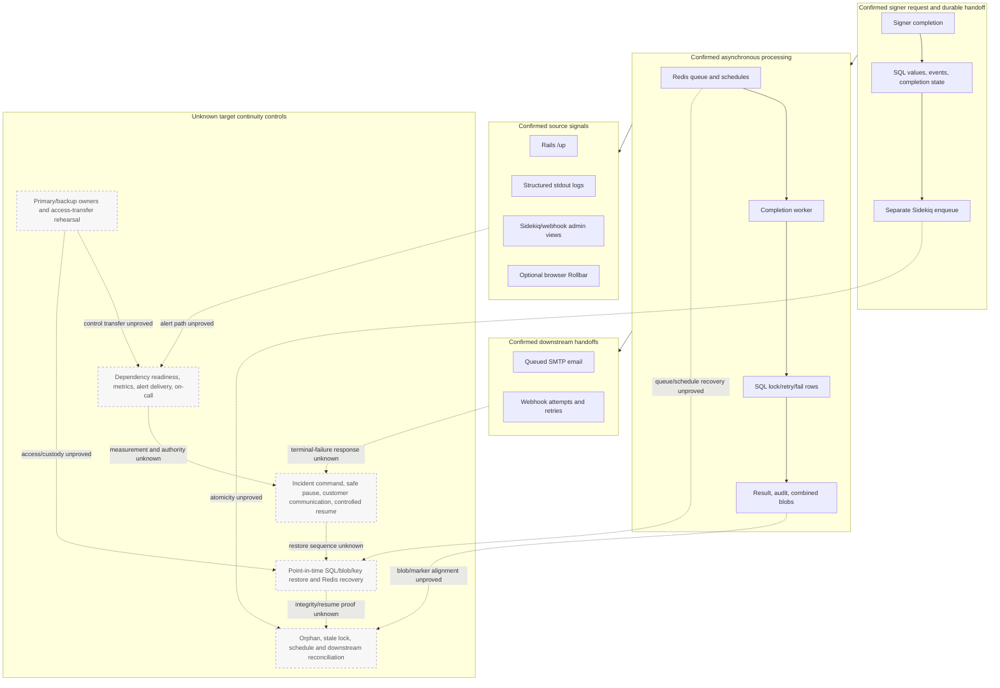

# Interruption And Recovery Boundaries

## Purpose And Evidence Boundary

- Reader question: Where can a signer-completion interruption be detected, recovered, reconciled, and transferred, and which links remain unknown?
- Evidence cutoff: 2026-08-06; Community `3.1.7` / `a2d8b855491793870b7b4acf176d2d95ae95ff83`.
- Confirmed notation: solid nodes/edges are source-visible mechanisms.
- Inferred notation: dotted labelled edges are source-supported interruption consequences, not observed failures.
- Unknown notation: dashed nodes and dotted edges identify missing target, live, ownership, or exercise evidence.
- Evidence links: [recovery packet](../../../evidence/packets/business-continuity-recovery-dataops-alerting.md), [transfer packet](../../../evidence/packets/business-continuity-delivery-account-transfer.md), [Architecture data/job diagram](../../architecture/diagrams/data-job-artifact-provenance.md), and [Security trust diagram](../../security/diagrams/identity-data-trust-boundaries.md).

## Evidence Dimensions Used

Implementation, cutoff-bounded upstream build history, and auditor-approved availability/RPO targets are present. Measurement definitions, observed target operation, recovery exercises, dashboard/alert delivery, execution ownership/approval, cost/commercial evidence, and specialist acceptance are unknown.

## Diagram

## Known Gaps And Follow-Up

- BC-Q-001 is answered: monthly availability targets are 99.5% for signing and 99% for onboarding, maximum data loss/RPO is two hours, and onboarding may pause during interruption. The unknown stages must now be measured and exercised against those targets; synchronous transactions remain a design preference, not an observed guarantee.
- OI-002–OI-006/OI-013 carry recovery, artifact/key, release, contract, and vendor proof. Canonical OI-014/OI-015/OI-016 carry incident response, ownership inventory, and access-transfer proof.
- Solid paths are source-visible behavior, not proof of a completed production workflow. No outage, restoration, failover, alert, incident, or transfer was performed or observed.
- The named `observability-and-response-path.md` was not created because no approved dashboard, alert ownership, incident, or alert-delivery evidence met its explicit trigger; this diagram preserves the unknown boundary without implying operation.
