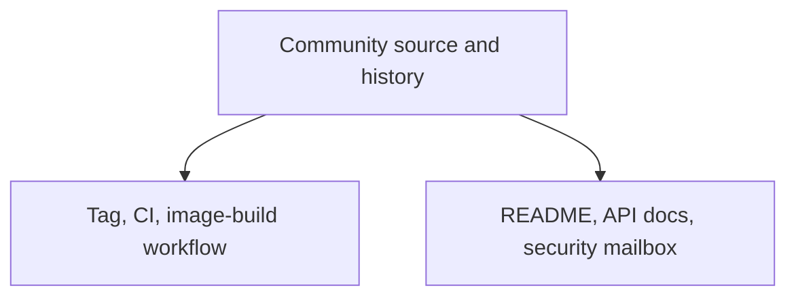
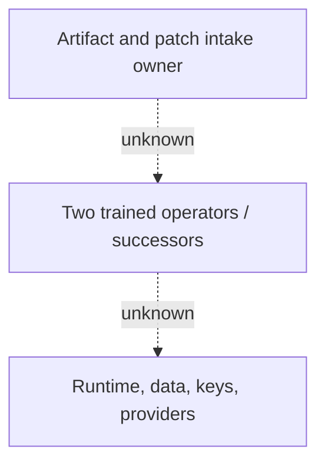
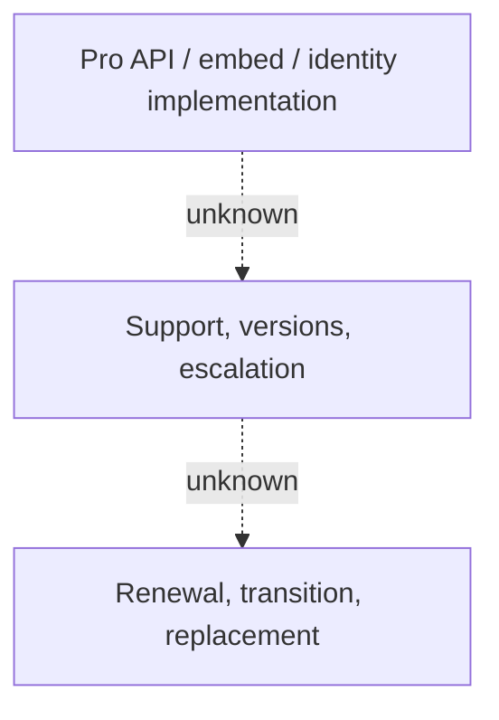
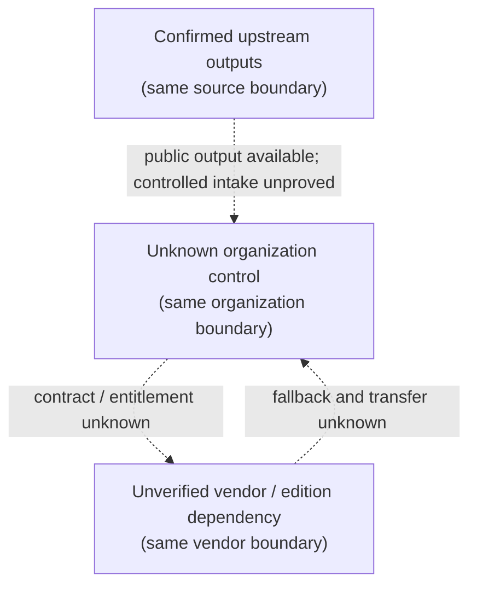

# Ownership, Successor, And Vendor-Dependency Map

Reader question: Which upstream outputs and target controls are available, who is evidenced as accountable, and what must be transferable before vendor or person loss can be tolerated?

## Evidence Boundary

This view uses the [ownership/support packet](../../evidence/packets/contributor-vendor-value-ownership-support.md), [feature-contribution packet](../../evidence/packets/contributor-vendor-value-feature-contribution.md), E-001–E-005/E-025–E-029/E-050–E-052, the completed Product Value and Business Continuity evidence, and no private personnel, account, contract, or live-operation record. It distinguishes delivered source/history from authority, ownership, contractual commitment, and transfer proof.

## Evidence Dimensions Used

| Dimension | Position | Material limit |
|---|---|---|
| Implementation | Present: inspectable Community signing core, tests, documentation, CI and release workflow | Does not prove target fitness, ownership, support, or replacement readiness. |
| History/rationale | Present but partial: public Git history, releases, one traceable sampled PR, issue leads | Internal `wip` review/rationale and uncredited work are unavailable. |
| Observed operation | Upstream CI and image-build jobs succeeded for the pin | No target service, support case, transfer, recovery, or replacement was observed. |
| Ownership/approval | `unknown` for upstream authority and every organization target control | Git labels, copyright, mailboxes, and account actions are not authority evidence. |
| Cost/commercial | Public planning terms only | Quote, operative agreement, accepted value, support terms, renewal, and transition are unknown. |
| Specialist evidence | `unknown` | No legal, compliance, security, procurement, or production acceptance was obtained. |

## Current Source-Bounded Position

| Boundary | EVIDENCED output/control | Accountable owner | Backup/successor | Replaceability/transfer position | Closure route |
|---|---|---|---|---|---|
| Community source and releases | Pinned code, tests, tag, green declared CI, image-build workflow, AGPL source | `unknown` upstream release authority; `unknown` organization intake owner | `unknown` | Source is inspectable and retainable, but protected release, mirror, patch intake, and replacement-maintainer proof are unavailable. | OI-004/OI-015; Maintenance Cost scopes replacement burden. |
| Signing/product behavior | Implemented template/signer/completion/output mechanisms | `unknown` organization product/control owner beyond named proposed roles | `unknown` | Core can be independently inspected; target acceptance and operational knowledge transfer are unproved. | OI-009/OI-010/OI-015. |
| Pro/API/embed/identity components | Public packaging/pricing and Community boundary markers | `unknown` vendor product/support authority; `unknown` organization commercial owner | `unknown` fallback | External implementations, entitlement, compatibility, support, continued operation, and substitution are unverified. | OI-001/OI-005/OI-020. |
| Security maintenance/support | Security mailbox and qualitative response statement | `unknown` maintainer/support authority | `unknown` | No supported-version, response/patch/notification evidence or case outcomes. | OI-013. |
| Target runtime/data/providers | Source-configurable SQL/blob/Redis/SMTP/webhook/TSA and secret/key surfaces | `unknown` | `unknown` | Configurability identifies substitution points; no inventory, access, export/recovery, or provider-transfer exercise. | OI-003/OI-006/OI-015/OI-016. |
| Commercial relationship | Public list prices/terms | `unknown` organization procurement/billing authority; vendor authority not evidenced | `unknown` | No quote/agreement, renewal, escalation, transition, or license-interruption behavior. | OI-019/OI-020. |

## Dependency And Handoff Diagram

The panels are read from top to bottom. Repeated boundary nodes refer to the
same source, organization, or vendor boundary.

### Panel 1 — Confirmed Upstream Outputs

### Panel 2 — Unknown Organization Control

### Panel 3 — Unverified Vendor Or Edition Dependency

### Panel 4 — Cross-Boundary Handoffs

Confirmed solid edges remain inside the source-visible upstream-output boundary. Dotted edges are unproved controlled intake, authority, contract, ownership, succession, or transfer boundaries. The diagram does not map Git author names or email labels to people, accounts, or vendor roles.

## Successor Minimum Evidence

Before treating upstream or internal loss as tolerable, the evidence set needs:

1. an organization-owned source/artifact mirror, version intake policy, and two named maintainers able to build, patch, test, deploy, and recover the pinned boundary;
2. a release-specific Community/Pro contract and package inventory with support/deprecation, export, termination, and replacement rights;
3. upstream supported-version, security-response, notification, and escalation evidence tied to accountable roles rather than mailboxes or Git labels;
4. a rehearsed transfer of repository/artifact, runtime, database, blob, Redis, DNS/TLS, monitoring, integration credentials, signing keys, and provider controls; and
5. retained results from a replacement-maintainer exercise, not an estimate derived from commit concentration.

## Material Unknowns And Closure Routes

No distinct new open item is proposed. OI-004/OI-013/OI-015/OI-016/OI-019/OI-020 already route release intake, vendor maintenance, ownership inventory, transfer proof, commercial authority, and operative agreement. The coordinator should expand OI-015 only if its final wording does not explicitly include two source/application maintainers and knowledge-transfer evidence.

Git activity and feature attribution are signals for diligence and succession testing. They are not performance, staffing, authority, support, solvency, or bus-factor findings.
