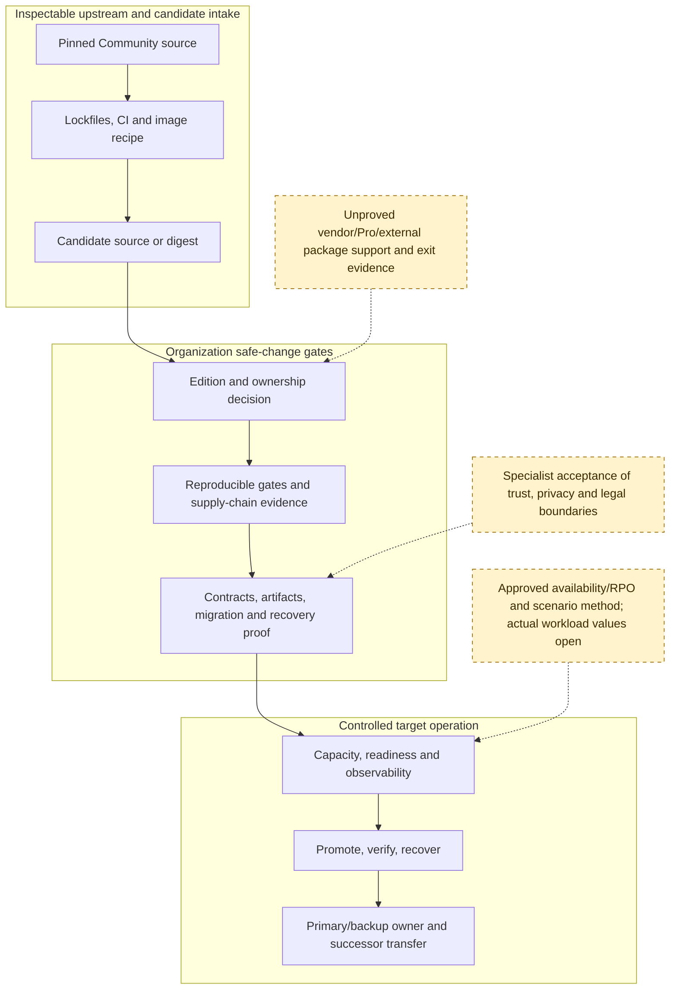

# Safe-Change And Ownership Boundary

## Purpose And Evidence Boundary

- **Reader question:** Where does inspectable upstream DocuSeal source stop, and which organization or vendor evidence gates must a replacement maintainer cross before a change is safe to promote?
- **Evidence cutoff:** 2026-08-06, America/Toronto; pinned Community source effective 2026-08-03.
- **Confirmed notation:** solid nodes and arrows within the inspectable-upstream stage show source-visible inputs and delivery relationships.
- **Inferred notation:** solid arrows beyond the upstream stage show the source-informed evidence order required for safe-change assessment; they do not establish completed gates.
- **Unknown notation:** dashed nodes and arrows show organization, vendor, specialist, workload, or ownership evidence not established by the approved sources.
- **Evidence links:** [maintenance packet](../../../evidence/packets/maintenance-cost-work-surfaces.md), [Code Quality change-safety matrix](../../quality/change-safety-matrix.md), [Continuity recovery control](../../continuity/recovery-and-service-control.md), and [Scalability envelope](../../scalability/capacity-envelope.md).

## Diagram

## Known Gaps And Follow-Up

Solid arrows show the required evidence order derived from the source-visible delivery and target-control boundaries. Dashed nodes are approved decisions or evidence still outside the pinned implementation. The diagram expresses no elapsed duration, staffing quantity, cost, or completed gate.
