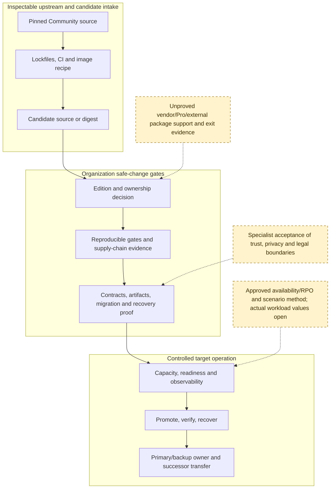

# Safe-Change And Ownership Boundary

## Reader Question

Where does inspectable upstream DocuSeal source stop, and which organization or vendor evidence gates must a replacement maintainer cross before a change is safe to promote?

Solid arrows show the required evidence order derived from the source-visible delivery and target-control boundaries. Dashed nodes are approved decisions or evidence still outside the pinned implementation. The diagram expresses no elapsed duration, staffing quantity, cost, or completed gate.

Evidence: [maintenance packet](../../../evidence/packets/maintenance-cost-work-surfaces.md), [Code Quality change-safety matrix](../../quality/change-safety-matrix.md), [Continuity recovery control](../../continuity/recovery-and-service-control.md), [Scalability envelope](../../scalability/capacity-envelope.md).

