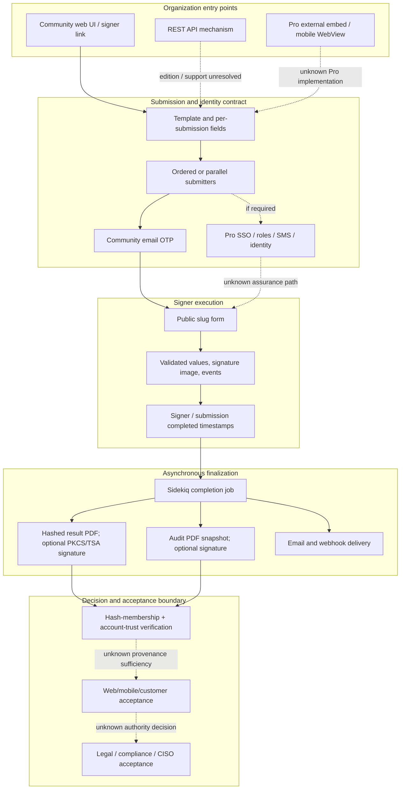

# Product Value Flow

## Purpose And Evidence Boundary

- Reader question: Where does an onboarding signature move from organization entry points to durable outputs, and where do entitlement, asynchronous completion, and specialist acceptance remain unknown?
- Evidence cutoff: Community source effective 2026-08-03; public documentation observed 2026-08-06 is post-cutoff validation only.
- Confirmed notation: solid edge/node.
- Inferred notation: dotted edge.
- Unknown notation: dashed `unknown` edge/node.
- Evidence links: [PV-E-001–PV-E-005](../../../evidence/packets/product-value-source-inspection.md), [Architecture data diagram](../../architecture/diagrams/data-job-artifact-provenance.md).

## Evidence Dimensions Used

Implementation and public promise evidence are present. Runtime demonstration, ownership/approval, customer acceptance, commercial contract, and specialist evidence are unknown.

## Diagram

## Known Gaps And Follow-Up

- The API and embedded-mobile edges require a versioned vendor contract and Pro implementation evidence.
- Signature image capture and `complete_form` do not establish disclosure, consent, intent, identity, or legal effect; the Community form leaves the disclosure option disabled.
- Completion is not one atomic state: SQL completion precedes result/audit/email/webhook work.
- Generated results may be unsigned; the audit and verifier do not by themselves prove immutable, tenant-bound legal evidence.
- Controlled web/mobile fixtures and specialist sign-off are required before customer onboarding acceptance.
