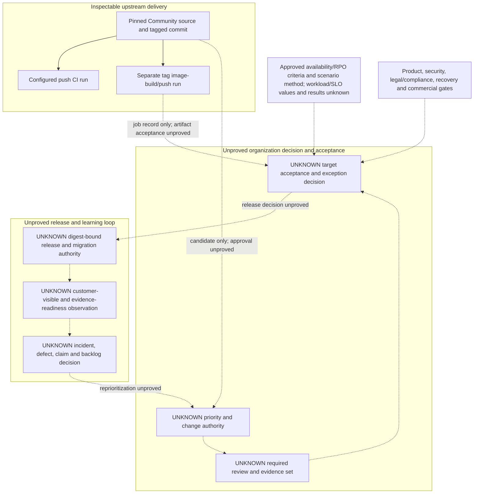

# Release, Acceptance, And Learning Boundary

## Purpose And Evidence Boundary

- **Reader question:** Where does inspectable upstream delivery stop, and which organization decisions and evidence must connect a candidate to safe release and learning?
- **Evidence cutoff:** 2026-08-06, America/Toronto; pinned Community source effective 2026-08-03.
- **Confirmed notation:** solid arrows show only the source-visible upstream delivery sequence.
- **Inferred notation:** no inferred relationship is asserted in this view.
- **Unknown notation:** dotted arrows and `UNKNOWN` nodes show organization decision, acceptance, release, observation, and learning boundaries not established by approved evidence.
- **Evidence links:** [Project Health packet](../../../evidence/packets/project-health-delivery-and-quality.md), [Code Quality test health](../../quality/test-health.md), [Maintenance time-to-safety](../../maintenance/time-to-safety.md), and [Revenue claim governance](../../revenue/claim-governance.md).

## Diagram

## Known Gaps And Follow-Up

Solid arrows show only the source-visible upstream sequence. Dotted arrows and `UNKNOWN` nodes show organization decision, acceptance, release, observation and learning boundaries not established by the approved evidence. The loop does not imply a cadence, staffing model, segregation-of-duties design, incident, customer reaction, defect, release approval, or production readiness.
