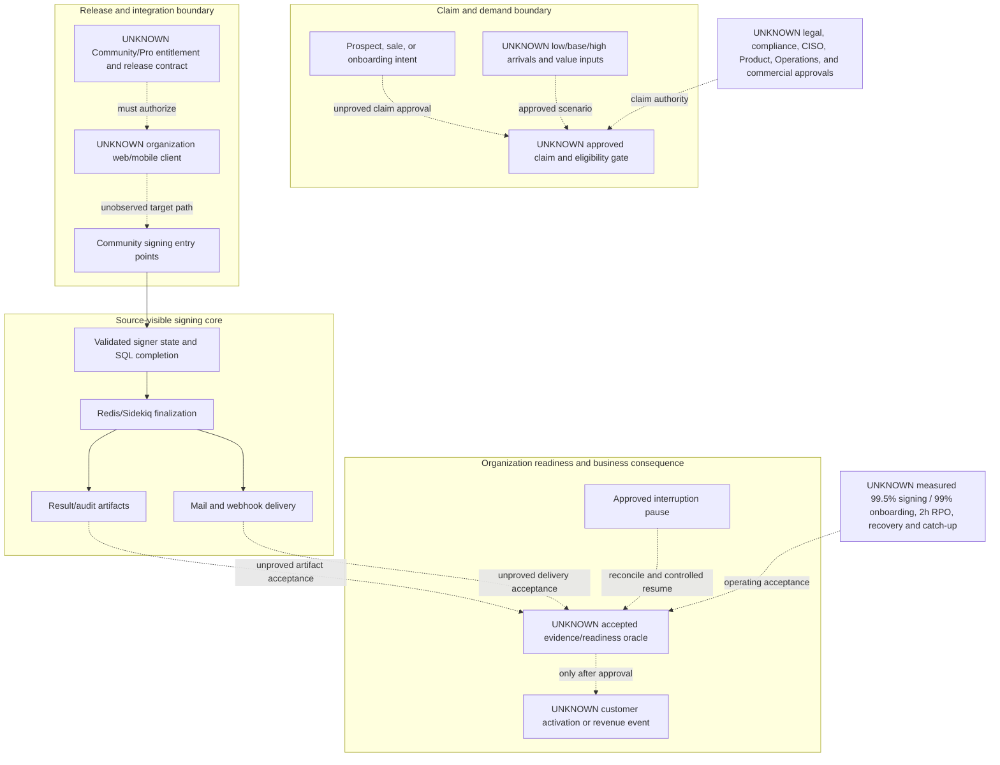

# Revenue-Critical Boundaries

## Purpose And Evidence Boundary

- **Reader question:** Where do source-visible signing transitions meet unproved claim, entitlement, integration, readiness, operating, and revenue-activation boundaries?
- **Evidence cutoff:** 2026-08-06, America/Toronto; pinned Community source effective 2026-08-03.
- **Confirmed notation:** solid arrows show implemented Community source transitions only.
- **Inferred notation:** no inferred relationship is asserted in this view.
- **Unknown notation:** dotted arrows and `UNKNOWN` nodes show organization, edition, authority, readiness, and operating boundaries not established by approved evidence.
- **Evidence links:** [Revenue Risk packet](../../../evidence/packets/revenue-risk-claim-demo-commercial.md), [claim governance](../claim-governance.md), and [demo readiness](../demo-readiness.md).

## Diagram

## Known Gaps And Follow-Up

Solid edges show implemented Community source transitions only. Dotted edges show unproved organization, edition, authority, readiness, and operating boundaries. The diagram does not assert production traffic, revenue recognition rules, contract behavior, loss, probability, or achieved service levels.
