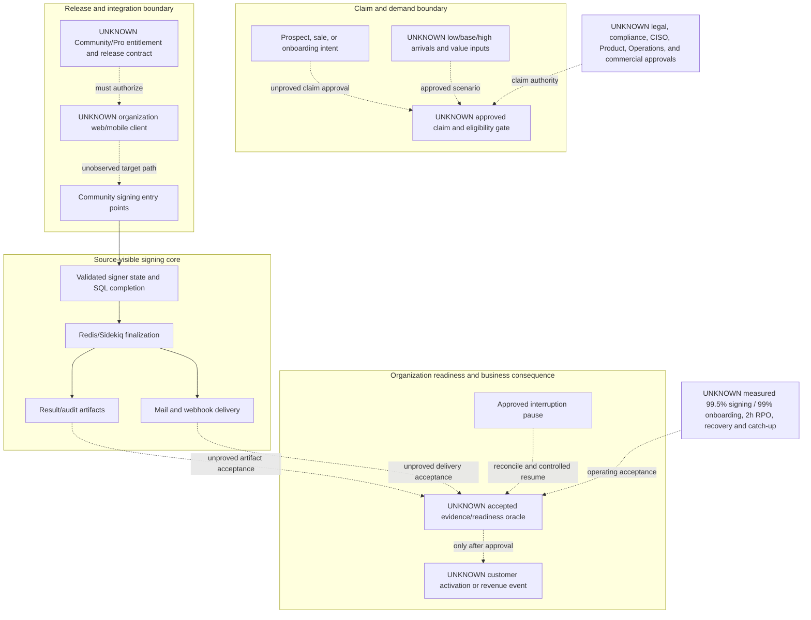

# Revenue-Critical Boundaries

Solid edges show implemented Community source transitions only. Dotted edges show unproved organization, edition, authority, readiness, and operating boundaries. The diagram does not assert production traffic, revenue recognition rules, contract behavior, loss, probability, or achieved service levels.
