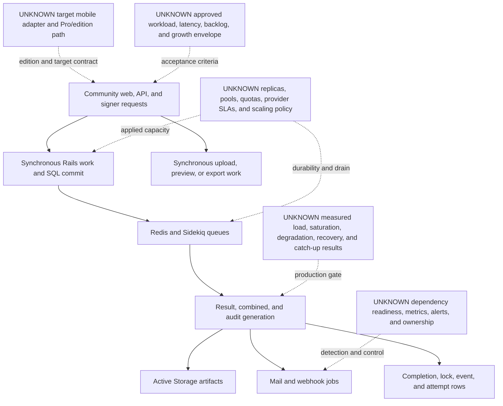

# Capacity And Degradation Envelope

Coordinator mapping: local SCAL-OI-001 is serialized as canonical OI-017. Local labels remain below for traceability to the reviewer draft.

Reader question: What can be accepted about DocuSeal Community `3.1.7` capacity and degradation for all-new-customer onboarding, and which boundaries still need target decisions and measured proof?

## Evidence Boundary

This view uses pinned Community source at commit `a2d8b855491793870b7b4acf176d2d95ae95ff83`, registered E-013/E-014/E-016–E-018/E-025/E-027/E-037–E-039, the [Scalability evidence packet](../../evidence/packets/scalability-workload-runtime.md), the auditor's 2026-08-06 availability/RPO answer, and the 2026-08-07 confirmation that authority-approved bounded low/base/high scenarios may be used when exact forecasts are unavailable. Approved public sizing and the later scenario-method answer are `post-cutoff-validation` inputs only. No target workload values, live environment, capacity metric, quota, replica count, load test, failure test, cost, Pro implementation, or production approval is in evidence.

## Evidence Dimensions Used

| Dimension | Evidence present | Material limit |
|---|---|---|
| Implementation/configuration | Request pagination, bulk-create shape, synchronous document/export work, SQL-to-Sidekiq completion, queue/retry/timeout configuration, datastore/storage choices, local cache/throttles, health/logging | Presence and configured values do not establish applied state, throughput, latency, backpressure, resilience, or target fit. |
| Demand/success criteria | Signing availability 99.5% monthly; onboarding availability 99% monthly; maximum RPO two hours; onboarding may pause during interruption; synchronous transactions preferred | Normal/peak volume, concurrency, growth, file/page/signer distribution, latency, backlog, catch-up, and measurement definitions are unknown. |
| Observed operation/capacity | None for the organization target | Upstream CI and image-build success do not establish runtime capacity. No benchmark, load, soak, failover, queue-drain, or provider result exists. |
| Ownership/approval | Named executive and technical audiences; target criteria and bounded-scenario method supplied by auditor | Actual workload/SLO envelope approval, capacity owner, saturation thresholds, provider quotas, scaling authority, and exception ownership are unknown. |
| Provider/commercial | Dynamic approximate server guidance and supported provider selectors | No applied provider, version, quota, rate limit, replica/zone design, SLA, egress bandwidth, or cost evidence. |

## Current Source-Bounded Position

### Workload and proof matrix

| Workload/boundary | Source/configuration position | Approved target position | Observed capacity proof | Credible degradation boundary | Closure route |
|---|---|---|---|---|---|
| Public signer interaction | Rails/Vue request path validates values and commits signer state; per-route local-memory throttles cover selected OTP/email paths only. | 99.5% monthly signing availability; workload and latency unknown. | None. | CPU/memory, SQL connection, direct blob-proxy, upload, or shared-ingress saturation is unbounded by evidence. | `SCAL-OI-001` workload/SLO values; OI-003 measured concurrency/latency/error/saturation tests at the real ingress. |
| API-driven onboarding creation | Reads are paged at 10 by default and 100 maximum; create can accept arrays and synchronously fans out records, invitations/events, indexing, expiration schedules, and completion jobs. | 99% monthly onboarding availability; all onboarding may pause during interruption. Maximum batch and peak arrival rate unknown. | None. | Request fan-out and downstream queue/storage pressure lack an approved admission, maximum-batch, or overload contract in the examined path. | Approve batch/arrival/latency ceilings under `SCAL-OI-001`; verify enforcement and graceful overload under OI-003/OI-010. |
| Completion and evidence readiness | SQL completion hands off post-commit to Redis/Sidekiq; workers generate result/combined/audit artifacts and then enqueue mail/webhooks. | RPO ≤2 hours; synchronous transactions preferred. Evidence-readiness latency/backlog/catch-up target unknown. | None. | Queue loss, backlog, retry, stale generation state, object/marker mismatch, or dependency delay can separate workflow completion from evidence readiness; occurrence is unobserved. | OI-003 queue/capacity/failure tests; OI-006 reconciliation/artifact tests; OI-009 defines authoritative readiness. |
| Document upload, preview, signing, and export | Source has ZIP/annotation/flatten/preview/image-thread/email-attachment limits; template processing and full CSV/XLSX export include synchronous materialization and blob/SQL work. | File/page/attachment distribution, maximum export cardinality, and operator latency unknown. | None. | Per-operation guards do not bound aggregate CPU, memory, storage, connection, or request-time pressure. | `SCAL-OI-001`; OI-003 resource/latency tests using approved representative and boundary fixtures. |
| SQL and data growth | PostgreSQL, SQLite, or MySQL/Trilogy can hold workflow/event/search/completion/attempt/lock data; production boot may migrate the selected database. | RPO ≤2 hours; retention/growth horizon unknown. | One maintainer migration estimate is non-target evidence only. | Index growth, scan/export cost, migration duration, connection exhaustion, backup/restore time, and cross-store alignment are unbounded. | Select one target datastore and retention model; OI-003 capacity/migration tests and OI-004/OI-006 backup/restore/lifecycle gates. |
| Blob/artifact growth | Disk/S3/GCS/Azure are selectable; each workflow can retain source, upload, preview, result, optional combined, and audit artifacts. | Size mix, retention, versions/replication, quota and restore-time target unknown. | None. | Storage can grow by multiple artifacts and derivatives per onboarding; no growth rate, quota alert, lifecycle, or cleanup proof exists. | Approve workload/retention under `SCAL-OI-001`; OI-003/OI-006 prove quota, growth, backup, restore and deletion behavior. |
| Web/worker/Redis runtime | Puma threads/workers and Sidekiq threads are configurable; single-tenant defaults embed Sidekiq and can embed Redis; database pool derives from thread settings. | Target replicas, isolation, failover, headroom and scaling authority unknown. | None. | Web, worker, queue and connection contention or common-process failure may occur under some targets; no applied topology or threshold is evidenced. | OI-003 target topology plus replica, pool, drain, failure and saturation proof. |
| SMTP/webhook/TSA/object-store dependencies | Finite SMTP/webhook/TSA timeouts and webhook retry/attempt records exist; destinations/providers are selectable. | Provider SLAs, quotas, fallback and evidence-readiness dependency policy unknown. | None. | Remote latency, throttling, exhaustion, unavailable TSA/storage, or retry buildup can delay notifications/evidence; no circuit-breaker or accepted fallback is established. | OI-003 provider/quota/failure proof; OI-005 consumer contract; OI-002/OI-006 TSA/artifact acceptance. |
| Monitoring and capacity control | `/up`, stdout request logs, in-process cache, selected local throttles. | Measurement points, SLO calculation, saturation thresholds, admission policy, alert and on-call owner unknown. | None. | `/up` does not prove dependency or pipeline readiness; local counters do not coordinate replicas. | Define service-level indicators and alert/stop thresholds, then prove them under OI-003. |

### Source-visible flow and unknown capacity gates

Solid edges are implemented source paths, not observed transactions. Dotted edges are required target/proof boundaries, not inferred missing product capabilities. The flow does not duplicate Architecture's deployment topology or Business Continuity's recovery control; it identifies where capacity acceptance must attach.

## Material Unknowns And Closure Routes

### Proposed decision item and answered auditor decision

| Placeholder | Type / priority | Needed decision | Why it changes the result | Owner | Closure route |
|---|---|---|---|---|---|
| SCAL-OI-001 | decision-needed / P1 | Define and approve the realistic bounded low/base/high workload and SLO envelope for signing and onboarding. | Without demand, latency, backlog, batch, artifact-size and retention bounds, neither source defaults nor future load evidence can be judged sufficient; infrastructure and cost modeling also remain unstable. | Product Manager, IT Operations Director, VP Software Engineering | Use the auditor-approved scenario method to publish a versioned workload/SLO envelope, then use it as the oracle for OI-003 capacity/failure verification; Expense Exposure consumes the approved envelope with organization rates. |

**Answered auditor decision (formerly `SCAL-Q-001`):** Yes. On 2026-08-07, the auditor confirmed that bounded low/base/high workload and SLO scenarios approved by Product, Engineering, and Operations may serve as the capacity acceptance oracle when exact forecasts are unavailable. This closes the auditor question, not the workload decision; actual scenario values remain the named authorities' work under canonical OI-017.

All other material gaps are proof or named-authority decisions already routed through OI-002–OI-006, OI-009/OI-010 and proposed Expense/Continuity items. No provider quota, replica count, capacity limit, bottleneck occurrence, workload, cost, or production readiness is inferred from source/configuration.
