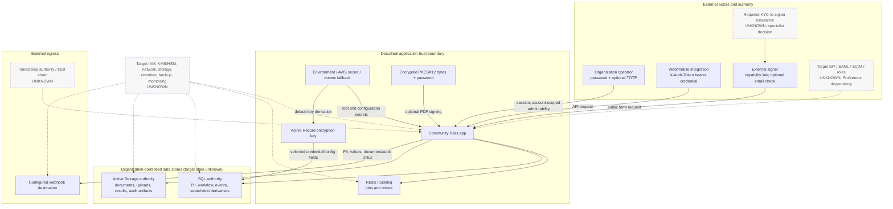

# Identity And Sensitive-Data Trust Boundaries

Reader question: Where do operator identity, signer capability, machine credentials, signing keys, and sensitive onboarding data cross source-visible trust boundaries?

## Purpose And Evidence Boundary

- **Evidence cutoff:** 2026-08-06, America/Toronto; pinned Community source effective 2026-08-03.
- **Confirmed notation:** solid arrows and solid-border nodes are source-visible paths/surfaces.
- **Inferred notation:** no inferred relationship is asserted in this view.
- **Unknown notation:** dotted arrows and dashed-border nodes identify absent live, Pro, organization, or specialist evidence.
- **Evidence links:** [identity/secrets/data packet](../../../evidence/packets/security-identity-secrets-data-boundaries.md), [architecture data packet](../../../evidence/packets/architecture-data-jobs-migrations-provenance.md), [architecture runtime packet](../../../evidence/packets/architecture-runtime-deployment-delivery-identity-secrets.md), and [signing/verification diagram](../../architecture/diagrams/signing-and-verification-trust-boundary.md).

## Diagram

## Confirmed Paths And Limits

| Path | Source establishes | Source does not establish | Closure route |
|---|---|---|---|
| Operator → app | Password/TOTP-capable sessions and one account-scoped admin role | Target IdP, global MFA enforcement, least privilege, lifecycle, or live session policy | OI-001 and OI-003 |
| Integration → app | Header bearer-token lookup and account-wide authorization | Pro entitlement, per-client scope/expiry, revocation behavior, or consumer security | OI-001 and OI-005 |
| Signer → app | Slug capability and optional email/link verification | Required identity assurance, secure delivery, or KYC binding | OI-006 plus specialist decision |
| App → SQL/blob/queue | Separate workflow, file, and job authorities | Target encryption, isolation, residency, recovery, retention, deletion, or durability | OI-003 and OI-006 |
| App → webhook | Source-visible signed outbound payload carrying personal and document metadata | Entitlement, enabled destinations, allow-list, receiver controls, residency, or minimization | OI-005 plus target egress/privacy approval |
| Secret/key sources → app | Secret bootstrap, encryption derivation, and optional PKCS#12 signing consumers | Purpose separation, live custody, rotation, revocation, HSM/KMS, or specialist acceptance | OI-002 and OI-003 |

## Known Gaps And Follow-Up

This diagram is a source topology, not a live exposure map. An edge-exposure diagram is intentionally omitted until approved DNS, TLS, ingress, WAF, and reachability evidence exists.
