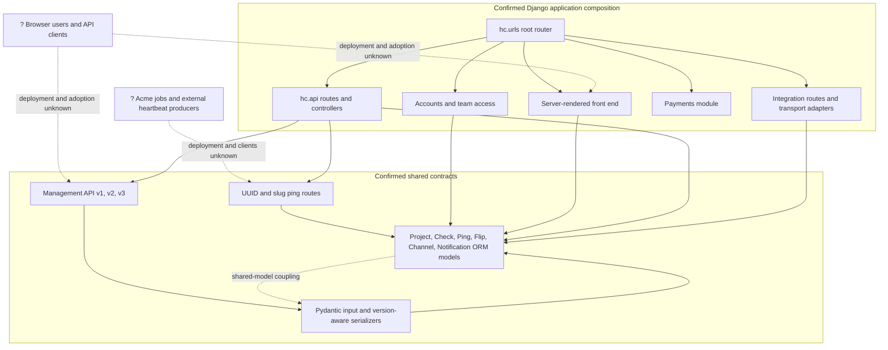

# Component And Contract Topology

## Purpose And Evidence Boundary

- Reader question: Which source components own the public ping, management, and operator interfaces, and where are their shared contracts?
- Evidence cutoff: 2026-08-19 at `HC-CODE-001` commit `fafac59eeb00cfdc87166242544fa071ecad1723`.
- Confirmed notation: Solid nodes and edges are present in the pinned source or documentation; they do not prove live deployment.
- Inferred notation: Dashed edges are architectural consequences inferred from the confirmed composition.
- Unknown notation: `?` marks Acme consumers or runtime state for which no evidence was approved.
- Evidence links: [E-002](../../../evidence/evidence-ledger.md#E-002), [E-006](../../../evidence/evidence-ledger.md#E-006).

## Evidence Dimensions Used

Implementation and repository documentation are present. Runtime operation,
consumer adoption, ownership, approval, cost, and specialist evidence are
unknown.

## Diagram

## Known Gaps And Follow-Up

- No approved evidence identifies Acme producers, API versions, UI use, or
  deployed endpoints. [OI-001](../../open-items.md#OI-001) closes the minimum
  client/job inventory gap.
- No machine-readable OpenAPI/JSON Schema contract was observed in the reviewed
  source set. Code Quality should assess change-detection coverage; this source-
  bounded observation does not prove that no external contract artifact exists.
- Security and Privacy must assess public identifier-bearing ping URLs and
  integration trust boundaries; this diagram does not make a security verdict.
