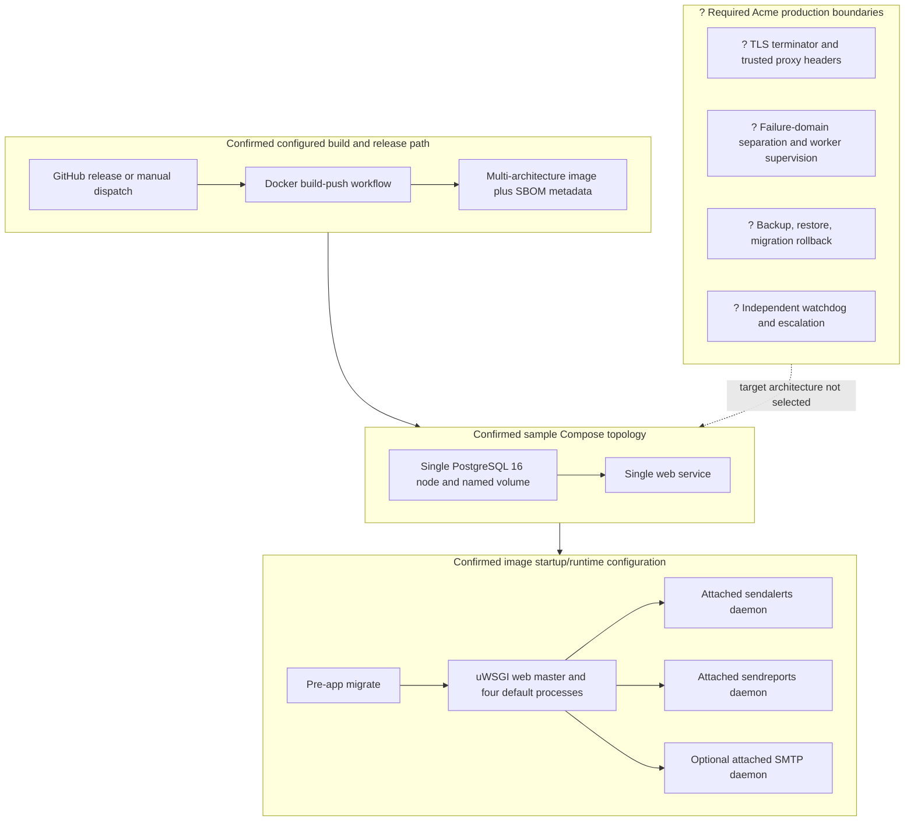

# Deployment And Runtime Path

## Purpose And Evidence Boundary

- Reader question: What does the supplied delivery/runtime configuration actually provide, and which production boundaries remain unknown?
- Evidence cutoff: 2026-08-19 at `HC-CODE-001` commit `fafac59eeb00cfdc87166242544fa071ecad1723`.
- Confirmed notation: Solid nodes and edges are configured in the pinned repository; they do not prove successful delivery or deployment.
- Inferred notation: Dashed edges show production controls required by the mandate or upstream guidance but absent from the supplied topology.
- Unknown notation: `?` marks Acme live infrastructure and ownership not included in approved evidence.
- Evidence links: [E-004](../../../evidence/evidence-ledger.md#E-004), [E-007](../../../evidence/evidence-ledger.md#E-007), [E-008](../../../evidence/evidence-ledger.md#E-008).

## Evidence Dimensions Used

Build, delivery configuration, runtime configuration, migration source, and
operator guidance are present. Workflow execution, image digest used by Acme,
live service state, infrastructure, ownership, approval, recovery, and cost are
unknown.

## Diagram

## Known Gaps And Follow-Up

- The workflow configuration does not prove that an image was built, signed,
  scanned, or deployed; an SBOM output is configured. Project Health and Security
  and Privacy should evaluate supply-chain evidence.
- The sample explicitly selects one database node and one web node on one host
  for simplicity and omits TLS termination. It is not a production availability
  design. See [ADR-002](../adr/ADR-002-reference-container-process-coupling.md)
  and [OI-005](../../open-items.md#OI-005).
- Startup migration precedes serving and includes data-changing migration
  history. No tested backup, restore, or rollback route was observed; close
  [OI-007](../../open-items.md#OI-007) before self-host production use.
- The detailed DevOps infrastructure view was not triggered because no approved
  live-environment evidence exists.
