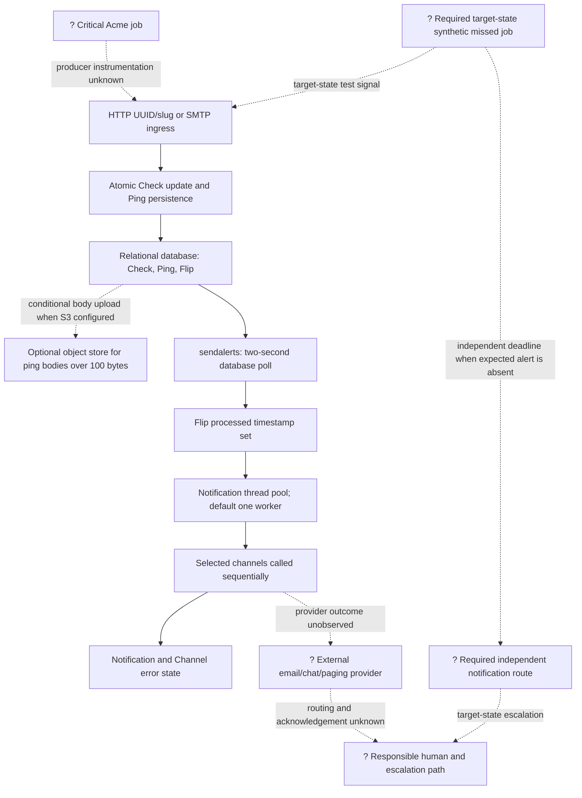

# Heartbeat To Human Alert Path

## Purpose And Evidence Boundary

- Reader question: Where can a missed critical job fail to become an actionable human alert within five minutes?
- Evidence cutoff: 2026-08-19 at `HC-CODE-001` commit `fafac59eeb00cfdc87166242544fa071ecad1723`.
- Confirmed notation: Solid nodes and edges are implemented or documented in the pinned source; they do not prove live operation.
- Inferred notation: Dashed boundaries identify required or plausible relationships not observed live.
- Unknown notation: `?` marks Acme job behavior, deployment, provider behavior, watchdog, or human escalation evidence that was not approved.
- Evidence links: [E-002](../../../evidence/evidence-ledger.md#E-002), [E-003](../../../evidence/evidence-ledger.md#E-003), [E-005](../../../evidence/evidence-ledger.md#E-005), [E-007](../../../evidence/evidence-ledger.md#E-007).

## Evidence Dimensions Used

Implementation, source tests, and operator guidance are present. Live operation,
ownership, approval, observed latency, data correctness, and responder behavior
are unknown.

## Diagram

## Known Gaps And Follow-Up

- The database handoff is durable, but the flip is marked processed before
  delivery completes. Reviewed source records channel errors but does not place
  the flip back into a durable retry state. See [ADR-001](../adr/ADR-001-database-mediated-alert-state.md).
- One HTTP channel may consume up to three 30-second attempts. Channels for one
  flip are sequential, and the Docker-launched worker uses the one-worker
  default. Queue latency during provider degradation or a simultaneous job-fail
  burst is unproven.
- The code's two-second polling interval alone does not establish the five-minute
  outcome. Under the audit measurement contract, `T0` is the first instant a
  critical job is late against its Acme-approved expected-completion schedule;
  `T1` is the first instant a responsible human receives enough identity,
  context, and routing to act. Every required fault case must satisfy
  `T1 - T0 <= 300 seconds` with no silent loss. Grace, polling, queueing,
  provider delivery, and escalation all consume that budget and must be measured
  under [OI-006](../../open-items.md#OI-006).
- Upstream explicitly tells self-hosters to monitor whether Healthchecks accepts
  pings and sends alerts, but no independent watchdog exists in the supplied
  Compose topology. The target architecture decision is [OI-005](../../open-items.md#OI-005).
