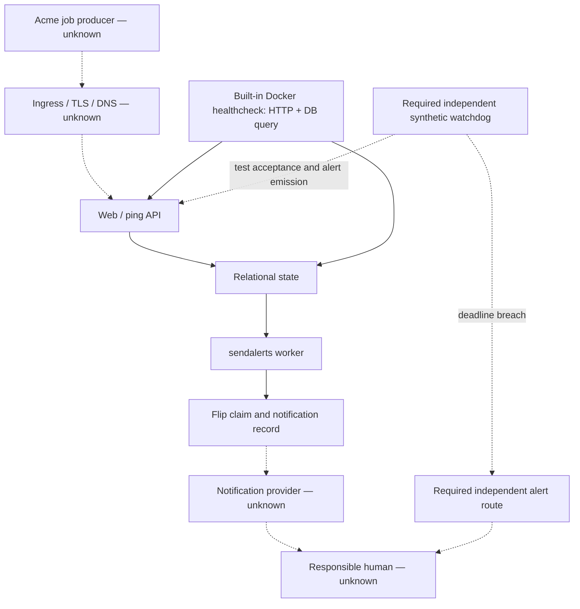

# Environment And Service Continuity

## Purpose And Evidence Boundary

This view traces the minimum service chain that must remain available for an
actionable alert. Solid relationships are source-observed at the pinned commit;
dashed relationships are required target-state controls. No live Acme
environment or hosted internal topology was observed. Evidence:
[E-003](../../evidence/evidence-ledger.md#E-003),
[E-004](../../evidence/evidence-ledger.md#E-004), and
[E-027](../../evidence/evidence-ledger.md#E-027).

## Source-Bounded Continuity Path

## Interruption Boundaries

| Boundary | Source-backed behavior | Failure not detected by built-in probe | Minimum target control | Route |
|---|---|---|---|---|
| Ping ingress | HTTP and database connectivity are exercised by the image healthcheck. | Incorrect DNS/TLS/public routing, job-side failure, and schedule configuration can remain outside the local probe. | External synthetic ping acceptance and job-contract checks. | [OI-005](../open-items.md#OI-005), [OI-009](../open-items.md#OI-009) |
| Database | State and pending flips are database-mediated. | A successful query does not prove backups, replicas, point-in-time recovery, or data correctness. | Durable database design plus restore evidence. | [OI-007](../open-items.md#OI-007), [OI-013](../open-items.md#OI-013) |
| Alert worker | Documentation requires `sendalerts` to run continuously and restart after crash. | The image probe does not inspect worker liveness or aged work. | Separate supervision and alerts for process absence, oldest eligible check, unprocessed flips, dwell time, and exceptions. | [OI-005](../open-items.md#OI-005), [OI-006](../open-items.md#OI-006) |
| Claim/delivery | A flip is marked processed before asynchronous delivery; channel errors are recorded. | Crash after claim and a failed provider can leave no durable retry of the flip. | Fault test, durable recovery design or equivalent compensating detector, and independent notification route. | [OI-006](../open-items.md#OI-006) |
| Provider/human | Channels are called sequentially; delivery and acknowledgement are external. | Provider acceptance is not human receipt or action. | Two failure-independent routes and an acknowledgement/escalation test within the 300-second contract. | [OI-006](../open-items.md#OI-006) |

The named live-evidence observability diagram
`controls/continuity/diagrams/observability-and-response-path.md` was not
created because the approved evidence contains no Acme dashboard, alert rule,
ownership, or incident-response state.
