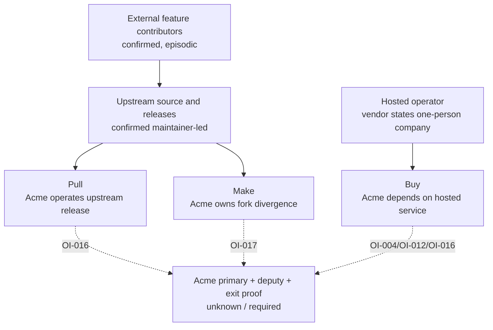

# Ownership, Vendor Dependency, And Successor Map

## Evidence Boundary

This source-bounded view uses E-037 and E-041..E-045. It distinguishes upstream contribution/release evidence, vendor-authored hosted ownership statements, license rights, and Acme ownership that remains unknown. It does not infer contracts, staff performance, live vendor operations, or Acme team capability.

## Evidence Dimensions Used

| Dimension | Present position | Limit |
|---|---|---|
| Implementation/history | Complete public Git history, selected feature units, contribution policy, and release tags | History is not current operational control or succession |
| Ownership/vendor | Vendor FAQ identifies a one-person hosted operator; repository policy is written in the first person | Vendor-authored statement; no private staffing/succession evidence |
| Approval/Acme ownership | Unknown | No Acme primary, deputy, fork maintainer, or exit owner is approved |
| Commercial | Public terms/list price via E-036/E-037 | No negotiated SLA, support, succession, or exit commitment |
| License | BSD-3-Clause permits redistribution and modification | Permission does not create maintenance capacity |

## Current Source-Bounded Position

| Option/boundary | EVIDENCED current dependency | Successor position | Acme gate |
|---|---|---|---|
| Pull | Upstream source direction and every recent release-tip commit inspected are maintainer-authored; material external contributions exist | Upstream contractual successor unknown; Acme deployment/update successor unknown | OI-016: primary/deputy for version selection, patch triage, recovery, and source exit |
| Make | Same upstream dependency plus Acme-owned divergence, merges, releases, and security fixes | No Acme fork maintainer or deputy evidenced | OI-017: authorize fork stewardship only with named owner/deputy and bounded change charter |
| Buy | Vendor FAQ describes SIA Monkey See Monkey Do as a one-person company | Vendor succession, SLA, support response, and exit assistance unknown | OI-004, OI-012, OI-016: vendor review, account continuity, export/exit rehearsal |

## Material Unknowns And Closure Routes

- No evidence names an upstream or vendor successor, and public contribution does not prove one.
- No Acme source/deployment/exit primary and deputy are approved. Close OI-016 before any option becomes core operations.
- Make has no approved fork charter, merge policy, release authority, or successor. Close OI-017 or remove make from consideration.
- Buy has no negotiated continuity or export/termination assistance. Close OI-004 and rehearse the OI-012/OI-016 exit path.
- Account-transfer mechanics remain Business Continuity's OI-012; this view does not duplicate that control.
