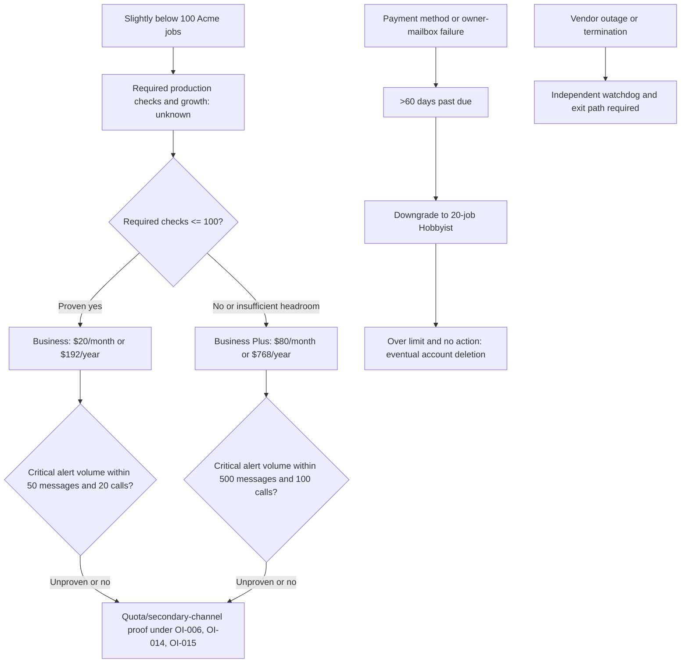

# Burn, Renewal, And Interruption Control

## Purpose And Evidence Boundary

This control separates dated list price from Acme total cost and interruption
exposure across pull, make, and buy. It uses [E-036 through E-038](../../evidence/evidence-ledger.md),
the [commercial packet](../../evidence/packets/vendor-ownership-commercial.md),
and existing architecture/product/scalability evidence only for the surfaces
that may need pricing. The public page displays `$`; no source establishes tax,
foreign-exchange, Acme discount, order, invoice, or selected billing cadence.
The cutoff is 2026-08-19.

The CTO selected a 36-month horizon and classified engineering time as opportunity cost rather than cash spend. No Acme application-architecture-change effort is assigned to pull or make; this does not remove deployment, hardening, integration, testing, recovery, upgrade, or operational work ([E-040](../../evidence/evidence-ledger.md)).

## Hosted Purchase Units And Step Costs

| Published plan | List price | Job limit | Log entries/job | Monthly SMS + WhatsApp | Monthly calls | Decision boundary |
|---|---:|---:|---:|---:|---:|---|
| Hobbyist | $0/month | 20 | 100 | none listed | none listed | Does not cover Acme's slightly-below-100 stated job count. Multiple free accounts to bypass limits are prohibited by the FAQ. |
| Supporter | $5/month | 20 | 100 | none listed | none listed | Same functional limits as Hobbyist; not a capacity fit. |
| Business | $20/month or $192/year | 100 | 1,000 | 50 combined | 20 | Nominal candidate only if required checks, growth, history, and alert volume fit. |
| Business Plus | $80/month or $768/year | 1,000 | 1,000 | 500 combined | 100 | Published next step when more check or alert headroom is required. |

Paying Business monthly for twelve months is `$20 × 12 = $240`; the listed
annual payment is $192, a $48 difference. Business Plus is `$80 × 12 = $960`
versus $768 annually, a $192 difference. Both annual prices are 20% below
twelve monthly payments. Moving from Business to Business Plus multiplies the
published subscription by four under either cadence. These are list-price
arithmetic, not an Acme total-cost forecast.

Over the approved 36-month horizon, published subscription arithmetic is $720 for Business paid monthly or $576 as three annual payments; Business Plus is $2,880 monthly or $2,304 as three annual payments. Taxes, foreign exchange, fee changes, credits/overages, external safeguards, and Acme work remain excluded.

Acme's current job count is not an exact required-check count. Per-job contracts,
overlapping runs, separate monitors, testing checks, and growth can change the
mapping. [OI-015](../open-items.md#OI-015) therefore owns plan selection and alert-
credit reserve; [OI-014](../open-items.md#OI-014) owns the capacity proof.

## Pull / Make / Buy Cash Envelope

| Option | Evidenced direct price | Unpriced cash surfaces | Labor boundary | What may be concluded now |
|---|---|---|---|---|
| Pull | BSD-3-Clause grants use/modification/redistribution rights; no product subscription or royalty requirement is stated. | Production compute, database, backups, storage, network/edge, observability, independent watchdog, registry/build, notification providers, recovery environment, and incident support depend on the selected design and supplier rates. | Initial hardening/integration and recurring upgrades, security response, cleanup, recovery exercises, capacity review, and on-call work are not priced. | Software acquisition is not the cost driver. No decision-ready TCO is calculable until topology, service levels, workload, and Acme rates exist. |
| Make | Same source-license position as pull. | Every pull surface plus fork build/release infrastructure and any source-delta dependencies. | Every pull duty plus design, implementation, regression, upstream merge, security backport, and fork-release work. No fork delta is proposed. | Make has no evidenced cost-saving or value offset. No decision-ready TCO is calculable until a measured source-level need defines the delta. |
| Buy | Business: $20/month or $192/year; Business Plus: $80/month or $768/year. Included limits are in the table above. | Taxes/FX, security/architecture changes, independent watchdog, secondary notification path, possible external incident tooling, and any credit/overage mechanism are unknown; no overage price was found. | Vendor operation may reduce Acme platform work, but integration, security review, account/billing control, job contracts, receipt tests, and exit readiness remain Acme work. | Buy is the only option with a published recurring product list price. No option has a verified all-in TCO or lowest-cost ranking. |

The intake's 1-2 vCPU, 1-2 GB RAM, 10-20 GB storage, 2-5 setup days, and
4-8 hours/month remain unsupported hypotheses ([E-035](../../evidence/evidence-ledger.md#E-035)).
Dependencies and required controls must not be converted to spend until an
actual provider price or Acme labor rate is applied. [OI-003](../open-items.md#OI-003)
owns that final calculation; Maintenance Cost owns the labor estimate.

## Renewal, Quota, And Service-Interruption View

| Trigger | Published behavior | Cash/interruption exposure | Required control |
|---|---|---|---|
| Annual versus monthly billing | Pricing offers annual billing; standard terms still describe recurring monthly billing cycles and automatic renewal. | Annual payment lowers list price but prepays a period; annual renewal mechanics are not coherently stated across the two public pages. | Confirm order cadence, renewal date, cancellation mechanics, and invoice/tax treatment before purchase under OI-004/OI-015. |
| Cancellation | Pricing says cancel any time but no prorated refund, except the listed wrong-account case; terms allow case-by-case refunds at vendor discretion. | Maximum prepaid-period exposure depends on cadence; refund entitlement is not assured by the pricing statement. | Record renewal/cancellation owner and review date; do not assume unused annual value is recoverable. |
| Fee change | Terms allow price modification effective after the current cycle with reasonable prior notice. | Future price is not fixed; continued use accepts the changed fee. | Route notices to a monitored Acme mailbox and require plan/value review before renewal. |
| Failed payment | FAQ says weekly owner emails, cancellation/downgrade to Hobbyist after more than 60 days past due, and eventual deletion if the account remains over Hobbyist limits. | Monitoring for near-100 jobs can lose paid entitlement and ultimately the account despite a low subscription amount. | Primary/deputy account and billing owners, valid payment method, monitored billing mailbox, and loss-of-owner drill under OI-012. |
| Message/call credits | Business includes 50 combined SMS/WhatsApp and 20 calls monthly; Plus includes 500 and 100; unused quota does not carry over. Pinned source refuses sends after configured limits, but hosted parity is unproven. | A synchronized incident or repeated state changes may exhaust a selected critical metered channel; no public overage purchase price was found. | Forecast/test alert demand and reserve; retain a non-metered or separately controlled channel and the independent OI-006 path. |
| Hosted outage/support | Standard terms disclaim uninterrupted availability; FAQ describes a one-person company and says multi-hour or multi-day outages are possible. Business lists email support; Plus lists priority email support, with no response time published. | The subscription does not evidence an SLA, recovery objective, service credit, or compensated failure exposure. | OI-004 contractual/vendor review, OI-006 external T0/T1 test, OI-013 recovery objective, and an Acme-controlled watchdog/exit route. |

## Cost And Interruption Flow

## Decision Gates And Stop Conditions

| Gate | Owner | Closure evidence | Stop condition |
|---|---|---|---|
| Cost basis | Acme CTO | Thirty-six-month horizon plus Acme cloud/provider rates applied to selected designs; engineering effort reported separately as opportunity cost under OI-003 | Do not publish a precise pull/make cash TCO, monetized opportunity cost, or all-in option ranking without the remaining rates. |
| Hosted plan/credits | Acme CTO with designated service/reliability and billing owners | Required checks, one-year growth, alert-volume/fault reserve, chosen cadence, and quota-exhaustion evidence under OI-015 | Do not approve buy while critical-channel headroom is unknown. |
| Hosted terms/continuity | Acme CTO with security/legal/platform owners | OI-004, OI-006, OI-012, and OI-013 evidence | Do not treat the low subscription fee as SLA or operational-risk transfer. |
| Pull topology | Designated platform owner | OI-005, OI-007, OI-013, OI-014 and priced supplier configuration | Do not use the sample Compose footprint or intake estimates as a budget. |
| Make delta | Acme CTO with platform/reliability owner | A measured source-level blocker, scoped delta, release/merge plan, and maintenance estimate | Do not fund a fork merely to implement deployment controls that pull can add externally. |

Failure cost is deliberately not monetized here. No incident frequency, affected
job set, customer/revenue mapping, or recovery tolerance supports a loss estimate;
Revenue Risk owns that consequence analysis.
