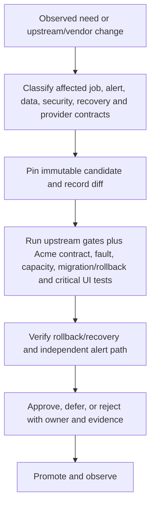

# Hotspot And Change-Risk View

Reader question: Where does source and change concentration increase review burden, and how should a pull or make path contain it?

## Evidence Boundary

This view uses read-only inventory and Git measurements at the pinned commit and over Acme's 36-month horizon. Evidence: [E-047](../../evidence/evidence-ledger.md#E-047), [E-048](../../evidence/evidence-ledger.md#E-048), and [E-009 through E-013](../../evidence/evidence-ledger.md#E-009). Counts identify surfaces; they are not defect, complexity, effort, or staffing measurements. Hosted internals are outside the source boundary.

## Measured Maintenance Surface

| Surface | Measured signal | Maintenance implication | Containment |
|---|---|---|---|
| Domain/state model | `hc/api/models.py`: 1,584 current lines and 1,459 changed lines over 36 months | Checks, pings, flips, notification state, retention, and integrations meet in a central model surface; changes can cross product, data, and alert behavior. | Pull: prefer upstream releases and regression/Acme contract gates. Make: isolate and document the smallest diff; rerun state, migration, alert, and recovery cases. |
| Notification transport core | `hc/api/transports.py`: 4,051 changed lines, the highest measured Python churn | Provider behavior and retry/timing changes can consume the five-minute budget. | Require provider contract tests, fault timing, quota/error handling, and independent receipt; avoid fork edits until OI-006 isolates a source need. |
| Management/UI boundaries | `hc/front/views.py`: 1,430 lines/3,686 changed; `hc/api/views.py`: 953/814; `hc/accounts/views.py`: 943 current lines | Monitor configuration, management APIs, ping intake, account control, and browser behavior span large active files. | Run API/job contract and critical browser acceptance for selected flows; make owns missing harnesses for changed UI behavior. |
| Schema evolution | 187 migration files | Fresh-database CI is not prior-data upgrade or rollback evidence; startup migrations couple deploy and data change. | Versioned backup, restored production-shaped data, migration rehearsal, explicit rollback point, RTO/RPO measurement. |
| Integrations | 30 integration package directories; contributor guide names multi-file code/template/test/route/model work | Provider drift and integration changes cross several artifacts; broad surface does not imply every integration is used. | Enable only selected channels; test them end to end; review only relevant provider changes, credentials, quotas, and deprecations. |
| Configuration and operations | 59 environment-access sites in `hc/settings.py`; 17 management-command files | Flexible deployment creates configuration, secret, cleanup, and runbook choices outside product defaults. | Maintain reviewed configuration-as-code, secure defaults, command schedule, expiry/ownership evidence, and drift checks. |
| Release/dependency stream | 1,348 commits, 26 version tags, and 218 unique dependency/deployment/workflow-touching commits over 36 months | A monthly fixed allowance cannot represent clustered releases, urgent patches, or deferred-upgrade catch-up. | Use event-triggered triage and planned windows; record accept/defer rationale and surge time. Make also tracks upstream divergence. |

## Safe-Change Path

For **pull**, the candidate is an upstream release and the safest default is no local product diff. For **make**, the candidate includes upstream delta plus Acme's fork diff, build, provenance, documentation, and successor obligations; the path repeats after each material merge/release. For **buy**, source gates are replaced by material service-change review and targeted job/integration/security/exit regression; Acme cannot infer hosted implementation from this source view.

## Material Unknowns And Closure Routes

Actual change frequency selected by Acme, enabled integrations, configuration profile, fork charter, incident/patch demand, test duration, and staff familiarity are unknown. OI-008 owns the acceptance gate, OI-017 the make decision, OI-018 time measurement, and OI-019 the trigger/cadence model.
