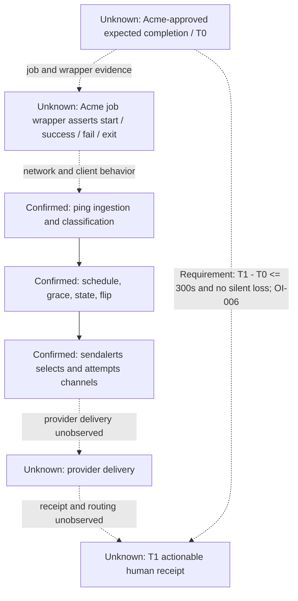

# Product Value Flow

## Purpose And Evidence Boundary

- Reader question: How does a job assertion become an actionable alert, and where
  are the product and evidence boundaries?
- Evidence cutoff: 2026-08-19.
- Confirmed notation: solid nodes and arrows are present in pinned source/docs.
- Inferred notation: dotted arrow is a bounded interpretation, not observation.
- Unknown notation: dashed nodes and arrows require Acme/hosted evidence.
- Evidence links: [E-014](../../../evidence/evidence-ledger.md#E-014),
  [E-015](../../../evidence/evidence-ledger.md#E-015),
  [E-017](../../../evidence/evidence-ledger.md#E-017), and
  [OI-006](../../open-items.md#OI-006).

## Evidence Dimensions Used

Implementation and repository documentation are present. The five-minute requirement
has auditor authority. Live operation, Acme ownership/readiness, provider receipt,
hosted parity, and user acceptance are unknown.

## Diagram

## Known Gaps And Follow-Up

`T0` is the first Acme-approved late instant. `T1` is the first instant a responsible
human receives enough job identity, failure context, and response routing to act.
OI-009 closes each job-side assertion and Windows workflow. OI-006 requires every
selected option to pass fault cases with `T1 - T0 <= 300 seconds` and no silent loss.
OI-004 separates hosted service evidence from this source-backed flow.
