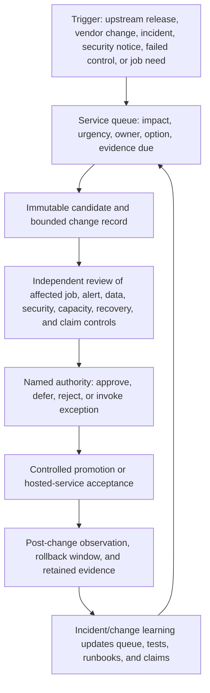

# Release And Change Control

## Reader Question And Evidence Boundary

Can Acme trace, review, accept, release, operate, and learn from changes to a
core monitoring dependency without treating upstream activity as Acme approval?
This control uses the [evidence ledger](../../evidence/evidence-ledger.md),
E-056 through E-060, the existing quality evidence E-009 through E-013, and
the maintenance/contributor evidence E-041 through E-050.
No Acme backlog, change policy, release record, incident review, deployment,
staffing evidence, or vendor change notice was approved. The view therefore
defines the minimum decision boundary; it does not prove that Acme operates it.

## Source-Bounded Delivery Position

| Boundary | Direct evidence | What it supports | What it does not establish |
|---|---|---|---|
| Prioritize and intake | Upstream asks contributors to discuss larger changes and integrations in issues; it gives integration-specific value criteria and currently routes completed branches through issue comments because pull requests are disabled. | There is a public intake route and some stated selection logic. | A general roadmap, service-level priority policy, response commitment, Acme queue, or authority to choose Acme-critical work. |
| Trace | Complete Git history, changelog, issues, releases, and Actions are public. Issue 1309 is a bounded example connecting a request, maintainer/user discussion, fifteen referenced commits, closure, and v4.3 release notes. | A material change can be reconstructed from public artifacts when links exist. | Universal issue-to-commit-to-test-to-release traceability; v4.3 release notes reference an issue for only 4 of 16 listed changes. |
| Review and accept | Contributor guidance requests tests and a description; upstream Tests, Coverage, Mypy, and CodeQL were green at the pin. | Strong upstream regression and contributor-expectation inputs. | Pull-request review/approval evidence for the current route, required-check enforcement, Acme acceptance, production fitness, or human-alert receipt. |
| Release | The repository has 77 lightweight tags and 76 public GitHub releases. Twenty-six tags fall in the 36-month window. v4.3 was published by `cuu508`; its release-triggered Docker workflow succeeded, and manual dispatch is also enabled. | A long-running, active version and image-publication path. | Signed/annotated tag policy, separation of release authority, test-to-publication dependency, Acme promotion approval, rollback, or predictable support windows. |
| Operate cadence | The 36-month history contains 1,348 commits and 26 version tags; the changelog has a current `v4.4-dev` section. | Recurring change and release-review demand exists. | The number of releases Acme should take, urgent-patch timing, fixed monthly effort, hosted change cadence, or sustainable Acme capacity. |
| Learn | Changelog entries record improvements, fixes, breaking dependency changes, and selected issue links; the issue 1309 exchange shows one feedback loop. | Operators can identify many shipped changes and one reviewed learning example. | An Acme incident/change retrospective, control-expiry review, trend loop, or verified closure of deferred work. |

The requested [GitHub/history packet](../../evidence/packets/github-history-and-hosted-ci.md)
was completed by the same collector identity after its initial process-start
failure. The packet and existing registered evidence preserve the hosted-access
limits; direct post-cutoff API inspection was used only to validate
cutoff-bounded release and traceability claims.

## Acme Change Path

## Minimum Authority And Evidence Record

| Decision or action | Minimum accountable role | Required evidence before closure | Exception/rollback authority |
|---|---|---|---|
| Prioritize or defer work | Acme service owner, with primary and deputy named | Trigger, impact tier, option, affected jobs/controls, owner, due or explicit defer rationale | CTO resolves risk acceptance or conflicts affecting the mandate |
| Accept a pull candidate | Technical approver independent of the change preparation when feasible | Immutable upstream version/digest, release/diff review, upstream checks, OI-008 Acme gate, OI-006/OI-007/OI-014 results when affected | Named incident/release authority may stop or roll back; exceptions require CTO approval and expiry |
| Accept a make candidate | Fork maintainer plus independent technical approver and deputy | Every pull record plus fork-diff rationale, upstream-merge result, provenance, regression, security response, documentation, and OI-017 charter | CTO owns fork charter/risk exception; named operator owns stop/rollback |
| Accept a buy service change | Service owner with security/vendor review for material changes | Vendor notice or observed change, affected job/data/identity/notification/contract controls, targeted regression, exit impact, and OI-004 evidence where applicable | CTO owns material contract/risk acceptance; service owner invokes fallback/exit path |
| Promote or configure production | Designated operator; reviewer/approver recorded | Approved candidate/configuration, backup or exit point, rollback/fallback steps, observation owner, and evidence retention location | On-duty named authority may halt/rollback without waiting for the next cadence meeting |
| Close learning work | Service owner and the control owner affected | Cause/contributing factors, corrective work, proof of closure, changed test/runbook/claim, residual risk, and next review trigger | CTO accepts only explicit, time-bounded residual risk |

For a small team, one person may hold several roles, but the same unreviewed
action must not silently become proposal, approval, and irreversible promotion.
When separation is impractical, require a deputy's recorded review before the
change or a time-bounded emergency record with prompt retrospective review.
Names and assignments remain unknown under OI-002, OI-016, and OI-022 in the
[open-items register](../open-items.md).

## Option-Specific Control Delta

| Option | What Acme may reuse | What Acme must own | Current stop condition |
|---|---|---|---|
| Pull | Upstream version history, release notes, source, hosted regression results, and published image workflow | Version selection, risk/diff review, immutable promotion, Acme acceptance/recovery tests, operating observation, rollback, and learning | OI-008 and OI-022; all affected production gates remain applicable |
| Make | Everything available to pull | Every pull duty plus fork priority, design, review, upstream merge, security repair, artifact publication, documentation, release authority, and successor coverage | Keep stopped under OI-017; OI-008 and OI-022 also apply |
| Buy | Public service documentation, terms/status, and vendor-operated runtime | Service-change review, data/security/contract acceptance, job/integration regression, account/billing control, independent alert path, fallback/exit, and learning | OI-004 and OI-022; purchase is not Acme acceptance |

## Work-In-Flight And Learning Loop

Acme's service queue should be the traceable system of record for risk-bearing
work. OI-019 owns the trigger matrix, operating cadence, and evidence-retention
rules. OI-022 owns the immutable change decision record through approval,
deferral, rejection, promotion, stop, or rollback. OI-023 in the
[open-items register](../open-items.md) owns only the link from a completed or
deferred change, incident, or failed-control record to verified closure and the
resulting test, runbook, claim, or control update. It does not create a competing
trigger, cadence, or retention control. This audit does not prescribe a fixed
cadence without Acme workload and ownership evidence.

## Documentation Audience, Currency, And Conflict

- `HC-CODE-001:CONTRIBUTING.md` serves contributors and upstream reviewers. It
  is current at the pinned commit but has no explicit update date and does not
  cover Acme release, rollback, authority, or operating learning.
- `HC-CODE-001:CHANGELOG.md` serves users, operators, and contributors comparing
  releases. Its `v4.4-dev` section and dated v4.3 entry were current at the pin;
  it is release navigation, not an acceptance or support policy.
- `HC-CODE-001:README.md` and Docker guidance serve developers and self-hosting
  operators. They explain mechanics and operator duties, but the documentation
  catalog found only partial production release/rollback/ownership coverage.
- The current pull-request template targets a pull-request path while
  `CONTRIBUTING.md` says pull requests are disabled and routes branches through
  issue comments. That is a current workflow conflict for contributors, not
  proof that changes are unreviewed. Contributor/Vendor Value owns its external
  participation consequence; Code Quality owns test/gate consequences; this
  control preserves only the Acme trace/review ambiguity.

## Material Unknowns And Closure Routes

Acme's service owner, release/change approver, rollback authority, work system,
emergency path, evidence retention, and learning cadence are unknown. OI-022
owns the authority and release/change record; OI-023 owns work-to-learning
traceability. OI-008 retains technical acceptance, OI-019 retains maintenance
cadence, OI-020 retains claim approval, and OI-002/OI-016 retain named coverage.
No source establishes upstream review service levels, a general roadmap,
universal change traceability, or hosted-service change governance.
