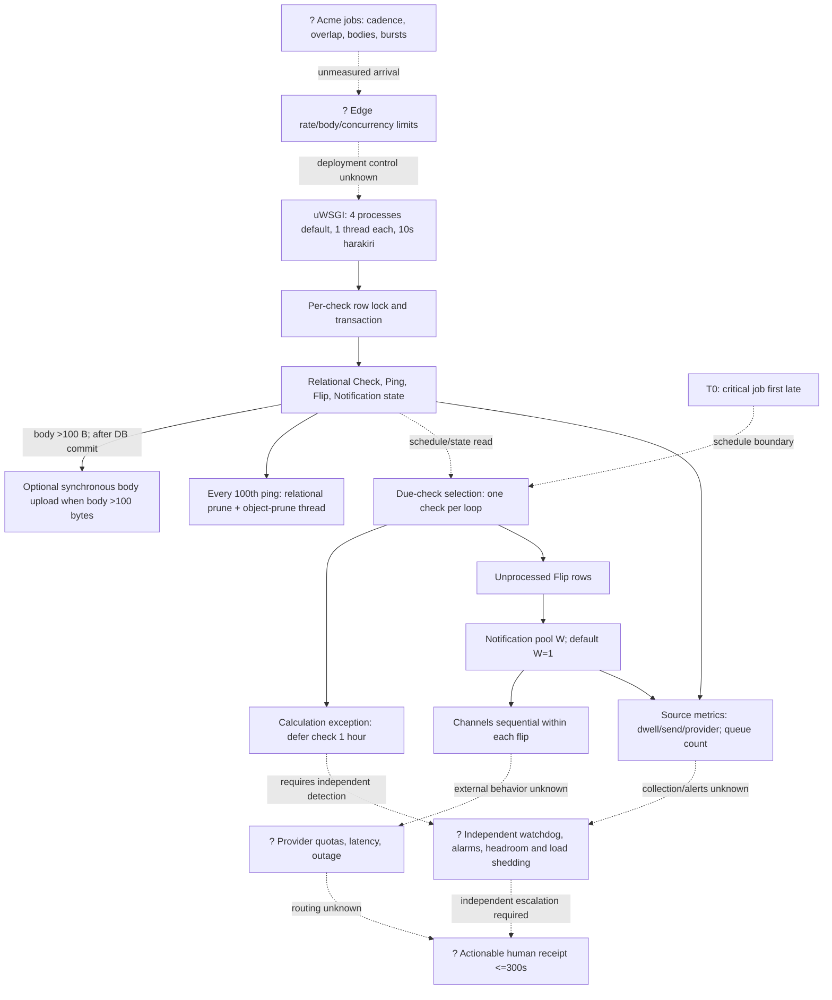

# Bottleneck And Degradation View

## Purpose And Evidence Boundary

This source-bounded view shows where workload can queue, expand, or degrade before an actionable alert. Solid paths are implemented in the pinned source; dashed nodes are required target controls or live evidence not observed. See [E-031](../../evidence/evidence-ledger.md), [E-032](../../evidence/evidence-ledger.md), and [E-033](../../evidence/evidence-ledger.md).

Boundary: `T0` is the first instant a critical job is late against its approved schedule; `T1` is first actionable human receipt. Pass requires `T1 - T0 <= 300 seconds` and no silent loss (OI-006).

## Bottlenecks, Degradation, And Controls

| Boundary | Load amplifier | Source-visible behavior | Missing production control / route |
|---|---|---|---|
| Edge to web | Unknown rate, schedules, and client request size before application truncation | No reviewed source limiter on ping routes; process count configurable | Enforce request/body/concurrency limits and observe rejects; OI-010/OI-014. |
| Web to database | Event multiplicity and same-check overlaps | Every ping writes; same-check requests serialize | Measure transaction/lock wait, connections, errors, saturation; OI-014. |
| Database to retention | Higher `L`, bodies, flips, notifications, dead tuples, prune failure | Automatic prune tied to every 100th ping; full sequential command exists | Alert on prune failures, row/index/dead-tuple and backup growth; OI-007/OI-014. |
| Ping to object storage | Any body >100 bytes; provider latency/outage | Upload follows DB commit but remains on request; retries and 60-second operation timeout | Send no body by default under OI-011; if enabled, bound/test outage and observe object growth. |
| Due scan to flip queue | Many checks late together or one calculation fault | Due checks are handled sequentially; due/unprocessed indexes exist; a calculation exception defers the affected check for one hour | Measure due-scan lag, calculation failures, and oldest unprocessed flip during fleet miss; OI-006/OI-014. |
| Flip to provider | `Burst × C` calls; slow provider; small `W` | `W` defaults 1; channels sequential; processed marking precedes delivery | Size from dwell/quotas; require independent escalation/no silent loss under OI-006. |
| Provider to human | Throttle/outage and unknown escalation | Errors/latency recorded; receipt outside source | Independent provider/channel and T0/T1 evidence; OI-006. |
| Runtime health | Web/database availability versus worker delivery | Container probe checks HTTP and one database query, not alert-worker liveness | Supervise workers and alert independently on worker/queue/dwell health; OI-005/OI-006. |
| Hosted service | Check tier and opaque quotas | Public plan shows 100/1,000 checks; status has current queue metrics | Confirm limits/commitments and run Acme-controlled tests; OI-004/OI-006/OI-014. |

Source contains useful degradation signals, but no approved evidence shows they are collected, alerted, retained, or owned. Unknown capacity is not treated as a bottleneck by itself; absence of measured margin is the production stop condition.
