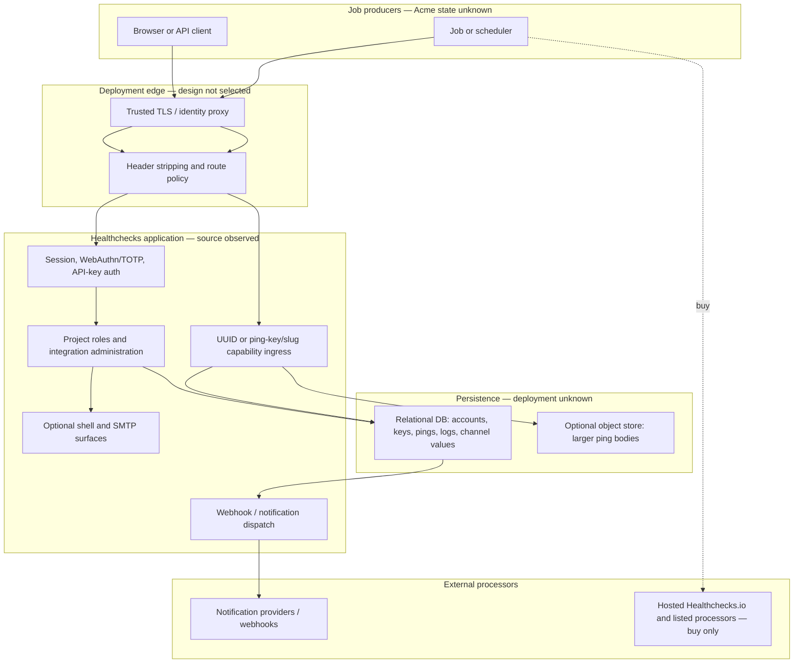

# Identity, Secret, And Data Boundaries

## Purpose And Evidence Boundary

This source-bounded view identifies the identities, capability secrets,
privileged features, stored data, and external trust boundaries that matter to
Acme's pull/make/buy decision. It uses `HC-CODE-001` at the pinned commit and
public hosted-service material in [E-020..E-023 and E-026](../../evidence/evidence-ledger.md).
It is not a live exposure map. Acme ingress, DNS, TLS, identity-provider,
network, secret-store, database, object-store, backup, and hosted contract state
were not observed.

## Source-Bounded Trust And Data Flow

Each ping UUID, and each project ping-key plus slug, is a bearer capability that
can change monitor state. The reverse proxy is also a trust anchor when it
supplies forwarded scheme/IP or remote-user identity headers. Neither boundary
is safe merely because the application is behind a proxy.

## Identity, Privilege, And Offboarding Controls

| Surface | Source-backed behavior | Required control for Acme | Residual limitation |
|---|---|---|---|
| User authentication | Argon2 is first; WebAuthn and TOTP are supported; login and second-factor paths have source-level rate limits. | Require phishing-resistant MFA where supported; retain TOTP only as a controlled fallback; verify recovery/offboarding. | Acme identity policy and live configuration are unknown. |
| Reverse-proxy SSO | Configuring `REMOTE_USER_HEADER` trusts that header and can create/login the named email account. | Permit only a sole trusted proxy to set it, strip all client copies, block direct app ingress, and test impersonation. | No live proxy evidence exists. |
| Project authorization | Owner/member/manager/read-only boundaries are project-scoped, but a regular member can create or revoke project API/ping keys and manage integrations. | Treat regular members as privileged operators; separate projects by sensitivity; review memberships and rotate project-wide keys on privileged departure. | Source has no narrower integration/key-manager role. |
| Management API keys | New keys are prefix plus HMAC digest; legacy plaintext values remain accepted. Read/write scope is project-wide. | Issue only the scope required by a server-side caller; inventory and rotate legacy/shared keys; never place keys in browser code or POST bodies. | `SECRET_KEY` rotation affects HMAC verification and needs a migration plan. |
| Ping identifiers | UUID is immutable; the project ping key can rotate, but one project key plus a slug can address or create checks. | Use one UUID per critical job, avoid slug auto-provisioning in production, and recreate/migrate a check after UUID disclosure. | There is no independent per-check UUID rotation in the reviewed source. |
| Shell integration | Disabled by default; if enabled, a read/write project member can store an arbitrary command that executes as the application OS user. | Keep disabled. If required, isolate a separate least-privilege worker with an allowlist rather than enabling general commands. | Non-root limits OS privilege, but the app user can still access application data and environment secrets. |

## Secret, Payload, And Retention Surface

| Data or secret | Observed source path | Exposure or lifecycle issue | Minimum control |
|---|---|---|---|
| Ping UUID, ping key, slug | URL path, scripts, job configuration, request/access logs | Bearer capability can forge state and may reveal job identity. | Redact paths at every proxy/log layer; store as secret metadata; unique UUID per job; no shared slug path for critical jobs. |
| API keys | Header or POST JSON; digest/legacy value in DB | POST bodies are more likely to be logged; legacy values are stored plaintext. | Header-only callers; legacy-key inventory and rotation; secret manager; project scoping. |
| Ping body and metadata | DB, event UI/API, notification templates; larger bodies may move to object storage | Body can carry job output, credentials, customer data, and host metadata; project viewers can retrieve it. | For critical jobs send no body by default; use an approved redacted schema only when necessary. |
| Integration credentials | `Channel.value` JSON in DB; sent to external providers | Source-level field encryption was not found; backups and DB readers become credential boundaries. | Prefer a scoped Acme relay credential, restrict/encrypt DB and backups, and rotate on membership/provider changes. |
| TOTP/WebAuthn material | Account tables | TOTP secret is a regular field; WebAuthn credential data is stored for verifier use. | Restrict/encrypt database and backups, protect `SECRET_KEY`, and define recovery/revocation. |
| Application/provider logs | DB logging at DEBUG+; some transports persist raw provider responses | Diagnostic data may be sensitive; source shows no general log-retention schedule. | Redact before persistence, lower production verbosity, restrict readers, and enforce deletion. |
| Object bodies | Optional S3-compatible store | Deleting relational records can leave objects until a separate prune command runs. | Schedule/monitor pruning; include the store in encryption, backup, restore, and deletion evidence. |

For buy, public privacy material says the hosted service receives account and
billing data, IP/browser/server log data, check names/descriptions, notification
service credentials, and client IPs; it lists processors and says backups may
retain deleted data for up to two months. A negotiated agreement may differ,
but none is approved evidence. Minimize check names, tags, and ping payloads
before vendor review; minimization is an architecture choice, not a contractual
substitute.

## Scenario Security Gates

| Option | Security position | Gate before production |
|---|---|---|
| Pull | Plausible without a fork; the sample is not a hardened production baseline. | Close [OI-010](../open-items.md#OI-010) and [OI-011](../open-items.md#OI-011), then verify the selected deployment. |
| Make | Adds source ownership and merge/supply-chain exposure. | Use only for a control unavailable by configuration, such as narrower privilege, field-level encryption, rotatable per-check capabilities, or authenticated callbacks. Reapply pull gates and OI-008. |
| Buy | Avoids Acme hosting the application but not visibility or bearer-capability risk. | Complete OI-004, use an approved data contract, and obtain contractual/security evidence appropriate to a core dependency. |

## Known Gaps And Follow-Up

- [OI-004](../open-items.md#OI-004) owns hosted security, privacy, contract, and
  live-control verification.
- [OI-010](../open-items.md#OI-010) owns the self-host hardening baseline and
  deployed proof.
- [OI-011](../open-items.md#OI-011) owns capability, payload, and offboarding
  lifecycle controls.
- No edge exposure view was created because approved live DNS, TLS, WAF,
  certificate, ingress, or reachability evidence does not exist.
