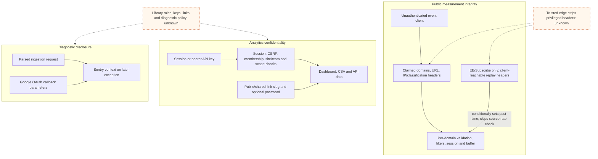

# Application Attack Paths And Controls

## Purpose And Evidence Boundary

- Reader question: Which source-visible application paths can alter measurement integrity or expose analytics/credential data, and where do controls apply?
- Evidence cutoff: 2026-08-20 at onboarding start, America/Toronto.
- Confirmed notation: solid source-implemented edge.
- Conditional/unknown notation: dotted edge requiring deployment, hosted, or use evidence.
- Evidence links: [E-031](../../evidence/evidence-ledger.md#e-031)–[E-034](../../evidence/evidence-ledger.md#e-034), [E-025](../../evidence/evidence-ledger.md#e-025), [E-026](../../evidence/evidence-ledger.md#e-026), and [E-027](../../evidence/evidence-ledger.md#e-027).

## Evidence Dimensions Used

Implementation and repository tests are present. Live ingress/header rewriting, enabled integrations, Sentry operation, role/key/link inventories, hosted internal controls, active exploitation, ownership approval, and legal assessment are unknown.

## Source-Bounded Paths

## Current Source-Bounded Position

| Path | Implemented controls | Source-visible weakness or limit | Closure |
|---|---|---|---|
| Public event submission | One-megabyte body bound, URL/event/property bounds, site existence, optional hostname/IP/country/page filters, bot classification, and configurable per-site rate limits. | Authentication is intentionally absent; claimed domains fan out without a source-visible count limit; first forwarding/classification headers influence identity and filtering. In EE/Subscribe only, client-reachable replay headers conditionally set past time and skip the source rate check. | [OI-011](../open-items.md#oi-011) |
| Staff browser access | Password/2FA attempt limits, CSRF, signed/revocable sessions, renewal on login, membership/site-role checks. | Live 2FA, assignments, session review, and exhaustive route coverage are not proven. | [OI-008](../open-items.md#oi-008), [OI-006](../open-items.md#oi-006) |
| Stats/Sites API | Bearer lookup, keyed hash storage, scope, team/site membership, feature, hourly and burst checks. | Server accepts a client-supplied API secret without a length/strength rule; effective inventories and offboarding are unknown. | [OI-013](../open-items.md#oi-013), [OI-008](../open-items.md#oi-008) |
| Shared/public dashboards | Random slug, optional Bcrypt password, signed slug-bound token, site-bound lookup, segment scope, revocation by deletion. | Shared-link password strength and online-attempt limits are absent from the reviewed source; unprotected links intentionally act as bearer capabilities. | [OI-013](../open-items.md#oi-013), [OI-008](../open-items.md#oi-008) |
| Diagnostics | Sentry is optional; a filter and bounded callback branches exist. | Parsed visitor request context is attached without field redaction; Google callback failures include the complete parameter map. | [OI-012](../open-items.md#oi-012), [OI-010](../open-items.md#oi-010) |

## Material Unknowns And Closure Routes

- [OI-011](../open-items.md#oi-011) requires a synthetic non-production proof that Run and Subscribe strip privileged headers and enforce appropriate hostname/rate/domain controls. No live bypass is claimed.
- [OI-010](../open-items.md#oi-010) and [OI-012](../open-items.md#oi-012) require source correction plus diagnostic-scrubbing validation; live Sentry use and affected records remain unknown.
- [OI-013](../open-items.md#oi-013) hardens optional alternate access. The library can reduce exposure immediately by disabling unused links/API keys through [OI-008](../open-items.md#oi-008).
- No dependency/build-input exploitability note was triggered: the approved sources show locked dependencies and commit-pinned Actions, but no approved vulnerability result or source-visible dependency exploit was established. Deployed provenance remains [OI-005](../open-items.md#oi-005).
