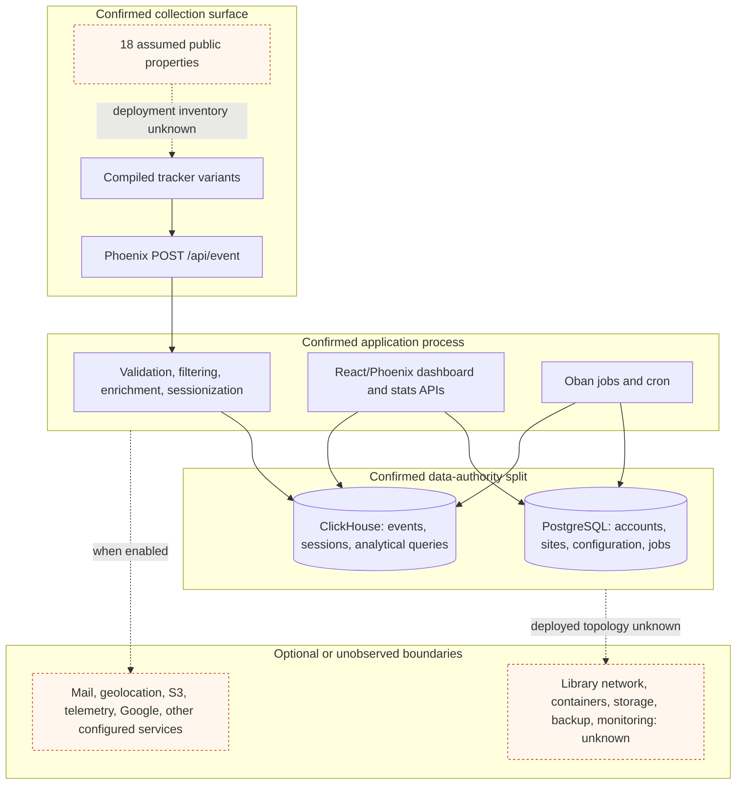

# Component And Data Authority View

## Purpose And Evidence Boundary

- Reader question: Which source-observed components handle collection, application state, analytics data, jobs, and reporting?
- Evidence cutoff: 2026-08-20 at onboarding start, America/Toronto
- Confirmed notation: solid node/edge, implemented in the approved snapshot
- Inferred notation: dashed edge, relationship inferred from adjacent source
- Unknown notation: dotted node/edge, library deployment or external boundary not observed
- Evidence links: [E-001](../../../evidence/evidence-ledger.md#e-001), [E-002](../../../evidence/evidence-ledger.md#e-002), [E-003](../../../evidence/evidence-ledger.md#e-003), [E-004](../../../evidence/evidence-ledger.md#e-004), [E-006](../../../evidence/evidence-ledger.md#e-006)

## Evidence Dimensions Used

Implementation and documented design goals are present. Runtime operation, ownership/approval, capacity/cost, and specialist validation are unknown.

## Diagram

## Known Gaps And Follow-Up

The diagram is not a live DevOps view. Resolve deployment, versions, enabled integrations, and storage/network boundaries through [OI-001](../../../controls/open-items.md#oi-001). Product Value should define the search/registration event contract; continuity/security reviewers should not infer operational controls from these source edges.
