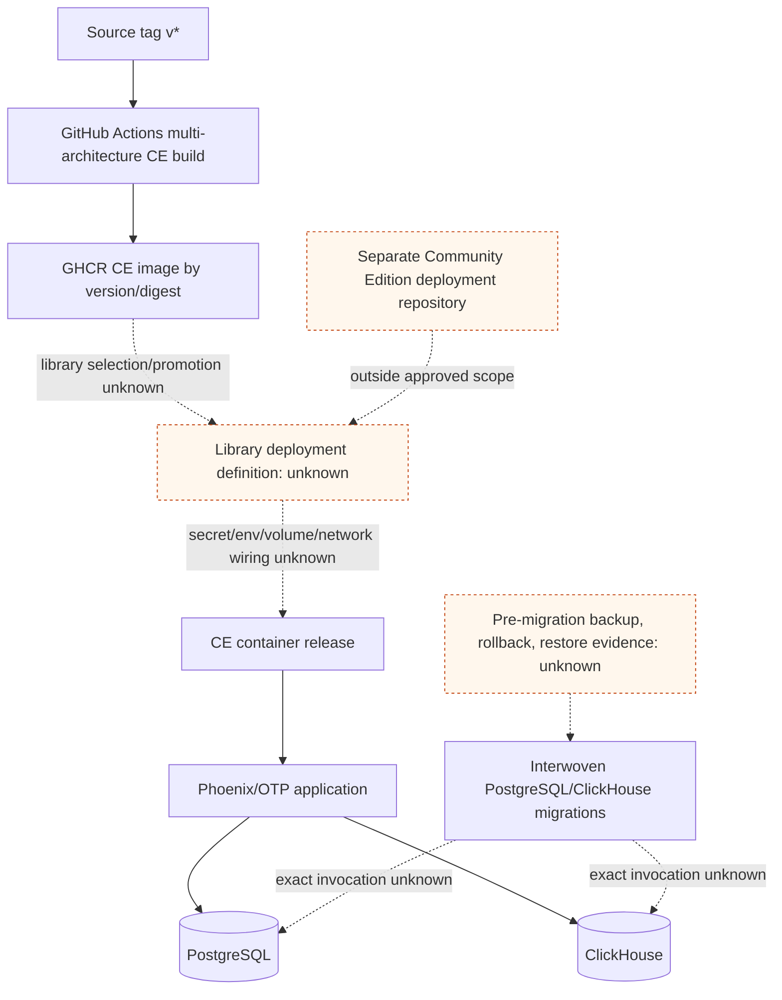

# Deployment And Runtime Path

## Purpose And Evidence Boundary

- Reader question: What release-to-runtime path is visible in approved source, and where does the library-specific deployment become unknown?
- Evidence cutoff: 2026-08-20 at onboarding start, America/Toronto
- Confirmed notation: solid edge, source workflow or image/runtime implementation
- Inferred notation: dashed edge, plausible handoff not observed
- Unknown notation: dotted edge/node, external deployment or operation not approved
- Evidence links: [E-005](../../../evidence/evidence-ledger.md#e-005), [E-006](../../../evidence/evidence-ledger.md#e-006), [E-007](../../../evidence/evidence-ledger.md#e-007), [E-008](../../../evidence/evidence-ledger.md#e-008)

## Evidence Dimensions Used

Build/release implementation and runtime configuration code are present. Hosted workflow execution, library deployment, approval, rollback, and live operation are unknown. E-008 is post-cutoff validation only.

## Diagram

## Known Gaps And Follow-Up

Documented outside audited scope; not independently verified. The separate Community Edition repository is the smallest useful source expansion, but it must be reviewed at the deployed tag and paired with the library's redacted configuration and procedures. Close deployment identity through [OI-001](../../../controls/open-items.md#oi-001) and migration/rollback/recovery proof through [OI-004](../../../controls/open-items.md#oi-004). This is not a live DevOps view.
