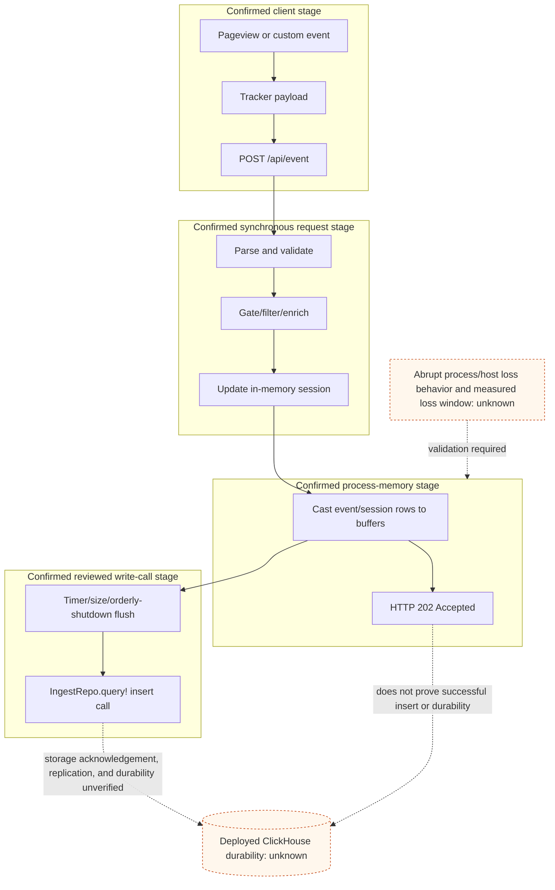

# Event Ingestion And Durability Boundary

## Purpose And Evidence Boundary

- Reader question: At what source-observed point is an event acknowledged, when is a ClickHouse write attempted, and what remains unknown about durability?
- Evidence cutoff: 2026-08-20 at onboarding start, America/Toronto
- Confirmed notation: solid edge, directly implemented
- Inferred notation: dashed edge, bounded consequence inferred from implementation
- Unknown notation: dotted edge/node, live backend/configuration or measured behavior unavailable
- Evidence links: [E-002](../../../evidence/evidence-ledger.md#e-002), [E-004](../../../evidence/evidence-ledger.md#e-004)

## Evidence Dimensions Used

Implementation is present. Live operation, accepted loss tolerance, observed failures, capacity, and approval are unknown.

## Diagram

## Known Gaps And Follow-Up

This view does not assert that production events were lost. The source creates an acknowledged-but-not-yet-written interval whose materiality depends on configuration and the library's tolerance. Set that tolerance in [OI-002](../../../controls/open-items.md#oi-002), identify the live backend through [OI-001](../../../controls/open-items.md#oi-001), and validate representative failure behavior through [OI-003](../../../controls/open-items.md#oi-003).
