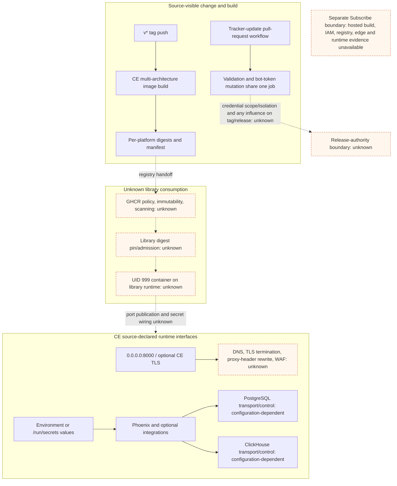

# Deployment And Environment Exposure View

## Purpose And Evidence Boundary

- Reader question: Where can identity, artifact, environment, and network trust change between approved source and a library or hosted runtime?
- Evidence cutoff: 2026-08-20 at onboarding start, America/Toronto.
- Confirmed notation: solid source-declared build/runtime edge.
- Conditional notation: dashed relationship whose enforcement is not observed.
- Unknown notation: dotted deployment, identity, registry, or hosted boundary not accessed.
- Evidence links: [E-007](../../evidence/evidence-ledger.md#e-007), [E-010](../../evidence/evidence-ledger.md#e-010), [E-028](../../evidence/evidence-ledger.md#e-028), and [E-040](../../evidence/evidence-ledger.md#e-040)–[E-043](../../evidence/evidence-ledger.md#e-043).

## Evidence Dimensions Used

Build/release and runtime implementation are present. Public exact-commit CI evidence is present. Tag authority, effective workflow and bot-token permissions, registry controls, promotion/admission, library deployment, hosted deployment, live operation, and ownership/approval are unknown.

## Source-Bounded Exposure Path

## Current Source-Bounded Position

| Stage | Confirmed mechanism | Exposure or unknown | Closure |
|---|---|---|---|
| Change identity | Default branch had enforced merge checks for the exact commit. Tracker NPM publishing uses OIDC. | Tag authority and environment approvals are unknown; tracker repository mutation still uses a bot token. | [OI-005](../open-items.md#oi-005), [OI-016](../open-items.md#oi-016) |
| Pull-request automation | The tracker update job narrows `GITHUB_TOKEN` permissions. | A separate bot token is provided in the same job that later runs pull-request-controlled dependency/install/build code; scope and isolation are unknown. | [OI-016](../open-items.md#oi-016) |
| CE image production | Commit-pinned Actions build digest-addressed platform images and one manifest; base images are digest-pinned. | Public workflow token scopes depend on repository settings; no source-visible SBOM/signature/attestation or quality-workflow dependency was found. | [OI-005](../open-items.md#oi-005) |
| Registry and promotion | Produced digests can be consumed by immutable reference. | Registry policy, scan results, retention, tag mutability, promotion, and library admission are unavailable. | [OI-005](../open-items.md#oi-005) |
| Container and data path | Image runs non-root and exposes an explicit data volume/port. | Deployed digest, security context, volume permissions/sharing, network policy, secret provider, and datastore transport are unknown. | [OI-001](../open-items.md#oi-001) |
| Subscribe | Public hosted security assertions describe control categories. | Hosted CI/CD, IAM, registry, deployment, network, and runtime evidence is non-public and excluded; CE source cannot substitute. | Obtain dated service-specific control evidence and assign retained library/vendor responsibilities through [OI-015](../open-items.md#oi-015). |

## Known Gaps And Follow-Up

Documented outside audited scope; not independently verified. The separate Community Edition repository and the library's redacted deployment definition are the smallest useful Run expansion for image selection, network/volume wiring, and upgrades. For Subscribe, obtain service-specific assurance and responsibility evidence through procurement/security review. Do not use the diagram to claim current exposure, compromise, control effectiveness, or hosted implementation.
