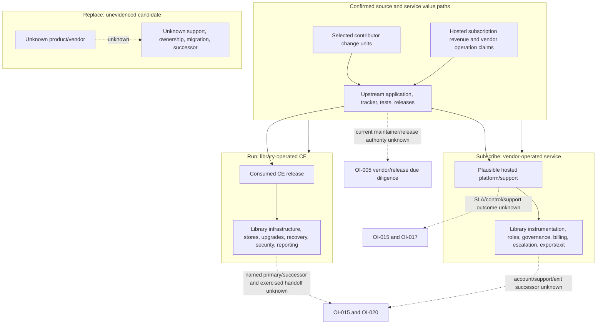

# Ownership, Successor, And Vendor Dependency Map

Reader question: Where does usable value come from, who retains control, and what must transfer if a library operator or vendor path disappears?

## Purpose And Evidence Boundary

- **Evidence cutoff:** 2026-08-20 at onboarding start, America/Toronto.
- **Confirmed notation:** solid arrows and nodes represent source/publicly documented mechanisms or responsibility statements.
- **Unknown notation:** dashed arrows/nodes represent unverified ownership, control effectiveness, or successor readiness.
- **Evidence links:** [E-039](../../evidence/evidence-ledger.md#e-039), [E-051](../../evidence/evidence-ledger.md#e-051), [E-052](../../evidence/evidence-ledger.md#e-052), [E-053](../../evidence/evidence-ledger.md#e-053), [vendor/commercial packet](../../evidence/packets/vendor-ownership-commercial.md).

## Evidence Dimensions Used

Implementation, cutoff-bounded history, repository responsibility statements, contribution/release mechanisms, and public hosted terms are present. Library ownership, current upstream maintainer/reviewer authority, vendor staffing/continuity, negotiated support, observed service operation, current cost, and successor readiness are unknown.

## Diagram

## Current Source-Bounded Position

| Option/boundary | Evidenced usable value | Control and handoff retained by library | External concentration/dependency | What must not be assumed | Closure route |
|---|---|---|---|---|---|
| Run / upstream source | Open source application/tracker, broad source-visible test/release machinery, twice-yearly CE release path, community forum, vulnerability route, and selected feature history across several contributors | Exact artifact choice, infrastructure, PostgreSQL/ClickHouse, backup/recovery, upgrades, edge/security, monitoring, reports/deletion, capacity, vendor/infrastructure accounts, and fork/migration decision | Upstream release/security fixes; separate CE deployment repository; community support; infrastructure/mail/geolocation providers | Selected contributors are not current maintainers or guaranteed successors; available source is not a support commitment or deployment proof | [OI-004](../open-items.md#oi-004), [OI-005](../open-items.md#oi-005), [OI-015](../open-items.md#oi-015), [OI-020](../open-items.md#oi-020) |
| Subscribe / Plausible service | Vendor-operated infrastructure and public support/backup/security claims; application roles, ownership transfer, export mechanisms; direct product funding statement | Instrumentation, event/data rules, staff roles, account security, procurement/billing, quota/report reconciliation, assurance, escalation, export, termination, and successor access | Plausible service, support, hosted controls, pricing/entitlement, subprocessors, and service continuity | Public claims or source contribution do not prove SLA, control effectiveness, support outcome, vendor continuity, library entitlement, or exit completeness | [OI-008](../open-items.md#oi-008), [OI-015](../open-items.md#oi-015), [OI-017](../open-items.md#oi-017), [OI-020](../open-items.md#oi-020) |
| Replace / future shortlist | None in approved evidence | Requirements, procurement, governance, migration, dual-run, data exit, staff transition, and new-account succession | Unknown candidate/vendor/community | Unknown is neither safer nor more transferable | Apply the same evidence, support, licence, portability, release, control-transfer, and successor gates in a funded selection |

## Material Unknowns And Closure Routes

The source does not establish a current upstream bus factor, and this review does not invent one from the top-80% sample. The material transfer problem is instead concrete and already routed: [OI-015](../open-items.md#oi-015) requires named option owners/successors and hosted assurance; [OI-020](../open-items.md#oi-020) requires an exercised library handoff; [OI-005](../open-items.md#oi-005) requires artifact-to-source/release proof. Expense evidence under [OI-017](../open-items.md#oi-017) is required before calling hosted support value cost-effective.

Documented outside audited scope; not independently verified. The separate Community Edition repository is the smallest source expansion for Run deployment/release ownership, but library procedures and a timed handoff remain necessary even if that repository is reviewed.
