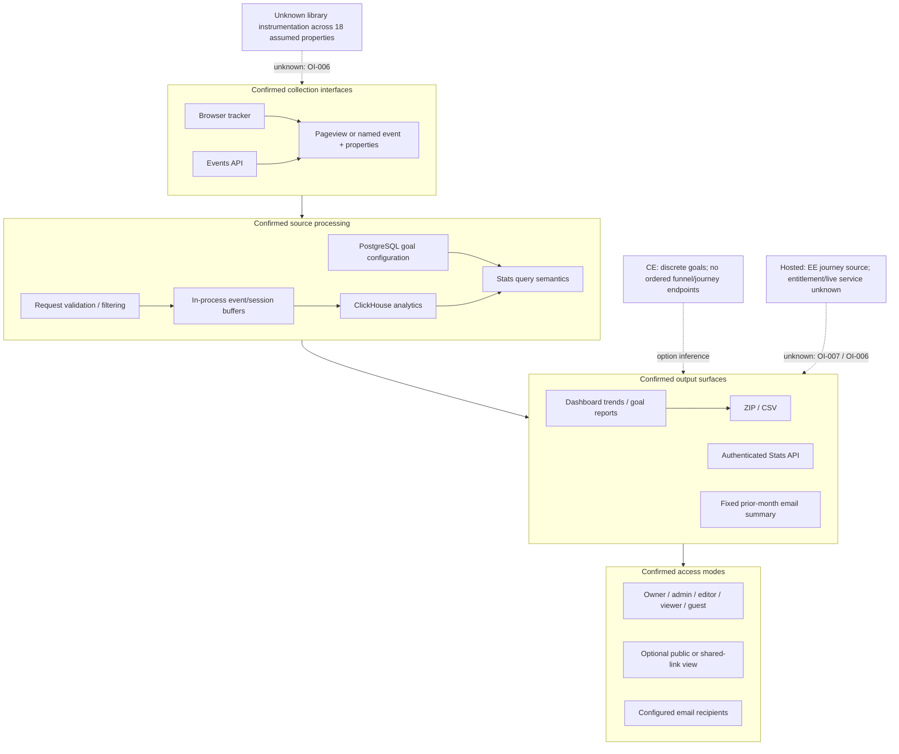

# Product Value Flow

## Purpose And Evidence Boundary

- Reader question: How do library interactions become role-governed reports, and where are the decision boundaries?
- Evidence cutoff: 2026-08-20 at onboarding start, America/Toronto.
- Confirmed notation: solid arrows/nodes are source-implemented.
- Inferred notation: dotted arrows labelled `option inference` are bounded comparisons, not observed operation.
- Unknown notation: dotted nodes/edges labelled `unknown` require validation.
- Evidence links: [E-004](../../../evidence/evidence-ledger.md#e-004), [E-016](../../../evidence/evidence-ledger.md#e-016), [E-017](../../../evidence/evidence-ledger.md#e-017), [E-018](../../../evidence/evidence-ledger.md#e-018), [E-019](../../../evidence/evidence-ledger.md#e-019).

## Evidence Dimensions Used

Implementation and source-documented promises are present. Runtime demonstration, deployment, library approval, specialist sign-off, cost, and hosted operation are unknown.

## Diagram

## Known Gaps And Follow-Up

HTTP 202 is not durability proof ([OI-002](../../open-items.md#oi-002), [OI-003](../../open-items.md#oi-003)). The exact deployed flow and outputs require [OI-001](../../open-items.md#oi-001) and [OI-006](../../open-items.md#oi-006). Whether CE's discrete goals are sufficient for a "journey" requires [OI-007](../../open-items.md#oi-007).
