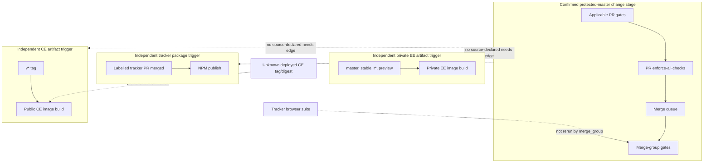

# Test Health And Change-Safety Matrix

## Evidence Boundary

This view covers `primary-code` at commit `9cc669b97ece3ecd37fcb3950791cb3873d7944d`, public GitHub workflow/ruleset evidence effective by the 2026-08-20 cutoff, and narrow read-only checks run afterward against the same pinned snapshot. It does not establish the library's deployed version, production behavior, hosted-service implementation, or any replacement product.

## Evidence Dimensions Used

| Dimension | Position |
|---|---|
| Implementation | Present: tests, workflows, package/build scripts, fixtures, and release definitions. |
| History/rationale | Limited: tracker architecture/changelogs and one exact-commit workflow history. |
| Observed operation | Limited: public CI outcomes for the audited commit; no library runtime or deployment. |
| Ownership/approval | Public default-branch ruleset observed; library acceptance and release/deployment authority unknown. |
| Cost/commercial | unknown; not owned by Code Quality. |
| Specialist evidence | unknown; no independent test, safety, or production-readiness sign-off. |

## Current Source-Bounded Position

### Declared Gate Inventory

| Gate | Trigger and declared command/control | Audited-commit observation | Critical coverage | Material limit |
|---|---|---|---|---|
| Elixir compile and suites | PR, `master`/`stable` push, merge group; strict compile; six `test` and six `ce_test` partitions including slow/migration tags and MinIO where applicable. | Merge group: all 12 partitions successful. | Phoenix/Elixir behavior in EE and CE variants; PostgreSQL and ClickHouse integration; migration-tagged tests. | No coverage measurement; test config uses mocks/sandboxes/manual jobs and is not production runtime. |
| Application E2E | PR, push, merge group; two Chromium Playwright shards after E2E format/type and application build. | 67/67 passed; blob artifacts later expired. | EE dashboard reports, filters, goals, CSV export, team setup, and verification flows. | E2E controller is `on_ee`; this is not CE Run evidence. E2E lint is not invoked; stats fixtures bypass public browser ingestion. |
| Elixir static | PR, push, merge group; format, unused deps, generated-country drift, Credo diff, Dialyzer. | Merge group passed; later push errored during dependency fetch before static commands. | Formatting, dependency hygiene, generated data, code analysis, types. | The post-merge red run coexisted with a successful independent private EE-image build. |
| Dashboard/NPM | PR, push, merge group; generated query types plus clean diff, typecheck, lint/stylelint, format, Jest; tracker lint/format/build. | 505/505 Jest tests passed; workflow successful. | Dashboard client behavior and generated schema/type drift; tracker compilation. | Tracker browser behavior is not run here; installs do not use `npm ci`. |
| Tracker browser | Tracker-changing PR or manual; four Playwright shards, Chromium/Firefox/WebKit. | Not applicable to the audited non-tracker commit; no exact-commit result. | Pageview/custom event, form, callback, SPA, package, and legacy tracker behavior. | No `merge_group`/push trigger; installation-support tests Chromium-only. |
| Migration isolation | Migration-changing PR; fail when most app/config code changes simultaneously. | Not applicable to the audited commit. | Change separation. | Does not prove upgrade/rollback or real data migration. |
| Tracker release controls | Tracker-changing PR; size report, release label, conditional changelog; labelled merged PR publishes NPM package. | Not applicable to the audited commit. | Version/changelog discipline and size visibility. | No size failure threshold; release job does not rerun tests/lint/type checks. |
| Aggregate merge control | PR/merge group `enforce-all-checks`; active master ruleset requires strict status, merge queue, one approval, linear history. | `enforce-all-checks` passed on the audited merge group. | Prevents merge while applicable checks are unresolved. | Conditional workflows absent from merge-group events are not rerun on the synthetic merge commit. |
| CE/private image build | CE `v*` tag; private EE `master`/`stable`/`r*` tag or labelled PR; Docker build/push and image inspection. | Private EE build succeeded on the audited master push; no CE tag evidence. | Compiled tracker/assets and Phoenix release packaging. | Private success is not CE Run evidence. No declared dependency on quality workflows; CE tag provenance and deployed digest unknown. |
| Supporting gates | Codespell; monthly IANA drift; Terraform format/init/validate/plan and master apply; optional pre-commit format/file/YAML hygiene; manual k6 load target. | Codespell passed; others not applicable/not run. | Narrow documentation/data/infrastructure/local hygiene. | Pre-commit is optional; Terraform/load testing were excluded; no capacity conclusion. |

### Exact Executed And Unexecuted Boundary

| Check | Working directory | Outcome | Pass/fail/error/skip | Dependency/authorization boundary | Bounded conclusion |
|---|---|---|---|---|---|
| Public merge-group CI for exact commit | GitHub `plausible/analytics` runs `32291476826`, `32291476808`, `32291476917`, `32291476920` | pass | 4 workflows passed; 12,188 test-case passes (6,468 EE backend, 5,148 CE backend, 67 EE-only application E2E, 505 Jest); 0 observed failures; 0 observed errors; separately, 384 ExUnit exclusions | Existing public metadata; no authentication change. | Counts are executions, not unique tests or coverage; exclusions are not skips; EE-only E2E is not CE Run evidence. |
| Public master-push CI for exact commit | GitHub `plausible/analytics` runs for the same SHA | mixed | 4 workflows passed, 1 failed; failure occurred at dependency fetch before static commands; product-test failures 0 | Existing public metadata. | Later red static workflow was an external registry/dependency-resolution error; independent build still succeeded. |
| `bash -n rel/docker-entrypoint.sh rel/overlays/migrate.sh rel/overlays/pending-migrations.sh tracker/release-update-changelog.sh` | `primary-code:.` | pass | 1 check pass, 0 fail/error/skip | Bash 5.3.3; no dependencies installed. | Four shell files parsed; no behavior or portability proof. |
| `node -e` JSON parsing for package/config/schema files | `primary-code:.` | pass | 6 files parsed, 0 fail/error/skip | Node 24.8.0; no package dependencies used. | Material JSON files are syntactically parseable. |
| `pre-commit validate-config .pre-commit-config.yaml` | `primary-code:.` | pass | 1 check pass, 0 fail/error/skip | pre-commit 4.2.0; hook environments were not installed/run. | Configuration parses; hooks did not execute. |
| `git show --check --oneline --format= <audited-sha>` | `primary-code:.` | initial access error; final pass | Initial attempt: 1 access error. Final retry: 1 pass, 0 fail/error/skip. | Partial clone initially could not resolve GitHub to fetch a promised object; approved public-network retry fetched it. | The final check found no Git-reported whitespace error in the audited patch. |
| Local Elixir, CE, E2E, Jest, tracker Playwright, lint/type/static, build, migration, image, Terraform, and load checks | `primary-code:.` | blocked/unexecuted | product tests: 0 pass, 0 fail, 0 error, 0 skip locally | Elixir/Mix, `_build`, `deps`, all Node dependency trees, browsers, databases, Terraform, and generated outputs absent; install/restore/provision/load actions prohibited. | No local product behavior or local coverage conclusion. Hosted results above remain separate. |

Coverage position: **blocked**. ExCoveralls and Jest coverage configuration exist, but no inspected CI command collected coverage or enforced a threshold, no retained coverage artifact was available, and local measurement required prohibited restoration and services. No audited result establishes line, branch, function, or critical-path coverage.

### Critical Path And Fixture Provenance

| Path/contract | Source test evidence | Fixture provenance | What green evidence covers | What it does not cover |
|---|---|---|---|---|
| Tracker event creation and delivery | 25 tracker Playwright files cover pageviews, custom properties, forms, callbacks, routing, package init, and legacy behavior. | Independently built browser fixtures. | Browser-side payload and interaction behavior when suite runs. | No audited-commit run; no merge-group rerun for tracker changes; no server persistence/dashboard result. |
| Public `/api/event` and buffered persistence | `external_controller_test.exs` exercises responses and persisted reads; helpers explicitly flush event/session buffers. `write_buffer_test.exs` checks survival of a linked child exit. | Independently built ExMachina data; repository test databases. | Validation, response, explicit flush, and one linked-process regression. | Abrupt buffer/host loss, ClickHouse write failure/retry, accepted-versus-stored reconciliation, and configured loss window. |
| Dashboard reports, goals, filters, exports, teams | 12 application E2E spec files; exact commit ran 67 tests. | Independently built TypeScript `Event` contract and E2E-only `on_ee` controller using factories/test utilities. | EE browser dashboard behavior against inserted PostgreSQL/ClickHouse test data. | CE Run behavior; browser tracker to public ingestion to buffered storage to dashboard as one journey; production traffic/data correctness. |
| Query API schema to dashboard types | JSON schema drives auto-generated `query-api.d.ts`; NPM CI regenerates and requires a clean diff. | Repository-generated, drift-checked artifact; runtime/production provenance unestablished. | Schema-to-TypeScript drift at generation time. | Runtime response conformance or every manually defined E2E fixture. |
| Migrations | Release tests create test repos and verify interwoven ordering from a historical v2.0.0 state; CI explicitly includes migration-tagged tests. | Independently built/faked applied-version state. | Ordering logic and database creation in test services. | Library's exact deployed upgrade dataset, rollback, partial failure, backup/restore. |
| CSV and third-party response fixtures | Stored expected CSV files and JSON/XML service-response fixtures support controller/import tests. | Unknown production provenance. | Stable expected outputs for covered cases. | Real production-source fidelity, completeness, or continuing third-party contract currency. |

### Change-Gate To Release Boundary

## Material Unknowns And Closure Routes

- Close deployed artifact and quality provenance through [OI-005](../open-items.md#oi-005), coordinated with deployment inventory [OI-001](../open-items.md#oi-001) and dual-store upgrade/recovery proof [OI-004](../open-items.md#oi-004).
- Close the acknowledged-but-not-durable test gap through [OI-003](../open-items.md#oi-003) after service tolerance [OI-002](../open-items.md#oi-002) is decided.
- No source or public CI evidence proves hosted-service behavior or any replacement product's quality; those options need their own evidence.
