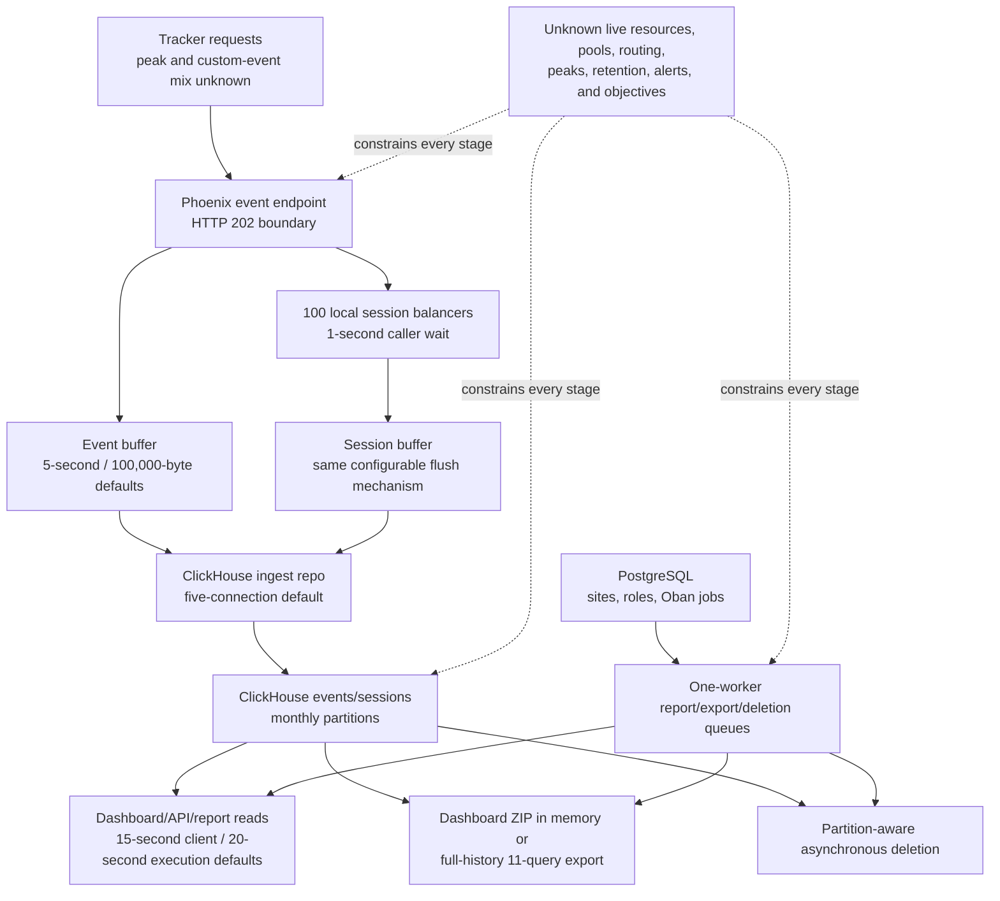

# Capacity Envelope And Degradation View

Reader question: What demand can be described from the approved evidence, where can Plausible degrade, and what must be verified before calling Run or Subscribe dependable as use grows?

## Evidence Boundary

This view uses the working assumptions recorded in [E-046](../../evidence/evidence-ledger.md#e-046), the approved `primary-code` snapshot at commit `9cc669b97ece3ecd37fcb3950791cb3873d7944d`, predecessor evidence E-001/E-003/E-004/E-035–E-045, and new source traces [E-047](../../evidence/evidence-ledger.md#e-047)–[E-050](../../evidence/evidence-ledger.md#e-050). The 18 properties, 2 million visits/year, 14 million pageviews/year, 25 staff, and seasonal peaks are unverified planning assumptions.

No deployment, resource configuration, live visitor traffic, queue state, datastore size, performance metric, hosted runtime, or replacement candidate was inspected. No load or failure test was run. Source defaults and a repository load-test fixture are not production capacity evidence.

## Evidence Dimensions Used

Implementation, configuration defaults, public quota/commercial rules, and working-assumption arithmetic are present. Observed operation, exact deployed topology, resource sizing, actual peak demand, ownership/approval, measured capacity, service objectives, hosted control effectiveness, replacement capacity, and total cost are unknown.

## Current Source-Bounded Position

### Demand baseline and variables

| Dimension | Transparent position | What it can establish | What remains unknown |
|---|---|---|---|
| Average pageviews | `14,000,000 / 12 = 1,166,666.67/month`; `14,000,000 / 365 = 38,356.16/day`; `14,000,000 / 31,536,000 = 0.4439/second` | Arithmetic on the working assumption only. | Actual monthly/day/hour distribution, peak-to-average factor, retries/bots, pageview correctness. |
| Visits | `2,000,000/year`; `14,000,000 / 2,000,000 = 7` assumed pageviews/visit | A consistency check for the planning assumptions. | Actual session shape and whether process/replica routing preserves it. |
| Custom events | `C_m = search events + registration-stage events + other named events` | Custom events increase ingest/storage demand and hosted billable volume. | Event taxonomy, custom-event-to-pageview ratio, payload/property size, retries, duplicate rate. |
| Peak ingress | `I_peak = maximum accepted pageviews + custom events per second over an approved peak window` | The workload input needed to test ingestion and session processing. | No measured or approved peak window/value exists. Uniform annual averages are not a proxy. |
| Staff/report demand | Up to 25 assumed staff across 18 properties; a configured monthly email performs five ClickHouse queries/site. | If every assumed site enabled the email, a reporting boundary could generate `18 x 5 = 90` ClickHouse queries, handled by a queue configured for concurrency one per Oban instance. | Which sites use built-in email, time zones, recipient counts, Oban instance count, simultaneous dashboard/API/CSV use, and acceptable completion time. |
| Data growth | `D_m = encoded event/session rows + indices/parts + PostgreSQL/jobs + exports/backups` | Identifies the categories that must be measured. | Bytes/row, compression, merge amplification, retention, current size, backup/export size, storage headroom. |

### Source-visible demand and degradation path

The edges and defaults are confirmed implementation from [E-003](../../evidence/evidence-ledger.md#e-003), [E-004](../../evidence/evidence-ledger.md#e-004), and [E-047](../../evidence/evidence-ledger.md#e-047)–[E-050](../../evidence/evidence-ledger.md#e-050). The workload values, live resource limits, and failure thresholds are unknown.

### Bottleneck and degradation register

| Boundary | Source-visible control or limit | Expected degradation signal | Consequence for the library | Evidence status and closure |
|---|---|---|---|---|
| Event/session processing | In-process buffers; five ingest connections by default; 100 local session balancers; one-second session-processing wait. | Buffer mailbox growth, session-processing timeout, ClickHouse queue/timeout, dropped/failed requests, or accepted-to-stored mismatch. | Peak registration/search measurement can become incomplete or session metrics can diverge. | Mechanisms confirmed, limit unknown: [E-004](../../evidence/evidence-ledger.md#e-004), [E-047](../../evidence/evidence-ledger.md#e-047); tolerance [OI-002](../open-items.md#oi-002), capacity proof [OI-019](../open-items.md#oi-019). |
| Horizontal application scaling | CE session caches/balancers are process-local; optional Unix-socket cache handoff targets deployment turnover and readiness records attempt, not success. | Same visitor handled by different processes can lose a shared in-memory session view unless deployment routing/transfer supplies the missing boundary. | Visits, bounce rate, duration, and views/visit can be distorted even when pageviews continue. | Conditional design risk, not observed failure: [E-049](../../evidence/evidence-ledger.md#e-049); inventory and reconciliation in [OI-001](../open-items.md#oi-001)/[OI-019](../open-items.md#oi-019). |
| Interactive dashboard/API | Read queries default to 15-second client and 20-second server execution limits; public API is rate limited, while CE source defaults those limits to 1,000,000/hour and 1,000,000/10 seconds. | Query timeout, connection queueing, HTTP failure, slow dashboard, or API throttle where effective limits differ. | Staff can lose timely access while collection remains healthy. | Source limits confirmed; live pool, query mix, latency and effective API configuration unknown: [E-048](../../evidence/evidence-ledger.md#e-048), [E-041](../../evidence/evidence-ledger.md#e-041). |
| Dashboard CSV | Up to 23 selectable report types; default parallelism three; ZIP assembled in application memory; most results cap at 300 rows and pages/exit pages at 100 because larger sets are documented to cause failures. | Slow/failed request, application memory pressure, or intentionally truncated breadth. | A monthly reporting workflow may be incomplete or contend with interactive use. | Source behavior confirmed; library export selections and memory/latency unmeasured: [E-048](../../evidence/evidence-ledger.md#e-048). |
| Built-in monthly email | Five ClickHouse queries/site, report queue concurrency one, one job attempt; mail failure visibility defect is already recorded. | Queue delay, query timeout, missed/late report, or silent delivery failure. | Required monthly reporting can trail the first-of-month boundary. | Source behavior confirmed; actual enabled sites/schedule/backlog unknown: [E-036](../../evidence/evidence-ledger.md#e-036), [E-048](../../evidence/evidence-ledger.md#e-048), [OI-014](../open-items.md#oi-014). |
| Full analytics export | One export worker; 11 grouped queries over available history; dedicated connection disables query-execution timeout; worker timeout 15 minutes and up to three attempts. | Long queue, timeout/retry, repeat work, datastore contention, or storage/mail dependency failure. | Exit/backup/report work can be delayed and can compete with dashboard reads. | Source behavior confirmed; data size, duration and isolation unmeasured: [E-048](../../evidence/evidence-ledger.md#e-048). |
| Data growth and deletion | Month-partitioned analytics tables; no core-table TTL found in approved migrations; single deletion worker submits partition and table deletes; CE source cron does not schedule it. | Disk/part growth, slower historical queries/backup/export, mutation pressure, pending deletion. | Capacity, governance, and reporting can degrade together as history grows. | Design confirmed, live growth/retention/completion unknown: [E-037](../../evidence/evidence-ledger.md#e-037), [E-050](../../evidence/evidence-ledger.md#e-050), governance [OI-008](../open-items.md#oi-008). |
| Observability | PromEx/OpenTelemetry and queue/cache/buffer metrics exist, but PromEx is disabled by default and the session-buffer metric targets the event buffer again. | Saturation can be detected late or attributed incorrectly. | Operators may scale or recover the wrong component after degradation. | Mechanism/defect confirmed, enabled alerts/owners unknown: [E-035](../../evidence/evidence-ledger.md#e-035), [OI-014](../open-items.md#oi-014). |
| Hosted quota and service | Public billing counts pageviews plus custom events and can lock dashboards after sustained overage; public terms do not guarantee uninterrupted service. | Upgrade notice, procurement delay, dashboard lock, provider degradation, or support delay. | Subscribe can interrupt reporting even though collection may continue. | Commercial rule confirmed; service capacity/SLA and library quote unknown: [E-039](../../evidence/evidence-ledger.md#e-039), [E-045](../../evidence/evidence-ledger.md#e-045), [OI-015](../open-items.md#oi-015), [OI-017](../open-items.md#oi-017), [OI-019](../open-items.md#oi-019). |

### Option-specific capacity position

| Option | What current evidence supports | Stop condition before calling it dependable | Reasonable next mitigation |
|---|---|---|---|
| Run | The source exposes configurable buffers, datastore roles, query timeouts, queues, partitions, telemetry, and transfer hooks. The annual-average assumption is not itself evidence of a large workload. | No deployed topology/resource/pool/retention evidence; no peak/event/query profile; no measured degradation; scale-out session correctness and recovery tolerance unresolved. | Keep a simple exact-topology baseline, isolate/sequence heavy export/deletion work, define retention and report priority, instrument queue/buffer/query/storage signals, then run the bounded non-production exercise in [OI-019](../open-items.md#oi-019). Do not add replicas until routing/session reconciliation is proven. |
| Subscribe | Infrastructure operation transfers to the vendor and public billing rules expose a usage gate. | No hosted service-capacity, rate-limit, fair-use, SLA, degradation, support, or 18-site/25-member entitlement proof. Quota is billable volume, not technical capacity. | Obtain one dated Enterprise or accepted multi-team response covering peak/event volume, API/report/export limits, service objectives, support and escalation; reconcile monthly demand through [OI-017](../open-items.md#oi-017). |
| Replace | The unresolved event, reporting, role, privacy, peak, retention, export, recovery, and ownership requirements form a future evaluation envelope. | No candidate, architecture, price, migration, or capacity evidence is approved. | Preserve [OI-019](../open-items.md#oi-019) as the workload/acceptance fixture for a later funded shortlist; do not infer that replacement scales better. |

## Material Unknowns And Closure Routes

[OI-019](../open-items.md#oi-019) is the single capacity-proof route. It first uses approved aggregate reports—without inspecting live visitor traffic—to replace annual averages with monthly/daily/hourly counts, custom-event mix, peak windows, report/query concurrency, retention, and overlap assumptions. Only after [OI-001](../open-items.md#oi-001) inventories the exact Run topology and [OI-002](../open-items.md#oi-002) defines loss/outage tolerances should an explicitly approved, non-production capacity/degradation exercise be run.

Preserve [OI-007](../open-items.md#oi-007): ordered-funnel requirements change query and option shape. Preserve [OI-008](../open-items.md#oi-008): retention and event design are governance decisions, not capacity optimizations. Preserve [OI-017](../open-items.md#oi-017): the same monthly event profile drives Subscribe quota/cost proof. No current source supports a numeric safe throughput, data volume, replica count, or response-time claim.
