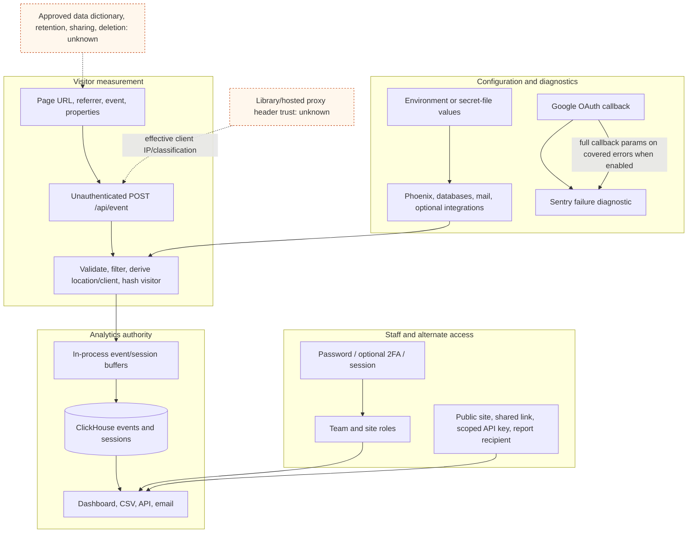

# Identity, Secret, And Analytics Data Flow

## Purpose And Evidence Boundary

- Reader question: Where do visitor measurements, staff identities, access paths, and secrets cross source-visible trust boundaries?
- Evidence cutoff: 2026-08-20 at onboarding start, America/Toronto.
- Confirmed notation: solid source-implemented edge.
- Inferred notation: dashed bounded consequence.
- Unknown notation: dotted live, hosted, or governance boundary not inspected.
- Evidence links: [E-023](../../evidence/evidence-ledger.md#e-023)–[E-027](../../evidence/evidence-ledger.md#e-027).

## Evidence Dimensions Used

Implementation and cutoff-effective public privacy guidance are present. Library runtime operation, approved data definitions, ownership, access assignments, retention, deletion completion, hosted internal controls, and legal applicability are unknown.

## Source-Bounded Flow

## Current Source-Bounded Position

| Surface | Source-visible control | Material limit / closure |
|---|---|---|
| Default visitor processing | Raw IP and User-Agent are transient inputs; ClickHouse schemas store a daily-derived visitor ID and coarse location/client attributes, not raw IP/User-Agent. Body, URL and property sizes are bounded ([E-024](../../evidence/evidence-ledger.md#e-024)). | URLs and scalar custom properties can still contain identifiers or sensitive search/registration content. Approve and test the data contract through [OI-008](../open-items.md#oi-008). |
| Daily visitor boundary | A midnight job rotates salts; previous-salt lookup preserves a session across one rotation for at most the source's 30-minute session window ([E-024](../../evidence/evidence-ledger.md#e-024)). | Public wording and implementation semantics appear mismatched: the policy says a salt is rotated and deleted every 24 hours, while source deletes database salts older than 48 hours and supports one bounded cross-rotation lookup. The wording may denote a different lifecycle boundary; reconcile rather than assume contradiction through [OI-009](../open-items.md#oi-009). |
| Staff authentication | Password hashing, optional 2FA routes, expiring/revocable sessions, CSRF, and route/plug authorization are implemented ([E-025](../../evidence/evidence-ledger.md#e-025), [E-027](../../evidence/evidence-ledger.md#e-027)). | Library 2FA, assignments, offboarding, session/device review, and hosted internal access are not evidenced. Coordinate [OI-006](../open-items.md#oi-006) and [OI-008](../open-items.md#oi-008). |
| Intentional alternate access and delivery | Public dashboards, optional password-protected shared links, scoped API keys, and report recipients are governance surfaces in addition to signed-in member roles; CSV is an authenticated output surface ([E-025](../../evidence/evidence-ledger.md#e-025), [E-018](../../evidence/evidence-ledger.md#e-018), [E-019](../../evidence/evidence-ledger.md#e-019)). | Effective visibility, recipients, keys, use logs, and ownership are unknown. This is not evidence of an authorization defect. Close governance through [OI-008](../open-items.md#oi-008). |
| Secret consumers | Runtime validates required secret/key material, supports secret files, hashes API keys, and renews sessions ([E-025](../../evidence/evidence-ledger.md#e-025), [E-027](../../evidence/evidence-ledger.md#e-027)). | Tracked dev/test files contain static credential-shaped values; production reuse is not evidenced. Deployment/config inventory remains [OI-001](../open-items.md#oi-001). |
| Diagnostic path | User/site context can be attached to Sentry. Covered Google callback error paths send the full parameter map ([E-027](../../evidence/evidence-ledger.md#e-027)). | A short-lived authorization code and signed state can enter diagnostics if Google and Sentry are enabled. Correct and verify through [OI-010](../open-items.md#oi-010). |
| Deletion | Site removal records a pending deletion and a scheduled worker asynchronously issues site-scoped ClickHouse deletions ([E-025](../../evidence/evidence-ledger.md#e-025)). | Completion time, backup expiry, failures, and Run/Subscribe retention are unknown. [OI-008](../open-items.md#oi-008); Continuity/Cloud own effective deletion and backups. |

## Material Unknowns And Closure Routes

- [OI-008](../open-items.md#oi-008) is the governing decision for collected fields, redaction, retention, deletion, roles, keys, sharing, email, and offboarding.
- [OI-009](../open-items.md#oi-009) reconciles an absolute public privacy claim with bounded source behavior.
- [OI-010](../open-items.md#oi-010) removes a source-visible diagnostic secret path.
- [OI-011](../open-items.md#oi-011) validates proxy/header trust and anti-poisoning controls. No live edge view was created because DNS/TLS/ingress/WAF/reachability evidence was not approved.
