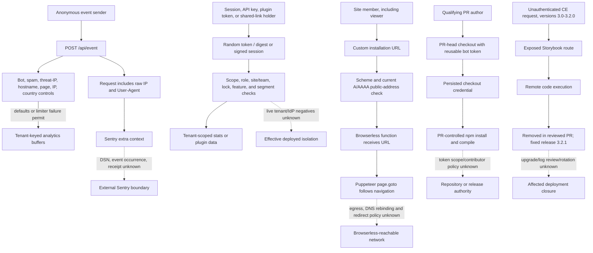

# Application Attack Paths And Controls

Reader question: Which source-visible application paths can cross identity, tenant, data, integrity, or outbound-fetch boundaries, and which controls materially constrain them?

## Evidence Boundary

This view is bounded to public source at `primary-code` commit `9cc669b97ece3ecd37fcb3950791cb3873d7944d`, its tests and pre-cutoff Git/GitHub history. It is a source review, not a penetration test. No request was sent to a Plausible, Browserless, tenant, CI, Sentry, or dependency service. Runtime configuration, edge enforcement, token scope, Browserless network topology, deployed versions, and actual exploitation are unknown.

## Evidence Dimensions Used

| Dimension | Position |
|---|---|
| Implementation | Present for the routes, inputs, guards, sinks, workflows, and tests listed below. |
| History/rationale | Present for GitHub Discussion #183, PR #6186, PR #6344, PR #6512, issue #6500, PRs #6501/#6520, and GHSA-mhcv-h7gf-57cf. |
| Observed operation | Unknown; no live application, tenant, CI, Sentry, Browserless, or deployment exercise was authorized. |
| Ownership/approval | Code-review metadata exists for selected PRs; current security risk acceptance and operational ownership are unknown. |
| Cost/commercial | Unknown; no abuse volume, ingest cost, or incident-loss record was obtained. |
| Specialist evidence | Source-level Application Security analysis is present; Cloud Security, privacy/legal, and incident-response conclusions remain outside this view. |

## Source-Bounded Paths

## Attack-Path And Control Matrix

| Path | Entry and attacker-controlled input | Material sink or asset | Implemented controls | Residual exploitability and consequence | Evidence and closure |
|---|---|---|---|---|---|
| Ingestion error-context disclosure | Anonymous event fields plus connection IP/User-Agent | Optional external Sentry event context | Input length/count bounds and a Sentry filter that changes the event fingerprint | The complete built request is attached before processing; no redaction is visible. Disclosure is conditional on Sentry configuration and event capture, but source permits visitor identifiers to cross the vendor boundary. | [E-037](../../evidence/evidence-ledger.md#e-037); [OI-015](../open-items.md#oi-015) |
| Analytics poisoning and resource abuse | Anonymous domain-keyed event | Tenant analytics integrity and ingest/storage resources | Bot/User-Agent, referrer-spam, datacenter/threat-IP, hostname, page, IP, country, and optional per-site rate controls | Maintainers acknowledge spoofability. Hostname allowlisting is opt-in, a site threshold can be absent, and rate-limiter failure permits traffic. Actual volume, bypass rate, and cost are unknown. | [E-039](../../evidence/evidence-ledger.md#e-039); [OI-016](../open-items.md#oi-016) |
| Session/API/plugin/shared-link tenant access | Token, cookie, scope, team/site identifier, or shared-link slug | Tenant statistics, site configuration, and plugin-visible data | Cryptorandom tokens; signed sessions; database session expiry/revocation; API/plugin digest storage; scope, membership, team/site, plan-lock, role, password, and segment checks; negative tests | No source-visible bypass was established in the reviewed paths. Live secret rotation, IdP flows, offboarding, route completeness, and tenant-negative-path effectiveness remain unproved. | [E-038](../../evidence/evidence-ledger.md#e-038); [E-043](../../evidence/evidence-ledger.md#e-043); [OI-013](../open-items.md#oi-013) |
| Browserless installation verification SSRF | Authenticated site member, including viewer, supplies a custom URL | Network reachable by the separate Browserless browser | Path controls are a URL scheme/current-A/AAAA public-address check and three checks/hour per site. The stronger `Plausible.SSRF.get/2` IP-pinning/per-redirect control protects other call sites and is **not** used for this Browserless fetch. | Installation checks validate DNS before forwarding the URL, then Browserless independently runs `page.goto`. The reviewed application source does not apply IP pinning or redirect revalidation at that actual browser fetch. Exploitability depends on Browserless DNS, redirect, sandbox, and egress controls not in scope. | [E-044](../../evidence/evidence-ledger.md#e-044); [OI-019](../open-items.md#oi-019) |
| Tracker PR credential crossing untrusted code | Qualifying PR controls tracker source and package metadata/scripts | Reusable bot credential and repository/release integrity | Commit-pinned actions; job declares read contents/write PR permissions; workflow path filter | Checkout receives the reusable bot token and does not disable credential persistence before PR-controlled `npm install` and compilation. Whether an attacker can trigger the job and what the PAT can modify remain unknown, but the credential-to-code route is source-visible. | [E-040](../../evidence/evidence-ledger.md#e-040); [dependency/build note](dependency-and-build-input-exploitability.md); [OI-017](../open-items.md#oi-017) |
| Public Stats API invalid `page` | Authenticated API caller controls `page` | Controller availability/error path | Other parameters have validation and API authorization/rate limits apply | `String.to_integer/1` raises on a non-integer. The effect is a contained request error, not an authorization bypass; proposed fixes were still open at the cutoff. | [E-017](../../evidence/evidence-ledger.md#e-017); [OI-007](../open-items.md#oi-007) |
| Historical Storybook RCE | Anonymous request to affected CE deployment | Application process and its secrets/data | Storybook was removed in reviewed PR #6344 and release 3.2.1 fixed the published affected range | The critical path is removed at the pinned source, but Plausible-controlled exposure, upgrade adoption, access-log review, and secret rotation were not proved. No current exploitability is inferred. | [E-041](../../evidence/evidence-ledger.md#e-041); [OI-020](../open-items.md#oi-020) |

## Current Source-Bounded Position

The strongest affirmative controls are the token/session construction, digest storage, scope and tenant checks, shared-link constraints, and direct HTTP SSRF helper with IP pinning and per-redirect revalidation. The material unresolved application routes are narrower: request disclosure to optional Sentry, intentionally permissive analytics ingestion, a reusable credential crossing PR-controlled execution, and a Browserless handoff where the application validates the URL before—but not at—the actual browser network boundary. The historical Storybook RCE is remediated in pinned source but lacks deployment-response closure.

Bounded React/HEEx and JavaScript inspection found framework escaping on reviewed customer-controlled URL/property/referrer displays and explicit escaping before a funnel tooltip's `innerHTML`; no material stored-XSS path was established. This is not a comprehensive sink absence claim.

## Material Unknowns And Closure Routes

- Close [OI-015](../open-items.md#oi-015), [OI-016](../open-items.md#oi-016), and [OI-017](../open-items.md#oi-017) through their existing correction/decision routes; Application Security confirms their source exploitability without duplicating the baseline privacy, product, or cloud conclusions.
- Enforce the restricted-address and redirect policy at the actual Browserless fetch boundary and verify egress isolation through [OI-019](../open-items.md#oi-019).
- Reconstruct Plausible-controlled affected-version exposure and incident-response closure for the fixed Storybook advisory through [OI-020](../open-items.md#oi-020).
- Retain [OI-007](../open-items.md#oi-007) and [OI-013](../open-items.md#oi-013) for the contained Stats input defect and tenant-effective access proof. Runner, network, secret, registry, and deployed-control effectiveness require separate Cloud Security evidence; ownership remains as assigned in the linked open items.
