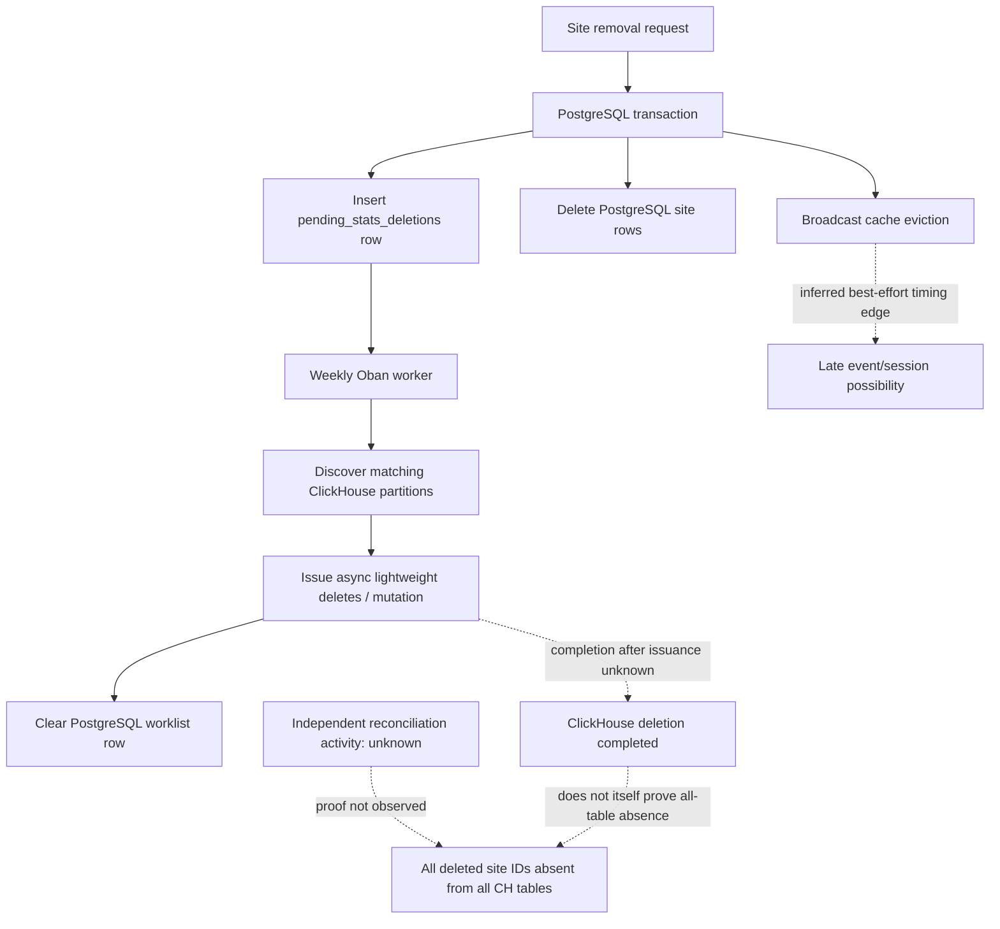

# Cross-Store Site Deletion Consistency Path

## Purpose And Evidence Boundary

- Reader question: Where does deletion intent cross from PostgreSQL to ClickHouse, and where is completion unknown?
- Evidence cutoff: 2026-08-22 22:08:28 EDT
- Confirmed notation: solid node/edge, observed in source/history
- Inferred notation: dotted edge labelled `inferred`
- Unknown notation: dotted node/edge labelled `unknown`
- Evidence links: [E-005](../../../evidence/evidence-ledger.md#e-005), [ADR-007](../adr/ADR-007-postgresql-worklist-for-clickhouse-site-deletion.md)

## Evidence Dimensions Used

Implementation and public PR rationale/review are present. Production mutation state, completion, reconciliation, ownership, and approval are unknown.

## Diagram

## Known Gaps And Follow-Up

`[Verified fact]` The source clears intent after asynchronous issuance, not after source-visible completion. `[Verified fact]` PR review challenged cross-store convergence and the final PR description retains a small spanning-session edge. `[Unknown]` Whether live reconciliation and mutation alerts close those gaps. Close [OI-002](../../open-items.md#oi-002); Security/Privacy and Business Continuity must not infer deletion effectiveness from this source flow.
