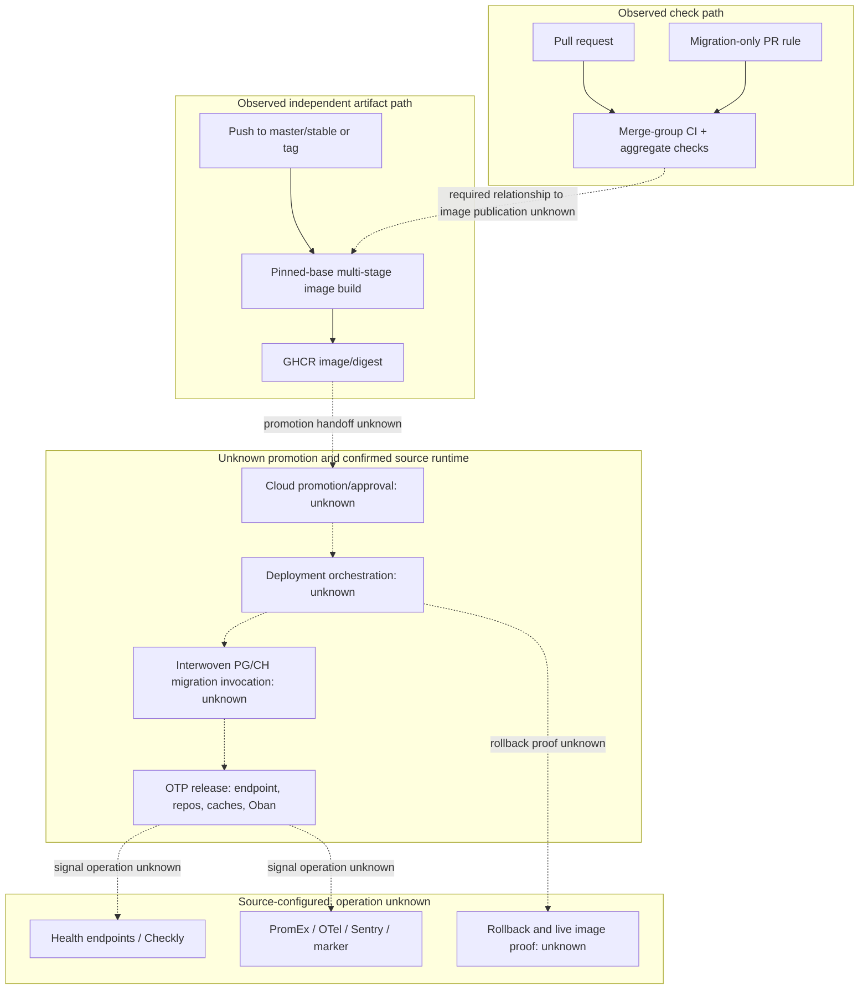

# Deployment and Runtime Path

## Purpose And Evidence Boundary

- Reader question: What source-backed path connects change, checks, image creation, migration, and runtime—and where does public evidence stop?
- Evidence cutoff: 2026-08-22 22:08:28 EDT
- Confirmed notation: solid node/edge, source or hosted GitHub metadata observed
- Inferred notation: dotted edge labelled `inferred`
- Unknown notation: dotted node/edge labelled `unknown`
- Evidence links: [E-004](../../../evidence/evidence-ledger.md#e-004), [E-007](../../../evidence/evidence-ledger.md#e-007), [E-010](../../../evidence/evidence-ledger.md#e-010), [E-012](../../../evidence/evidence-ledger.md#e-012)

## Evidence Dimensions Used

Implementation, hosted workflow history, and partial rationale are present. Live promotion, approval, migration execution, infrastructure, ownership, and rollback evidence are unknown.

## Diagram

## Known Gaps And Follow-Up

At the pinned commit, merge-group CI and aggregate checks succeeded; the master image build succeeded; a separate push CI run failed at dependency retrieval while its shown test/E2E jobs succeeded. `[Unknown]` Required-check enforcement, whether any image was promoted, migration stop conditions, and rollback. Close [OI-003](../../open-items.md#oi-003). No DevOps infrastructure view was created because no approved live-environment evidence exists.
