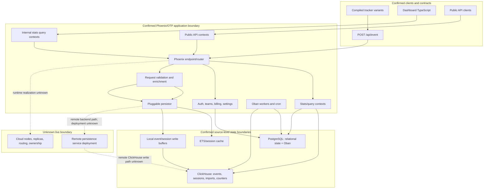

# System Component and Data Flow

## Purpose And Evidence Boundary

- Reader question: How do tracker/client, Phoenix, PostgreSQL, ClickHouse, and background work relate in the approved source?
- Evidence cutoff: 2026-08-22 22:08:28 EDT
- Confirmed notation: solid node/edge, directly observed in source
- Inferred notation: dotted edge labelled `inferred`
- Unknown notation: dotted boundary labelled `unknown`
- Evidence links: [E-001](../../../evidence/evidence-ledger.md#e-001), [E-002](../../../evidence/evidence-ledger.md#e-002), [E-004](../../../evidence/evidence-ledger.md#e-004), [E-006](../../../evidence/evidence-ledger.md#e-006), [E-008](../../../evidence/evidence-ledger.md#e-008), [E-009](../../../evidence/evidence-ledger.md#e-009)

## Evidence Dimensions Used

Implementation and selected history/rationale are present. Observed live operation, ownership/approval, commercial cost, and specialist assurance are unknown.

## Diagram

## Known Gaps And Follow-Up

`[Unknown]` Live service count, backend selection, database topology, ownership, and data-loss/consistency SLOs. Close [OI-001](../../open-items.md#oi-001), [OI-002](../../open-items.md#oi-002), and [OI-003](../../open-items.md#oi-003). Product promise validation belongs to Product Value.
