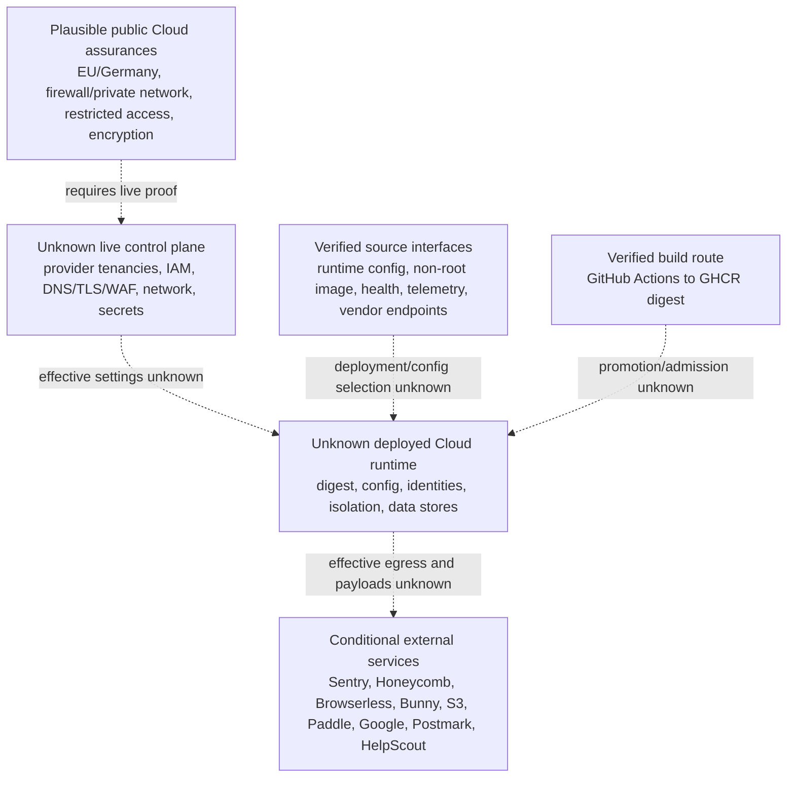

# Cloud/IAM/Network/Runtime Control View

Use when: Source-visible cloud, IAM, network, secret, workload, registry, and runtime boundaries materially affect an incoming CTO's ability to accept Cloud accountability.
Reader question: Which intended Cloud boundaries are supported by public claims or pinned source, and which require live proof before reliance?
Create from: `primary-code` at `9cc669b97ece3ecd37fcb3950791cb3873d7944d`, cutoff-valid Plausible public statements, post-cutoff validation, and linked reviewer evidence.
Do not infer: Current operation, ownership, approval, compliance, data residency, isolation, or control effectiveness from source or public wording alone.
Minimum completion: The evidence boundary, control position, unknowns, and smallest closure routes are shown below.

## Evidence Boundary

The audit cutoff is 2026-08-22 22:08:28 EDT. Available evidence covers public Cloud/CE responsibility and control statements, application/container/workflow configuration, selected public GitHub history and run metadata, and public status records. No cloud account, provider console, IAM, DNS/TLS/WAF/CDN, network policy, secret store, workload/orchestrator, registry policy, storage-encryption setting, runtime configuration, access log, or production audit log was approved. The `live-environment-and-access` packet was therefore not collected.

The March DPA and pinned README are cutoff-valid public claims. The currently served security page self-labels August 2026, the privacy page also self-labels August 2026, and the current EU-hosting page exposes no exact effective date in the reviewed content. Their expanded specifics are post-cutoff context with unknown cutoff-effective timing, not cutoff assurance, as reconciled in [E-046](../../evidence/evidence-ledger.md#e-046) and [E-053](../../evidence/evidence-ledger.md#e-053).

## Evidence Dimensions Used

| Dimension | Present position | Evidence status |
|---|---|---|
| Implementation/configuration | Runtime, secret-file interface, datastore TLS options, container, workflow, synthetic-check, telemetry, Browserless and S3 interfaces inspected | Verified source fact; [E-054](../../evidence/evidence-ledger.md#e-054)–[E-056](../../evidence/evidence-ledger.md#e-056) |
| History/rationale | Specific source and cutoff-dated PR/Actions records support action pinning, SSRF work, advisory remediation, and the pinned image build | Source facts plus cutoff-dated hosted history; post-cutoff API reads validate only the pre-cutoff records; [E-040](../../evidence/evidence-ledger.md#e-040), [E-041](../../evidence/evidence-ledger.md#e-041), [E-044](../../evidence/evidence-ledger.md#e-044), [E-055](../../evidence/evidence-ledger.md#e-055) |
| Public control statement | Cloud responsibility, Germany/EU processing, firewall/private networking, secure backups and restricted personnel access are stated | Plausible public claim; [E-053](../../evidence/evidence-ledger.md#e-053) |
| Observed operation | No live control or environment observation approved | Unknown; [OI-024](../open-items.md#oi-024) |
| Ownership/approval | No account, resource, role, control-owner, approval, access-review, or successor record approved | Unknown; [OI-022](../open-items.md#oi-022), [OI-024](../open-items.md#oi-024) |
| Cost/commercial | No cloud bills, contracts, tenancy inventory, or capacity records approved | Unknown; downstream Expense Exposure owns cost assessment |

## Current Source-Bounded Position

| Boundary | Public/source-visible position | Evidence class | Effective live boundary | Consequence and closure route |
|---|---|---|---|---|
| Provider and data location | Cutoff-valid sources say visitor data is processed on EU-owned infrastructure in Germany. Current post-cutoff public content names Hetzner, Bunny, and UpCloud in the visitor-data path. | Public claim; the provider-name expansion is post-cutoff context with unknown cutoff-effective timing | Unknown | A provider/region/data-flow mistake could contradict a core product assurance. Verify tenancy, region, storage, CDN/DNS and export flows under [OI-024](../open-items.md#oi-024); backup scope remains [OI-021](../open-items.md#oi-021), and Compliance Assurance owns legal mapping. |
| Administrative and service access | The DPA describes restricted authorized-personnel access. Source accepts configured application super-admin IDs and named vendor credentials. Current security-page wording adds more detailed access-control claims. | Public claim plus verified source interface; current expansions are post-cutoff context, not cutoff assurance | Unknown cloud IAM, workload identity, offboarding, review, break-glass, or service-account privilege | Verify principals, groups, roles, service identities, authentication controls, control-plane logs/reviews and emergency access under OI-024; retain custody and successor proof under [OI-022](../open-items.md#oi-022). |
| Ingress, DNS/TLS, CDN/WAF and segmentation | The DPA states HTTPS, firewall rules and private networking. The image binds port 8000 on all interfaces, source declares unauthenticated system info/live/ready routes, and non-self-host builds reserve Erlang distribution ports 9100–9200. | Public claim plus verified source fact | Unknown Internet reachability, edge termination, certificate policy, WAF/CDN rules, origin exposure, health/info filtering, distribution-port exposure, security groups/firewalls, east-west segmentation and tenant isolation | Obtain the DNS-to-workload path and effective policies under OI-024, explicitly checking system routes and 8000/9100–9200. Source listeners/routes do not prove exposure or an enforced network boundary. |
| Datastore transport and encryption | Runtime supports PostgreSQL peer-verification modes and a ClickHouse CA file. Cutoff-valid DPA wording states HTTPS and secure backups; the current security page adds at-rest and AES-256 backup specifics. | Verified source capability plus public claim; current encryption specifics are post-cutoff context, not cutoff assurance | Unknown live TLS modes, keys/KMS, disk/database/object encryption, backup encryption, rotation and residency | Inspect deployed connection settings, storage encryption and key ownership under OI-024. Backup encryption and recovery completeness remain [OI-021](../open-items.md#oi-021). |
| Secret delivery | Runtime reads a named file from a configurable directory defaulting to `/run/secrets`, then falls back to an environment variable. Workflow files reference GitHub, bot, Terraform/Checkly, notification and Honeycomb secrets without exposing values. | Verified source fact | Unknown secret manager, scopes, rotation, runner exposure, audit trail, injection mechanism and runtime lifetime | Verify secret stores, workload identity, rotation and access logs under OI-024; remove the PR-controlled reusable credential path under [OI-017](../open-items.md#oi-017). |
| Source-bounded container posture/runtime interface | Container bases are digest-pinned; the runtime image executes as UID 999. Source exposes build metadata and readiness state. | Verified source fact | Unknown orchestrator, namespace/host isolation, capabilities, filesystem mode, seccomp/AppArmor, resource limits, replica topology and effective runtime settings | Verify representative effective workload identity/isolation settings under OI-024; reconstruct admission and release-to-runtime identity under [OI-003](../open-items.md#oi-003). |
| Build/registry integrity signals | The private build has `contents: read`/`packages: write`, pushes GHCR tags and exposes a digest. The public CE workflow assembles tags from platform digests. Actions and Docker bases are commit/digest pinned. | Verified source fact plus cutoff-dated hosted history validated post-cutoff | Unknown GHCR access/retention, tag mutability, signing, SBOM/provenance attestations, vulnerability gate and runtime admission | Close registry-to-runtime and release-gate proof under OI-003. Application Security owns exploitability and [OI-018](../open-items.md#oi-018) owns scanner-claim coverage. |
| Runtime telemetry and response | Source defines Checkly probes, PagerDuty/Instatus channels, readiness, Sentry, Honeycomb/OpenTelemetry and PromEx. | Verified configuration fact | Unknown enablement, dashboard/alert coverage, delivery, on-call ownership and response | Prove the end-to-end path under [OI-023](../open-items.md#oi-023). Sentry's sensitive request context remains [OI-015](../open-items.md#oi-015). |
| Outbound/vendor egress | Source names conditional Sentry, Honeycomb, Browserless, Bunny, S3-compatible storage, Paddle, Google, Postmark, HelpScout and MaxMind integrations; a selectable remote persistor transmits encoded event/session data and site/user headers to its configured endpoint. | Verified source fact | Unknown endpoint selection, egress allowlists, private connectivity, proxying, payload classification, vendor account/region, retention, active persistor mode and isolation | Inventory effective egress/data flows under OI-024. Enforce Browserless fetch-boundary restrictions and network isolation under [OI-019](../open-items.md#oi-019). |
| Vulnerability response exposure | Pinned source contains the reviewed Storybook removal and the project published CE 3.2.1/advisory records. | Verified source/hosted record | Unknown exposure or fixed-image adoption for Plausible-controlled Cloud, preview, support or published-image environments | Close environment inventory, logs and secret-response evidence under [OI-020](../open-items.md#oi-020). |

## Source-Bounded Boundary Diagram

All dotted relationships are unknown live handoffs, not observed topology.

## Material Unknowns And Closure Routes

- [OI-024](../open-items.md#oi-024) is the one distinct Cloud-effectiveness verification: it maps live accounts, IAM, network, secrets, workload, registry, encryption, logging and data location to public claims.
- [OI-003](../open-items.md#oi-003) remains the release/promotion/runtime-image gate; [OI-017](../open-items.md#oi-017) remains the PR credential correction.
- [OI-015](../open-items.md#oi-015), [OI-019](../open-items.md#oi-019), and [OI-020](../open-items.md#oi-020) retain Sentry, Browserless egress, and Storybook-environment ownership respectively.
- [OI-021](../open-items.md#oi-021), [OI-022](../open-items.md#oi-022), and [OI-023](../open-items.md#oi-023) retain recovery scope, transferable custody, and end-to-end observability/response proof. This view does not duplicate those routes or conclude continuity readiness.
