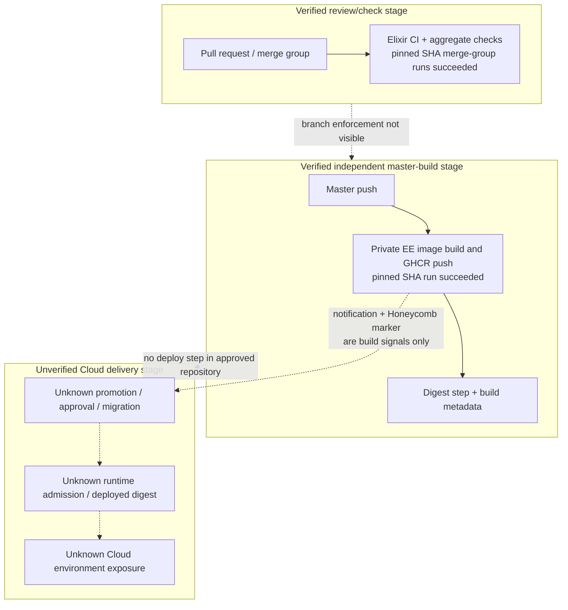

# Deployment And Environment Exposure View

Use when: CI/CD, registry, image provenance, environment promotion, and runtime exposure materially affect transition-control risk.
Reader question: What does the approved evidence establish from reviewed change to image publication and deployed environment, and where does proof stop?
Create from: Pinned workflow/container source, public GitHub PR/Actions metadata, and linked architecture/security evidence.
Do not infer: Deployment, runtime identity, approval, migration safety, rollback, registry policy, or environment exposure from a successful build or notification.
Minimum completion: The source-bounded path, material exposures, evidence limits, and existing closure routes are shown below.

## Evidence Boundary

The source is `primary-code` at `9cc669b97ece3ecd37fcb3950791cb3873d7944d`; cutoff is 2026-08-22 22:08:28 EDT. Public Actions metadata was re-read after cutoff only to validate pre-cutoff runs. No branch/ruleset settings, private job logs/artifacts, GHCR policy or image contents, signing/attestation service, deploy system, environment inventory, orchestrator, runtime digest/config, migration record, approval record, or rollback execution was available.

## Evidence Dimensions Used

| Dimension | Position |
|---|---|
| Implementation/configuration | Verified pinned workflow and Dockerfile source; [E-055](../../evidence/evidence-ledger.md#e-055), [E-056](../../evidence/evidence-ledger.md#e-056) |
| Hosted execution/history | Cutoff-dated merge-group and master-push conclusions for the pinned SHA plus PR records for action pinning, SSRF work and Storybook removal; post-cutoff API reads validate only those pre-cutoff records; [E-040](../../evidence/evidence-ledger.md#e-040), [E-041](../../evidence/evidence-ledger.md#e-041), [E-044](../../evidence/evidence-ledger.md#e-044), [E-055](../../evidence/evidence-ledger.md#e-055) |
| Observed deployment/runtime | Unknown |
| Ownership/approval | Unknown |
| Registry/admission | Build/push mechanics visible; effective policy unknown |

## Source-Bounded Delivery Path

The master-push image run and master-push Elixir CI are separate workflows. At the pinned SHA the image run succeeded while the push CI run failed; this does not mean a failing build was deployed, but it proves image publication was not technically sequenced behind that push-CI outcome in the visible workflows.

## Exposure And Control Matrix

| Surface | Verified source/hosted fact | Unknown environment/control state | Transition consequence | Route |
|---|---|---|---|---|
| Review and merge gate | Merge-group Elixir CI and aggregate checks succeeded for the pinned SHA; branch/ruleset settings were inaccessible. | Required checks, bypass rights, reviewer enforcement and release authorization | The CTO cannot infer that every master update satisfied the same gate. | [OI-003](../open-items.md#oi-003), [OI-008](../open-items.md#oi-008) |
| Private Cloud image | Master/stable/tag and labeled-preview events can push `ghcr.io/plausible/analytics/ee`; job token requests read-content/write-package scope. | GHCR access, retention, tag mutability, protected preview origin, vulnerability gate, signing, SBOM, provenance attestation | Registry compromise or mutable/unverified promotion could sever commit-to-runtime trust. | [OI-003](../open-items.md#oi-003), [OI-024](../open-items.md#oi-024) |
| Container runtime | Digest-pinned base stages, OCI build metadata and UID 999 are present. | Deployed digest, runtime user/capabilities, filesystem, secrets, admission, orchestration, network and replicas | Source hardening cannot be credited as live isolation or version adoption. | [OI-024](../open-items.md#oi-024) |
| Cloud promotion/deploy | No Cloud deployment step was found in the approved repository; success notification says “Deploying” and sets a Honeycomb marker. | External/private deploy system, approvals, environments, migration order, stop conditions, rollback and live image identity | A build signal can be mistaken for a safe deployment record. | [OI-003](../open-items.md#oi-003) |
| CE publication | Version tags build amd64/arm64 images and create/inspect a GHCR manifest from platform digests. | Tag authorization, signing/attestation, registry retention, downstream adoption and update completion | Published-image integrity and fixed-version adoption cannot be assumed. | [OI-003](../open-items.md#oi-003), [OI-020](../open-items.md#oi-020) |
| Tracker npm release | Merged labeled PRs can publish through OIDC and then push repository changes using the reusable bot credential. | Label authority, PAT scope/rotation, npm policy and consumer adoption | PR/release credential transfer remains materially unbounded. | [OI-017](../open-items.md#oi-017) |
| Monitoring IaC | `test/e2e/main.tf` declares active Checkly resources and PagerDuty/Instatus channels; master changes auto-apply through Terraform Cloud. The public workflow endpoint was active but returned no accessible runs. | State, plan/apply history, drift, secret scope, alert delivery and ownership | Source-visible monitoring may not match the effective control plane. | [OI-023](../open-items.md#oi-023), [OI-024](../open-items.md#oi-024) |
| Browserless workload | Cloud build includes the installation-support Browserless function; application pre-checks a URL, while the browser performs the actual navigation. | Browserless network placement, metadata/private-network reachability, redirects, DNS behavior, credentials and egress policy | An unisolated browser workload could turn a source boundary mismatch into network reachability. | [OI-019](../open-items.md#oi-019) |
| Historical Storybook fix | PR #6344 removed Storybook; CE 3.2.1 and the project advisory record the fix. | Cloud/preview/support/published-image exposure, logs, secret rotation and fixed-version adoption | The source fix does not close the environment/incident record. | [OI-020](../open-items.md#oi-020) |

## Material Unknowns And Closure Routes

- Reconstruct commit-to-runtime evidence, approval, promotion, migrations and rollback under [OI-003](../open-items.md#oi-003).
- Verify registry/admission, runtime identity, environment isolation, network and secret controls under [OI-024](../open-items.md#oi-024).
- Correct the PR credential route under [OI-017](../open-items.md#oi-017); enforce the Browserless egress boundary under [OI-019](../open-items.md#oi-019); close the affected-environment record under [OI-020](../open-items.md#oi-020).
- This view does not establish Application Security exploitability, Business Continuity recovery readiness, or Compliance Assurance.
