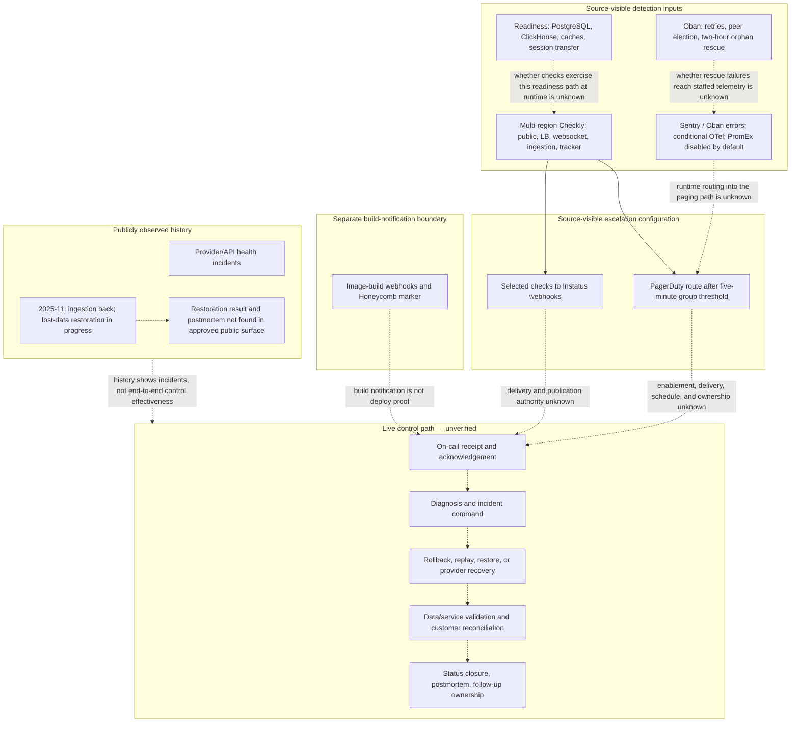

# Observability and Response Path

Reader question: where does source-visible detection and escalation stop, and what live response and recovery evidence must be supplied before the incoming CTO can rely on it?

## Purpose And Evidence Boundary

The diagram is material because pinned source contains health, synthetic-check, alert-routing, telemetry, and background-job recovery configuration, while pre-cutoff public status history records provider and data-restoration incidents ([E-048](../../../evidence/evidence-ledger.md#e-048), [E-050](../../../evidence/evidence-ledger.md#e-050), [E-051](../../../evidence/evidence-ledger.md#e-051)). No dashboard, alert receipt, on-call schedule, responder, runbook, deploy, restore, or incident-system access was approved. Solid arrows below are source-visible configuration or public incident sequence; dashed arrows are unverified live transitions.

- Reader question: where does source-visible detection and escalation stop, and what live response and recovery evidence must be supplied before the incoming CTO can rely on it?
- Evidence cutoff: 2026-08-22 22:08:28 EDT; pinned `primary-code` commit `9cc669b97ece3ecd37fcb3950791cb3873d7944d` and pre-cutoff public incident history.
- Confirmed notation: solid nodes and arrows represent source-visible configuration or a separately dated public observation.
- Inferred notation: no inferred edge is relied on; causal interpretation beyond the evidence is omitted.
- Unknown notation: dashed arrows represent unverified runtime enablement, delivery, ownership, response, recovery, or closure.
- Evidence links: [E-048](../../../evidence/evidence-ledger.md#e-048), [E-050](../../../evidence/evidence-ledger.md#e-050), [E-051](../../../evidence/evidence-ledger.md#e-051).

## Evidence Dimensions Used

| Dimension | Used here | Missing |
|---|---|---|
| Implementation/configuration | Health endpoints, Checkly checks, PagerDuty/Instatus routes, Sentry/OTel/PromEx, Oban recovery, build notifications | Terraform state, effective flags, live rules, deploy integration |
| Observed history | Public status incident updates, including ingestion resumption and restoration-in-progress | Alert provenance, acknowledgements, responder actions, restoration completion, postmortems |
| Ownership/approval | None sufficient | On-call owner, incident commander, service owners, closure approver |
| Outcome/effectiveness | None sufficient | Detection time, delivery, response time, RPO/RTO, recovered correctness, recurrence prevention |

## Diagram

## Decision Use

Do not treat source configuration as proof of 24/7 coverage, delivery, response, or recovery. Close [OI-023](../../open-items.md#oi-023) with enabled checks/dashboards, alert rules, schedules and escalation, delivery/acknowledgement history, queue/retry health, named incident ownership, recovery validation, customer/status reconciliation, and postmortem follow-through. Backup correctness and recovery objectives remain separately owned by [OI-021](../../open-items.md#oi-021); successor and account authority remain owned by [OI-022](../../open-items.md#oi-022).

## Known Gaps And Follow-Up

- PromEx being defined in source is not proof it is enabled; the pinned default is disabled.
- Checkly/PagerDuty/Instatus definitions do not prove Terraform apply, current state, successful delivery, or staffed escalation.
- Sentry and OTel wiring do not prove DSN/keys, data handling, sampling, retention, or responder action; [OI-015](../../open-items.md#oi-015) remains relevant.
- The public incident update establishes restoration in progress, not amount recovered, correctness, timing, customer impact, or closure.
- No live exercise was authorized, so the dashed path remains deliberately unresolved.
