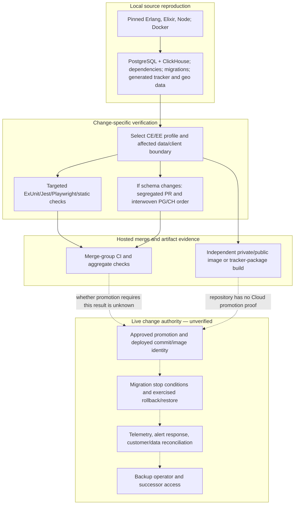

# Complexity, Skills, And Time-To-Safety Map

Reader question: what technical breadth, change coordination, and proof path would a small replacement team inherit before it could maintain Plausible safely?

## Decision Position And Evidence Boundary

`[Fact]` The pinned monorepo documents a local-development route, declares broad automated gates, pins primary toolchain versions, and contains explicit release/migration utilities. Its source spans Elixir/OTP application behavior, PostgreSQL and ClickHouse data authority, React/TypeScript dashboard behavior, a multi-variant browser tracker, background jobs, container/image delivery, telemetry, and external-service integrations ([E-078](../../evidence/evidence-ledger.md#e-078), [E-080](../../evidence/evidence-ledger.md#e-080)). `[Reasoned inference]` Safe maintenance therefore requires coordinated understanding across these boundaries; the public corpus does not establish whether the documented local route succeeds for a replacement maintainer.

`[Unknown]` Public evidence does not establish the current people or vendor skill mix, who can approve or perform each change, successful replacement onboarding, live topology, production promotion, migration/rollback outcomes, recovery, coverage, effort, elapsed time, headcount, rates, or staffing cost. The map therefore names **capability coverage and proof gates**, not a staffing model or estimate.

The triggered [delivery-and-quality packet](../../evidence/packets/delivery-and-quality.md) consolidates the approved setup, gate, artifact, migration, and repair evidence. No `vendor-ownership-commercial` packet was requested because no approved role, access, contract, billing, acceptance, or successor record exists to populate it. Existing items already own the material residual work: ingestion durability [OI-001](../open-items.md), cross-store deletion [OI-002](../open-items.md), release/migration/rollback [OI-003](../open-items.md), tracker compatibility [OI-004](../open-items.md), source-level coverage and journey proof [OI-008](../open-items.md), tracker workflow credentials [OI-017](../open-items.md), recovery [OI-021](../open-items.md), transferable control [OI-022](../open-items.md), and live response [OI-023](../open-items.md). No duplicate maintenance open item was created.

## Capability And Operating-Burden Map

One person may cover more than one row; the public corpus cannot establish how work is staffed or whether knowledge is concentrated.

| Capability boundary | Source-visible surface | Why safe change crosses disciplines | Proof required before reliance |
|---|---|---|---|
| Application and product semantics | Elixir 1.20 / Erlang 28, Phoenix/LiveView, Ecto, authentication, billing, Stats APIs, dashboard controllers and workers | Product rules, web/API contracts, background work, and edition gates coexist in one OTP application. Current integration-heavy navigation points include the router, Stats controller, sites LiveView, generic components, and query builders ([E-079](../../evidence/evidence-ledger.md#e-079)). | Demonstrate representative local change, targeted tests, review authority, and a current customer-effective contract; keep defect/test truth with Code Quality. |
| Data and ingestion | PostgreSQL relational/Oban state; ClickHouse read, ingest, async-insert, and deletion repositories; event/session buffers and caches | Acknowledgement, persistence, query, deletion, imports/exports, and schema order span stores and asynchronous boundaries ([E-001](../../evidence/evidence-ledger.md#e-001), [E-004](../../evidence/evidence-ledger.md#e-004), [E-005](../../evidence/evidence-ledger.md#e-005)). | Close durability/deletion proof and exercise compatible migration plus recovery under [OI-001](../open-items.md), [OI-002](../open-items.md), [OI-003](../open-items.md), and [OI-021](../open-items.md). |
| Dashboard and client code | React 18, TypeScript, Tailwind, Jest, generated API types, Chromium application E2E | Dashboard fixtures and types duplicate some server contracts; the application E2E populates analytics through a test-only endpoint rather than the full tracker-to-query journey ([E-013](../../evidence/evidence-ledger.md#e-013), [E-014](../../evidence/evidence-ledger.md#e-014)). | Establish coverage/fixture lineage and one full analytics journey under [OI-008](../open-items.md). |
| Tracker compatibility and distribution | JavaScript/TypeScript, source-visible compiler, Playwright across three browser engines, web/legacy/npm/support variants, version and release workflows | One tracker change can alter browser behavior, compiled variants, npm packaging, application-served assets, size, compatibility, and release metadata. PR #6174 crossed source, version/changelog, and workflow behavior without a test-file change ([E-006](../../evidence/evidence-ledger.md#e-006), [E-018](../../evidence/evidence-ledger.md#e-018), [E-080](../../evidence/evidence-ledger.md#e-080)). | Define supported variant/browser matrix, prove path-to-publication and representative compatibility under [OI-004](../open-items.md); correct credential handling under [OI-017](../open-items.md). |
| Build, schema, release, and recovery | Docker multi-stage release, GitHub Actions, 235 PostgreSQL and 55 ClickHouse migrations, interwoven migration utility, pending-streak and generic rollback scripts | Source separates schema/application changes and orders cross-store migrations, but the image build can succeed independently of application CI and the Cloud promotion path is absent. Issue #5319 and PR #5320 show a realized CE upgrade-order failure corrected by migration reordering ([E-004](../../evidence/evidence-ledger.md#e-004), [E-007](../../evidence/evidence-ledger.md#e-007), [E-080](../../evidence/evidence-ledger.md#e-080)). | Close commit-to-runtime, approval, migration, rollback, and recovery evidence under [OI-003](../open-items.md) and [OI-021](../open-items.md) before accepting production change authority. |
| Runtime operations and external dependencies | Oban, caches, clustering, Checkly/PagerDuty/Instatus, conditional Sentry/OTel/PromEx, S3-compatible storage, Browserless, Bunny, Paddle, email/support/geo services | Operators must distinguish configuration from enablement, job completion from retry, build notification from deploy, and dependency presence from transferable account control ([E-008](../../evidence/evidence-ledger.md#e-008), [E-048](../../evidence/evidence-ledger.md#e-048), [E-052](../../evidence/evidence-ledger.md#e-052)). | Prove alert/response and critical-service successor access under [OI-022](../open-items.md) and [OI-023](../open-items.md); Expense Exposure owns actual vendor/cash evidence. |
| Edition and configuration matrix | Compile-time CE/EE profiles, `extra/lib`, environment/runtime settings, CE and cloud images | One monorepo yields materially different feature, source, release, and operator-responsibility profiles. A green result in one profile does not establish the other or the deployed configuration ([E-011](../../evidence/evidence-ledger.md#e-011), [E-013](../../evidence/evidence-ledger.md#e-013)). | Inventory supported Cloud/CE/tracker configurations and require profile-appropriate tests and release proof under [OI-004](../open-items.md) and [OI-008](../open-items.md). |

## Hotspot Reading Rule

The cutoff-anchored year contains 626 commits touching 1,370 paths. The evidenced high-frequency integration paths include `primary-code:lib/plausible_web/router.ex`, `primary-code:lib/plausible_web/controllers/api/stats_controller.ex`, `primary-code:lib/plausible_web/components/generic.ex`, `primary-code:lib/plausible_web/live/sites.ex`, `primary-code:assets/js/dashboard/extra/exploration.js`, and `primary-code:.github/workflows/elixir.yml` ([E-079](../../evidence/evidence-ledger.md#e-079)).

`[Reasoned inference]` These are high-value **orientation and review targets** for a replacement maintainer because they combine many routes, semantics, configuration branches, or recent changes. They are not proven defect hotspots. Raw churn was rejected as a risk ranking because parser databases, fixtures, lockfiles, and tests dominate several totals; file size and change frequency do not establish complexity, ownership, or cost.

## Source-Bounded Path To Safe Change

Solid arrows are source-visible steps or hosted cutoff-bounded outcomes. Dashed arrows are required but unverified live transitions. No elapsed-time estimate is implied.

## Time-To-Safety Gates, Without Time Claims

| Gate | Minimum evidence | Current public position | Stop condition / route |
|---|---|---|---|
| 1. Reproduce | Clean setup reaches the application with both stores and generated assets | Instructions and pins exist; no onboarding exercise ran ([E-080](../../evidence/evidence-ledger.md#e-080), [E-081](../../evidence/evidence-ledger.md#e-081)) | Do not infer ramp time or competence from documentation. Record actual outcomes during a consent-aware replacement exercise. |
| 2. Understand boundary | Maintainer can trace one event, query, edition gate, job, migration, and tracker variant | Source topology is legible; CodeGraph covers only supported JS/TS/config, so Elixir requires direct navigation ([E-001](../../evidence/evidence-ledger.md#e-001), [E-078](../../evidence/evidence-ledger.md#e-078)) | Do not infer retained knowledge. If critical-service access or successor authority cannot be demonstrated, route it to [OI-022](../open-items.md); Contributor/Vendor Value owns knowledge and handoff conclusions. |
| 3. Prove source change | A representative change passes relevant profile, database, browser, contract, fixture, and negative-path checks | Broad declared gates and a green merge-group exist; coverage, case/retry history, full journey, and branch enforcement remain unknown ([E-013](../../evidence/evidence-ledger.md#e-013), [E-015](../../evidence/evidence-ledger.md#e-015)) | Close [OI-008](../open-items.md); Code Quality owns defect and coverage truth. |
| 4. Prove release | Approved artifact is tied to passed gates and deployed identity | Image build is independent; Cloud promotion/deployed identity/authority are unknown ([E-007](../../evidence/evidence-ledger.md#e-007)) | Close [OI-003](../open-items.md) before routine production release authority transfers. |
| 5. Prove data-safe operation | Migration, rollback/restore, alert, queue, and reconciliation evidence meet an approved stop condition | Utilities and controls are source-visible; live effectiveness and recovery are unknown, with public history showing migration sensitivity and data restoration ([E-050](../../evidence/evidence-ledger.md#e-050), [E-080](../../evidence/evidence-ledger.md#e-080)) | Close [OI-001](../open-items.md), [OI-002](../open-items.md), [OI-021](../open-items.md), and [OI-023](../open-items.md) before accepting reliability assurance. |
| 6. Prove transfer | Backup operator can access, diagnose, release, recover, and communicate without the primary | No approved role/access/successor exercise exists ([E-077](../../evidence/evidence-ledger.md#e-077)) | Close [OI-022](../open-items.md); Contributor/Vendor Value owns knowledge/attribution conclusions. |

## What This Does Not Price Or Staff

- No source-backed headcount, hour, rate, staffing-cost, on-call-load, ticket-volume, or opportunity-cost evidence was approved. Expense Exposure owns actual cash and contract evidence through [OI-025](../open-items.md).
- Repository breadth and hotspots do not show current team performance, morale, individual knowledge, or whether the existing organization already covers these capabilities well.
- The separately referenced Community Edition packaging/upgrade repository is `Documented outside audited scope; not independently verified.` Its smallest useful addition would be the cutoff-pinned packaging, upgrade, release, and supported-version evidence needed to validate the CE change path.
- Private production runbooks, promotion configuration, incident/restore records, access matrices, and role/knowledge records were outside scope. Their absence here is an evidence limit, not proof they do not exist.
