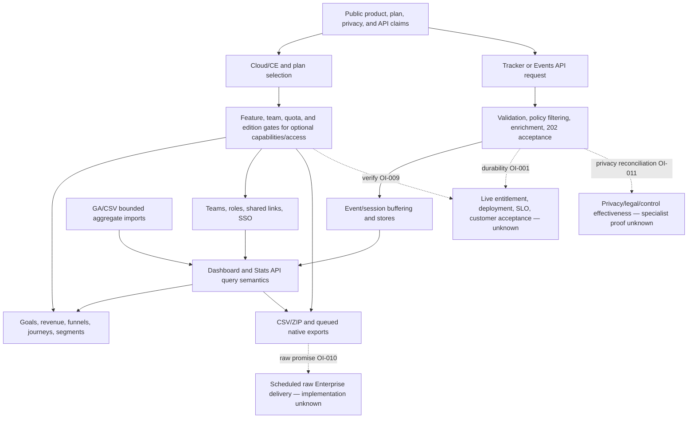

# Product Value Flow

## Purpose And Evidence Boundary

- Reader question: How do the public promise, entitlement, event path, analysis, and customer-facing outputs connect, and where does approved evidence stop?
- Evidence cutoff: 2026-08-22 22:08:28 EDT; pinned source commit 2026-08-19.
- Confirmed notation: solid node/edge from source or approved public documentation.
- Inferred notation: dotted edge labelled `inferred`.
- Unknown notation: dotted node/edge labelled `unknown` and routed to an open item.
- Evidence links: claims/edition/plan [E-020](../../../evidence/evidence-ledger.md#e-020), [E-025](../../../evidence/evidence-ledger.md#e-025), [E-028](../../../evidence/evidence-ledger.md#e-028); tracker/acceptance/store [E-021](../../../evidence/evidence-ledger.md#e-021), [E-002](../../../evidence/evidence-ledger.md#e-002), [E-003](../../../evidence/evidence-ledger.md#e-003); query/analysis/access/import/export [E-022](../../../evidence/evidence-ledger.md#e-022), [E-023](../../../evidence/evidence-ledger.md#e-023), [E-024](../../../evidence/evidence-ledger.md#e-024), [E-026](../../../evidence/evidence-ledger.md#e-026); raw/privacy boundaries [E-029](../../../evidence/evidence-ledger.md#e-029), [E-027](../../../evidence/evidence-ledger.md#e-027); [capability matrix](../capability-contract-matrix.md).

## Evidence Dimensions Used

Implementation and public promise are present. Runtime demonstration, customer-specific commercial state, acceptance, ownership/approval, and specialist sign-off are unknown.

## Diagram

## Known Gaps And Follow-Up

The diagram confirms source-visible routing, not live operation. Close customer-specific entitlement truth under [OI-009](../open-items.md#oi-009), raw-export fulfillment under [OI-010](../open-items.md#oi-010), privacy interpretation under [OI-011](../open-items.md#oi-011), access behavior under [OI-013](../open-items.md#oi-013), queued native export under [OI-014](../open-items.md#oi-014), and one authorized full journey under [OI-008](../open-items.md#oi-008).
