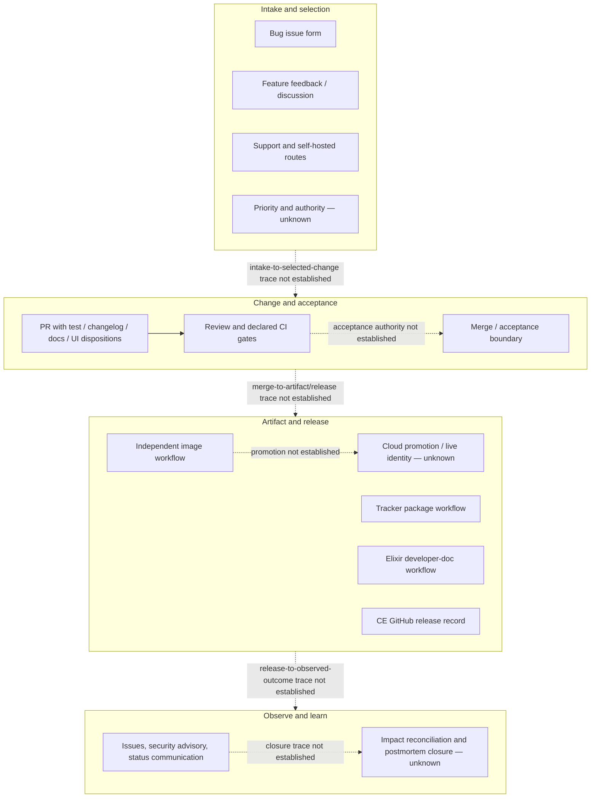

# Work-In-Flight And Release/Change-Control View

## Boundary And Reading Rule

This view asks whether a small team can understand, prioritize, review, accept,
release, trace, and learn from work visible in the approved public sources. It
is bounded by 2026-08-22 22:08:28 EDT and `primary-code` commit
`9cc669b97ece3ecd37fcb3950791cb3873d7944d`.

`[Fact]` is direct source or dated hosted evidence. `[Plausible public claim]`
is provider-authored positioning. `[Reasoned inference]` states a bounded
decision consequence. `[Unknown]` requires internal, live, or authority proof.
Commit, pull-request, or release counts are not treated as delivery health,
team capacity, performance, or cadence.

## Delivery Boundary

The solid sequence shows source-visible stages, not one proven end-to-end
operating process. The unknown nodes are the evidence gates needed to accept
delivery accountability ([E-082](../../evidence/evidence-ledger.md),
[OI-029](../open-items.md)).

## Ability Assessment

| Ability | Public evidence | Evidence-bounded position | Material limit and route |
|---|---|---|---|
| Understand work | `[Fact]` CONTRIBUTING gives a multi-store local setup and task route; README, CHANGELOG, source, tests, and targeted PR history give product/change context ([E-080](../../evidence/evidence-ledger.md), [E-082](../../evidence/evidence-ledger.md)). | A contributor can locate declared setup, source, change prompts, and selected history. | No clean setup ran, Cloud/CE operational procedures are outside or unavailable, and no maintainer/ownership map is public. Use [OI-022](../open-items.md) and the maintenance safe-change gates. |
| Prioritize | `[Fact]` Bugs route to GitHub Issues, feature requests to a feedback board, self-hosted support to Discussions, and feature PRs are asked to follow discussion ([E-082](../../evidence/evidence-ledger.md)). | Intake is segmented by work type and audience. | The public organization Projects page rendered `0 open and 0 closed projects found` only in a post-cutoff read; the repository Projects URL was not retrievable ([source-access register](../../evidence/source-access-register.md)). The separate feedback board was not inspected. Priority criteria, roadmap state, decision rights, and exception handling are unknown; close [OI-029](../open-items.md). |
| Review | `[Fact]` The PR template prompts test, changelog, docs, and dark-mode dispositions. Sampled PR #1121 and #3111 include changes-requested review, revision, and approval; reviewed feature samples include source-visible tests ([E-074](../../evidence/evidence-ledger.md), [E-075](../../evidence/evidence-ledger.md), [E-082](../../evidence/evidence-ledger.md)). | The repository demonstrates that substantive review can change selected work. | A sample is not policy or universal practice. Required reviewer identity, no-test/no-doc acceptance criteria, CODEOWNERS, branch rules, and reviewer backup coverage remain unknown ([E-077](../../evidence/evidence-ledger.md)); use OI-008/OI-022/OI-029. |
| Accept | `[Fact]` Merged PRs and a green pinned merge-group show source acceptance and hosted gate results in selected cases ([E-015](../../evidence/evidence-ledger.md), [E-074–E-076](../../evidence/evidence-ledger.md)). | A source-level merge and check path exists. | Merge does not prove user/product acceptance, required-check enforcement, release approval, deployed state, or customer outcome. Two material fixes remained open at the cutoff ([E-016](../../evidence/evidence-ledger.md), [E-017](../../evidence/evidence-ledger.md)); close OI-006/OI-007/OI-008/OI-029. |
| Release and trace | `[Fact]` CE release 3.2.1 traces a reviewed Storybook removal to a security-fix release before the public advisory; workflows build/push images and tracker packages, and a separate workflow builds and deploys Elixir developer documentation to GitHub Pages ([E-007](../../evidence/evidence-ledger.md), [E-041](../../evidence/evidence-ledger.md), [E-082](../../evidence/evidence-ledger.md)). `[Plausible public claim]` README says Cloud receives updates multiple times per week while CE is a twice-yearly long-term release. | CE has a public release/advisory example; artifact automation and edition cadence claims are visible. | The master image can publish independently of failed master CI. No public Cloud promotion, approval, deployed image, migration, rollback, or live acceptance record exists. A build or release claim is not live operation; close [OI-003](../open-items.md) and OI-029. |
| Learn and close | `[Fact]` Public issues describe migration, import-loss, API-input, and tracker-performance defects; selected PRs repair some, while others remained proposed. A security fix release/advisory and public incident/status communication exist ([E-016–E-018](../../evidence/evidence-ledger.md), [E-041](../../evidence/evidence-ledger.md), [E-050](../../evidence/evidence-ledger.md), [E-080](../../evidence/evidence-ledger.md)). | The public record shows defect intake and corrective change, not silence. | Frequency, impact, closure criteria, deployed remediation, incident reconciliation, retrospective decisions, and recurrence controls are unknown. Use OI-006/OI-007 for open corrections and [OI-023](../open-items.md)/OI-029 for learning-to-closure proof. |

## Release And Acceptance Evidence By Surface

| Surface | Declared or observed control | Cutoff-bounded result | Acceptance boundary |
|---|---|---|---|
| Elixir application | PR, push, and merge-group CI with EE/CE test partitions, application E2E, static checks, and aggregate waiter | Pinned merge-group: 19 hosted jobs across Elixir, NPM, spelling, and aggregate runs succeeded. Pinned master push: 16 hosted application jobs comprised 15 success and one dependency-retrieval failure; NPM succeeded ([E-015](../../evidence/evidence-ledger.md)). | These are job counts, not test-case counts. Ruleset enforcement, coverage, retry history, acceptance authority, and deployment gating are unknown. |
| Cloud image | Private image workflow builds/pushes on `master`/`stable` and selected tags/previews | Pinned master private-image build succeeded while the independent master Elixir run had one failed static job ([E-007](../../evidence/evidence-ledger.md)). | No source-visible Cloud promotion or requirement that CI pass first. Deployed identity, approval, rollback, and live result are unknown. |
| Community Edition | README/issue form state twice-yearly long-term release; CHANGELOG separates Unreleased and versioned changes | GitHub release 3.2.1 linked a reviewed removal to an urgent security update ([E-041](../../evidence/evidence-ledger.md), [E-082](../../evidence/evidence-ledger.md)). | The companion packaging/upgrade repository is `Documented outside audited scope; not independently verified.` Installed-version adoption and release acceptance are unknown. |
| Tracker package/script | PR automation checks version, script size, release label, and package changelog; an NPM-release workflow is source-visible on version/tag paths | Declared automation and selected merged change history exist ([E-006](../../evidence/evidence-ledger.md), [E-013](../../evidence/evidence-ledger.md), [E-018](../../evidence/evidence-ledger.md)). | Token safety remains OI-017; registry state, publication approval, market/browser compatibility, and runtime adoption are unknown. |
| Customer and developer documentation | PR template asks for a docs disposition and links the separate `plausible/docs` repository; a different workflow builds Elixir developer docs from `master` and deploys them to GitHub Pages | Source-visible prompts and one developer-doc publication workflow exist ([E-082](../../evidence/evidence-ledger.md)). | The separate customer-docs repository is `Documented outside audited scope; not independently verified.` Customer-doc review/approval, deployed site version, and claim-owner accountability are unknown; the Elixir-doc workflow does not close that gap. |

## Documentation Audience, Task, Currency, And Conflict View

| Audience/task | Coverage visible by cutoff | Currency position | Material conflict or limit | Consequence owner/route |
|---|---|---|---|---|
| Product user and integrator | Public docs index covers setup, dashboards, APIs, exports, billing, privacy, roles, and integrations; README is a broad overview. | Mutable web pages plus source at the pinned commit; full docs source/history was not approved. | Events API docs show `{}` while pinned source/history use `ok`; `202` is acceptance, not durability ([E-021](../../evidence/evidence-ledger.md)). | API/documentation owners; OI-001/OI-012. |
| Privacy/security reviewer | Data policy, DPA, compliance, security, and vulnerability-disclosure pages cover customer-review topics. | Cutoff-valid copies coexist with August 2026 page expansions whose cutoff-effective time is unknown ([E-046](../../evidence/evidence-ledger.md), [E-072](../../evidence/evidence-ledger.md)). | Public 24-hour salt wording conflicts with source retaining current/previous salt and deleting older-than-48-hour rows; conditional Sentry context further qualifies categorical data claims ([E-031](../../evidence/evidence-ledger.md), [E-037](../../evidence/evidence-ledger.md)). | Privacy/legal/security owners; OI-011/OI-015/OI-028. |
| Contributor | CONTRIBUTING provides prerequisites, setup, task discovery, and discussion guidance; PR template prompts change evidence. | Pinned source is current to 2026-08-19. | The approved public corpus does not establish a review policy, decision-rights map, exception criteria, or clean-setup result; the bounded pinned-ref search found no CODEOWNERS, governance, or maintainer file ([E-077](../../evidence/evidence-ledger.md), [E-080](../../evidence/evidence-ledger.md)). | Engineering/release owners; OI-008/OI-022/OI-029. |
| CE operator | README and issue form define responsibility and release model, then direct installation/upgrade work elsewhere. | Main-repo CHANGELOG contains Unreleased and dated CE-oriented versions. | The Community Edition packaging/upgrade repository is `Documented outside audited scope; not independently verified.` Main-repo material does not establish a tested install/upgrade/rollback path. | CE/release owner; OI-003/OI-006/OI-021. |
| Cloud operator and successor | Source exposes health, telemetry, image, migration, rollback-utility, and vendor primitives. | Pinned source plus selected pre-cutoff hosted results. | No public runbook, SLO, promotion, rollback exercise, incident-closure record, owner map, or successor exercise exists in the approved corpus. | Operations/release/executive owners; OI-003/OI-021–OI-023/OI-029. |

## Incoming-CTO Stop Conditions

- Do not treat commit volume, PR count, recent merges, or a green sample as a
  healthy cadence or adequate capacity.
- Do not accept Cloud release accountability until one representative change
  is traced from approved priority through declared checks and verified
  ruleset/required-check configuration, artifact,
  migration decision, deployed identity, observation, rollback decision, and
  documentation/claim update ([OI-003](../open-items.md),
  [OI-029](../open-items.md)).
- Do not accept a named reviewer or release owner from public contribution
  history. Verify current authority, primary/backup access, and successor
  ability under [OI-022](../open-items.md).
- Keep product correctness, commercial outcome, incident recovery, staffing,
  and individual performance with their owning evidence routes; this view
  establishes only a public delivery-process boundary.
