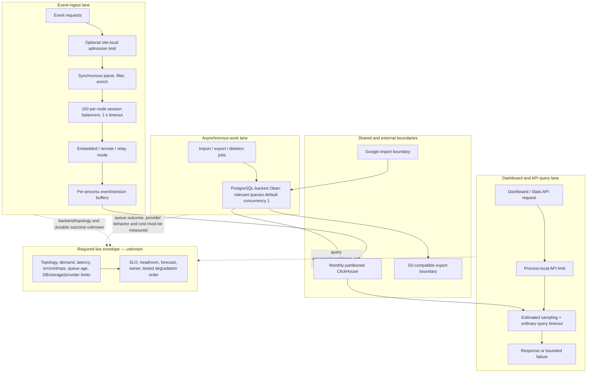

# Capacity And Degradation View

Use when: Material ingestion, query, asynchronous-work, data-growth, provider, and cost boundaries are evidenced.
Reader question: What capacity and degradation behavior is visible in the approved public sources, and what must be proved before accepting scale accountability?

## Evidence Boundary

This view is bounded to the public `primary-code` repository at `9cc669b97ece3ecd37fcb3950791cb3873d7944d`, cutoff-valid GitHub issues/PRs/history, and approved Plausible pages through 2026-08-22 22:08:28 EDT. Source/configuration proves implemented defaults and possible modes, not deployed Cloud values or effectiveness. Developer-local results are attributed observations, not product capacity. Historical company copy is context, not current demand.

No production metrics, live replicas/topology, quotas, SLOs, dashboards, bills, customer data, load-test results, incident detail, provider state, or safe test environment was approved. No load, failover, deployment, export, migration, or production test ran.

## Evidence Dimensions Used

| Dimension | Position | Evidence/limit |
|---|---|---|
| Implementation/configuration | Present for ingestion, persistence variants, ClickHouse repositories, sampling, timeouts, local rate limits, Oban concurrency, export, deletion, caches and telemetry. | [E-062](../../evidence/evidence-ledger.md#e-062), [E-063](../../evidence/evidence-ledger.md#e-063), [E-065](../../evidence/evidence-ledger.md#e-065) |
| History/rationale | Present in specific reviewed PRs and public issues; one historical company page describes a former vertical-scaling limit. | [E-064](../../evidence/evidence-ledger.md#e-064), [E-066](../../evidence/evidence-ledger.md#e-066) |
| Observed operation/capacity | Unknown. One PR reports a developer-local result; no retained environment/result packet or Cloud observation exists. | [E-064](../../evidence/evidence-ledger.md#e-064), [OI-027](../open-items.md#oi-027) |
| Demand/SLO/customer envelope | Unknown. Custom traffic, retention, API and export terms exist, but effective tenant mix, commitments and accuracy/latency objectives are unavailable. | [E-059](../../evidence/evidence-ledger.md#e-059), [OI-009](../open-items.md#oi-009), [OI-027](../open-items.md#oi-027) |
| Ownership/approval | Unknown for runtime values, thresholds, capacity forecasts, alerts, investment and stop conditions. | [OI-023](../open-items.md#oi-023), [OI-027](../open-items.md#oi-027) |
| Cost/commercial | Potential drivers are mapped; actual spend, terms, unit cost and margin are unknown. | [expense view](../expense/burn-and-renewal.md), [OI-025](../open-items.md#oi-025) |

## Source-Bounded Flow And Degradation Boundaries

Confirmed nodes/solid edges are source-visible behavior. Dotted edges lead to unproved live-state boundaries; they do not assert a bottleneck.

## Current Source-Bounded Position

| Workload/boundary | Source-visible envelope or safeguard | Source-visible degradation/failure behavior | What cannot be inferred | Closure route |
|---|---|---|---|---|
| Public event ingestion | Request work is synchronous through session registration. Embedded buffers flush at 100,000 bytes or five seconds by default. Session work is hashed across 100 per-node balancers with a one-second wait. | Lock timeout drops an event; gatekeeper can drop/throttle; the endpoint can still return `202` for non-validation drops. Embedded buffering acknowledges before confirmed ClickHouse durability. | Fleet throughput, hot-key contention, loss/drop distribution, ClickHouse lag, safe burst length, replicas, routing, abuse tolerance, and durable-persistence SLO. | [E-002](../../evidence/evidence-ledger.md#e-002), [E-062](../../evidence/evidence-ledger.md#e-062), [OI-001](../open-items.md#oi-001), [OI-016](../open-items.md#oi-016), [OI-027](../open-items.md#oi-027) |
| Remote/relay persistence | Runtime can choose embedded, remote or relay and apply deterministic percentage routing by user ID. Remote has a configurable pool and timeout plus three narrow retries. | Remote errors/timeouts become explicit drops; relay remote work is unlinked asynchronous work while embedded remains authoritative. | Deployed mode/percentage, remote-service implementation/topology, concurrency, retry pressure, pool saturation, safe failover, or whether relay is still transitional. | [E-003](../../evidence/evidence-ledger.md#e-003), [E-062](../../evidence/evidence-ledger.md#e-062), [OI-003](../open-items.md#oi-003), [OI-027](../open-items.md#oi-027) |
| Dashboard and Stats API queries | EE sampling estimates demand and aims around 10 million scanned events; ordinary ClickHouse reads have client/server time bounds; application fan-out defaults to three; public APIs have hourly/burst limits. | Sampling can be absent or floored; timeouts return failure rather than unlimited work. Local ETS counters make effective fleet limits topology-dependent. Historical issues show long-range UI/query degradation was encountered and bounded in specific versions. | Current query distribution, scanned rows, accuracy impact, cache effectiveness, saturation, tenant fairness, timeout/error experience, or fleet-effective QPS. | [E-060](../../evidence/evidence-ledger.md#e-060), [E-063](../../evidence/evidence-ledger.md#e-063), [OI-027](../open-items.md#oi-027) |
| Import, native export and deletion | Relevant Oban queues default to one concurrent job; exports cap attempts at three and worker time at 15 minutes; deletion work is partition-scoped with a dedicated pool. | Export bypasses the ordinary ClickHouse execution limit and uses infinite DB timeouts within the worker boundary; queued work can wait behind long work; deletion completion/convergence is not proved. | Queue age/depth, job duration/size, retry distribution, cancellation, query/ingest interference, archive/storage growth, or customer completion SLO. | [E-057](../../evidence/evidence-ledger.md#e-057), [E-063](../../evidence/evidence-ledger.md#e-063), [OI-002](../open-items.md#oi-002), [OI-014](../open-items.md#oi-014), [OI-027](../open-items.md#oi-027) |
| Data growth and retention | ClickHouse event/session tables are monthly partitioned and sampled; customer plans can promise multi-year/custom retention; deleted sites enter a weekly cleanup path. | No table TTL was identified in the inspected pinned structure; that bounded result does not prove uncontrolled growth because live storage policy, external lifecycle and customer/site deletion are unknown. | Rows/bytes/parts by tenant/time, retention enforcement, compaction, disk headroom, forecast, backup multiplier, deletion volume, or storage policy. | [E-063](../../evidence/evidence-ledger.md#e-063), [E-059](../../evidence/evidence-ledger.md#e-059), [OI-021](../open-items.md#oi-021), [OI-025](../open-items.md#oi-025), [OI-027](../open-items.md#oi-027) |
| Telemetry and response | Source defines ingestion step/drop/timeout, buffer queue, cache, remote-persistor and deletion metrics; Continuity maps the separately evidenced configured alert path. | The session queue metric reads the event-buffer PID, so it cannot independently expose session-buffer backlog. Runtime scrape, thresholds, alert delivery and response remain unknown. | Whether this series is enabled or relied upon; detection coverage, SLO burn, alert quality, ownership, or recovery effectiveness. | [E-065](../../evidence/evidence-ledger.md#e-065), [continuity observability path](../continuity/diagrams/observability-and-response-path.md), [OI-026](../open-items.md#oi-026), [OI-023](../open-items.md#oi-023) |
| Third-party/provider and cost boundaries | S3-compatible export, CDN, monitoring, email, support and other integrations are conditional; public terms/custom plans can raise volume, API, retention and export obligations. | Source-visible timeout/retry/fallback behavior varies by path. **Conditional inference:** if an enabled provider reaches an effective quota, interrupts service, or becomes materially expensive, the dependent workflow can degrade; the approved evidence does not establish that condition occurred. | Enabled vendors, quota/headroom, service tiers, unit cost, concentration, commercial terms, customer mix, margin, or observed provider constraint. | [E-058](../../evidence/evidence-ledger.md#e-058), [expense view](../expense/burn-and-renewal.md), [OI-022](../open-items.md#oi-022), [OI-025](../open-items.md#oi-025), [OI-027](../open-items.md#oi-027) |

## Source-Supported Strengths

- Deliberate sampling, ordinary-query time bounds, queue concurrency, explicit persistence drop reasons, and ingestion/deletion telemetry make several degradation decisions and validation levers visible in source ([E-060](../../evidence/evidence-ledger.md#e-060), [E-062](../../evidence/evidence-ledger.md#e-062), [E-063](../../evidence/evidence-ledger.md#e-063)). Their presence reduces implementation ambiguity; it does not establish deployed values, sufficient thresholds, monitoring, capacity, or effectiveness.
- Specific performance and degradation changes received public review and approval, including ingest throughput, persistence separation, sampling, query limits and deletion-load work ([E-063](../../evidence/evidence-ledger.md#e-063), [E-064](../../evidence/evidence-ledger.md#e-064)). Review history proves visible engineering scrutiny, not a production result.

## Historical Test And Claim Boundary

- **Verified repository/history:** the current k6 asset declares 6,000 synthetic event requests/second for one minute; PR #5380 reports about 12,000 requests/second on one developer machine after reviewed changes. Neither is a retained capacity result or Cloud SLO ([E-064](../../evidence/evidence-ledger.md#e-064)).
- **Historical company claim:** an undated, now-filled infrastructure posting said more than one billion monthly events and over 30,000 sites were beginning to strain vertical scaling. It is useful evidence of a former concern, not current demand or unresolved capacity ([E-066](../../evidence/evidence-ledger.md#e-066)).
- **Unknown:** whether current Cloud demand, topology, capacity and headroom are above, below or unrelated to either historical signal.

## Material Unknowns And Closure Routes

1. Close [OI-027](../open-items.md#oi-027) with a business-approved workload/SLO matrix, effective topology/configuration, 30–90 days of demand/degradation/resource data, safe production-like load/degradation exercises, a headroom/forecast model, and named investment/stop decisions.
2. Fix and validate the misleading session-buffer metric under [OI-026](../open-items.md#oi-026); use [OI-023](../open-items.md#oi-023) for alert delivery, on-call and response effectiveness.
3. Preserve distinct closure: event durability [OI-001](../open-items.md#oi-001), deletion convergence [OI-002](../open-items.md#oi-002), commit-to-runtime and rollback [OI-003](../open-items.md#oi-003), export completion [OI-014](../open-items.md#oi-014), abuse/rate policy [OI-016](../open-items.md#oi-016), recovery [OI-021](../open-items.md#oi-021), Cloud topology/IAM [OI-024](../open-items.md#oi-024), and actual cost/terms [OI-025](../open-items.md#oi-025).

This view identifies where degradation can occur and where source places limits. It does not prove a present bottleneck, production capacity, safe maximum, SLO attainment, customer impact, cost, or readiness for growth.
