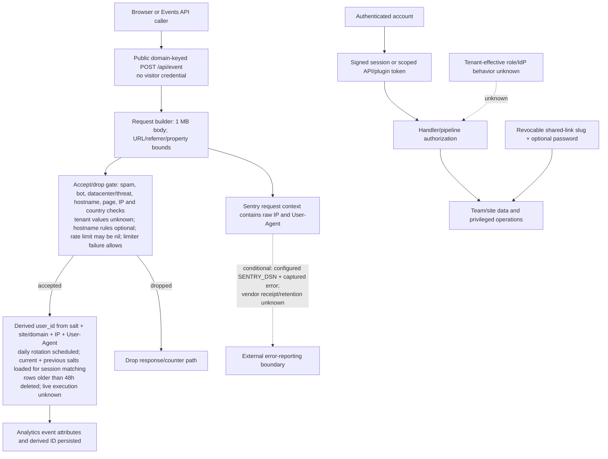

# Identity, Data, And Abuse Boundaries

## Purpose And Evidence Boundary

- Reader question: Where do public analytics input, visitor-derived identifiers, tenant access, error reporting, and source-visible abuse controls cross trust boundaries?
- Evidence cutoff: 2026-08-22 22:08:28 EDT; `primary-code` pinned at `9cc669b97ece3ecd37fcb3950791cb3873d7944d`.
- Confirmed notation: solid node/edge, established by source or policy text.
- Inferred notation: dashed edge labelled `inferred`; none is used as runtime proof.
- Unknown notation: dotted edge/node labelled `unknown`.
- Evidence links: [E-037](../../../evidence/evidence-ledger.md#e-037), [E-038](../../../evidence/evidence-ledger.md#e-038), [E-039](../../../evidence/evidence-ledger.md#e-039).

## Evidence Dimensions Used

Implementation and public claim text are present. Historical rationale is partial. Live operation, environment values, vendor retention, tenant configuration, ownership/approval, and specialist exploitability are unknown.

## Diagram

## Known Gaps And Follow-Up

- Public ingestion is deliberately domain-keyed and requires no visitor credential. Hostname allowlisting is optional and a site rate limit can be absent; quantify abuse and set the accepted contract through [OI-016](../../open-items.md#oi-016).
- The Sentry filter changes only the fingerprint; it does not remove the request context. External disclosure remains conditional on a configured DSN and captured event. Correct the context and confirm any live/retained vendor data through [OI-015](../../open-items.md#oi-015).
- Public wording says salt rotation/deletion every 24 hours, while source schedules daily rotation, loads current/previous salts for session matching, and deletes rows older than 48 hours. Effective lifetime, live execution, customer-supplied fields, logs/caches, and wording remain [OI-011](../../open-items.md#oi-011). Tenant-effective access remains [OI-013](../../open-items.md#oi-013).
- This is not an edge-exposure view and does not establish reachability, WAF, TLS, IAM, or deployed effectiveness. Those belong to Cloud Security; source-level bypass/exploitability belongs to Application Security.
