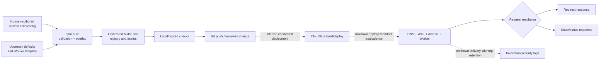

# Build, Deploy, And Request Path

## Purpose And Evidence Boundary

- Reader question: How does an instance change become a redirect, and which handoffs are unobserved?
- Evidence cutoff: July 22, 2026.
- Confirmed notation: Solid arrows are implemented or declared in cutoff-pinned source/configuration.
- Inferred notation: Dashed `inferred` arrows are documented conditional integrations.
- Unknown notation: Dotted `unknown` arrows require live deployment/ownership evidence.
- Evidence links: [E-004/E-006/E-007](../../../evidence/evidence-ledger.md), [delivery packet](../../../evidence/packets/delivery-and-quality.md), [recovery packet](../../../evidence/packets/recovery-and-operations.md).

## Evidence Dimensions Used

Implementation, source history, hosted-check samples, and recovery documentation are present. Live deployment, DNS responses, applied edge controls, account ownership, cost, and exercised rollback are unknown.

## Diagram

## Known Gaps And Follow-Up

No executable checks, deployment, production request, log inspection, rollback, or recovery drill was approved. The path shows what a successor must prove; it does not establish that the current service follows every edge.
