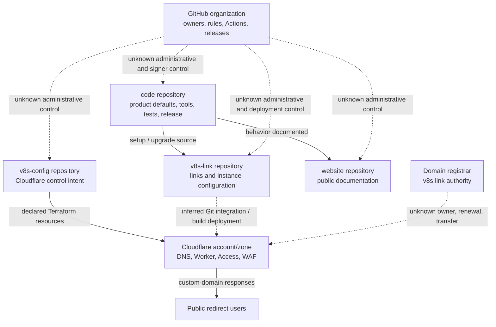

# Cross-Repository Control Boundary

## Purpose And Evidence Boundary

- Reader question: Which repository owns each durable artifact, and where does control leave public source?
- Evidence cutoff: July 22, 2026.
- Confirmed notation: Solid nodes and arrows are declared in cutoff-pinned source/configuration.
- Inferred notation: Dashed `inferred` edges are reasonable integrations described conditionally but not observed.
- Unknown notation: Dotted `unknown` edges require ownership, live-state, or transfer proof.
- Evidence links: [E-001/E-004](../../../evidence/evidence-ledger.md), [documentation alignment](../../../evidence/packets/documentation-alignment.md), [vendor/ownership](../../../evidence/packets/vendor-ownership-commercial.md).

## Evidence Dimensions Used

Implementation and documented rationale are present. Observed operation, ownership/approval, cost/commercial, and exercised recovery are unknown.

## Diagram

## Known Gaps And Follow-Up

The public repositories prove the intended division of responsibility, not the account owners or live connections. OI-001/OI-002 require a redacted authority and transfer inventory; OI-006 requires Cloudflare/Terraform/domain live-state and recovery proof.
