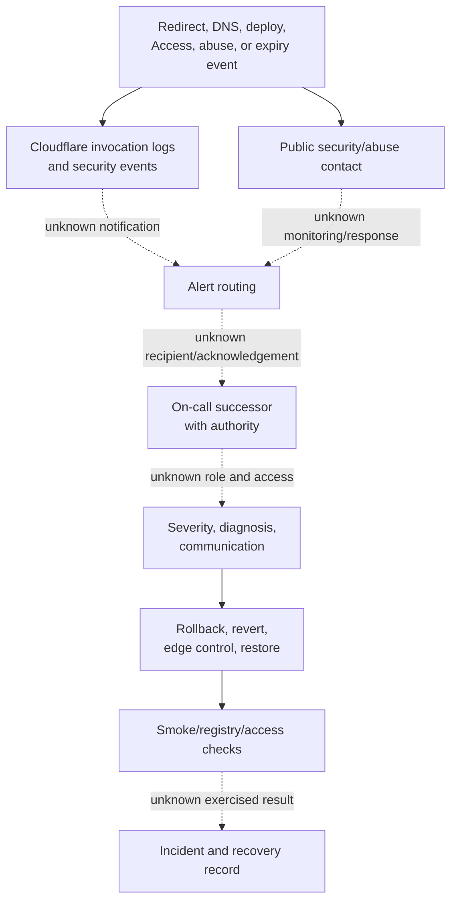

# Observability And Response Path

## Purpose And Evidence Boundary

- Reader question: How would a successor detect, triage, respond to, and recover from an interruption?
- Evidence cutoff: July 22, 2026.
- Confirmed notation: Solid edges are source/documentation declarations.
- Inferred notation: Dashed `inferred` edges are plausible external/operator handoffs not observed.
- Unknown notation: Dotted `unknown` edges require live alert, owner, acknowledgement, recovery, or communication proof.
- Evidence links: [Recovery packet](../../../evidence/packets/recovery-and-operations.md), [vendor/ownership packet](../../../evidence/packets/vendor-ownership-commercial.md), [continuity matrix](../../continuity/continuity-and-transfer-matrix.md).

## Evidence Dimensions Used

Implementation, logging declarations, public intake, and rollback guidance are present. Live signals, alert delivery, ownership, acknowledgement, escalation, communication, recovery execution, cost, and service objectives are unknown.

## Diagram

## Known Gaps And Follow-Up

Source documents rollback and some signals, but no public alert route, responder authority, severity/escalation, communication plan, recovery objective, or exercised result exists. OI-012 closes response ownership/delivery; OI-002/OI-006 close authority and recovery; operator aids may be drafted only after synthesis approval.
